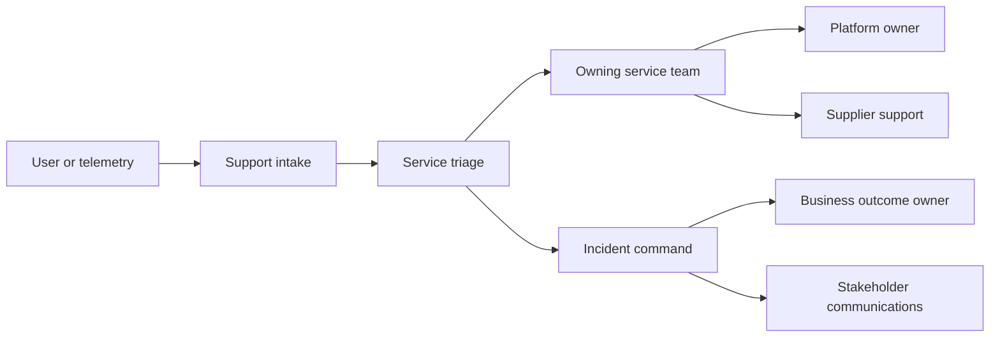
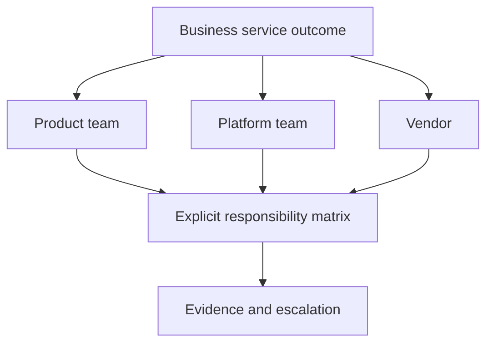

Operational discovery establishes who is accountable for a service outcome after delivery, how work is supported, which decisions can be made safely, and how responsibilities cross product, platform, vendor, and business boundaries. Architecture is incomplete when deployment succeeds but ownership remains ambiguous.

## Architectural Question

**Who owns each service outcome and operational decision across normal operation, change, incident, recovery, and dependency failure?**

## Service as an Owned Outcome

A service is more than a runtime component. Define its consumers, business capability, critical journeys, boundaries, data, dependencies, quality commitments, lifecycle, and accountable owner. One deployable may support several services; one service may rely on several deployables.

## Ownership Model

| Responsibility | Discovery question |
|---|---|
| Outcome owner | Who accepts service value, priority, and business consequence? |
| Product/service owner | Who owns roadmap, lifecycle, and consumer commitment? |
| Technical owner | Who owns architecture and change integrity? |
| Operational owner | Who detects, responds, restores, and improves? |
| Data/control owner | Who governs data and required controls? |
| Dependency owner | Who commits shared-platform or supplier behavior? |
| Risk acceptor | Who may accept residual operational exposure? |

Avoid “the squad” or “IT” as an ownership answer. Name accountable roles and deputies.

## Operating-Model Record

Capture support hours, coverage regions, staffing and skills, on-call, intake channels, triage, severity authority, escalation, incident command, communications, change permissions, safe operational actions, vendor path, continuity roles, measures, and improvement governance.

The path must work outside normal hours and during widespread failure.

## Decision Rights

Clarify who may declare severity, shed load, disable a feature, invoke degraded mode, fail over, restore data, replay messages, perform privileged correction, roll back, communicate externally, or accept continued operation. Define preauthorized safe actions and escalation thresholds.

If every action needs executive approval, recovery may be too slow. If operators can perform irreversible business actions without guardrails, control risk is too high.

## Shared Responsibility

For platforms and suppliers, map responsibilities rather than relying on “managed service.” Include configuration, capacity, security, backups, restore, patching, telemetry, application behavior, data reconciliation, incident notification, escalation, and exit.

## Staffing and Skills

Assess coverage, on-call sustainability, specialist concentration, onboarding, runbook usability, training, incident experience, privileged access, and vendor dependency. A technically resilient system with one knowledgeable operator is not operationally resilient.

Consider toil, interruption, alert load, after-hours burden, and improvement capacity. A team consumed by support cannot maintain service health or deliver safely.

## Service Catalogue Evidence

Minimum operational catalogue fields include service/outcome, tier, owners, consumers, dependencies, SLOs, dashboard, alerts, runbook, on-call, repository, deployment, data class, recovery objectives, last exercise, lifecycle, and exceptions. Reconcile declared records with runtime and ownership evidence.

## Discovery Procedure

1. Start with business services and critical journeys.
2. Define service boundary, consumers, dependencies, and commitments.
3. Name accountable product, technical, operational, data, control, and risk roles.
4. Walk support, incident, degraded, recovery, change, and supplier scenarios.
5. Map decision rights and safe actions.
6. Assess staffing, skills, coverage, toil, and key-person risk.
7. Verify service catalogue, on-call, dashboard, runbook, and exercise evidence.
8. Link gaps to requirements, risks, modernization readiness, and decisions.

## Common Failure Modes

- Equating code ownership with service-outcome ownership.
- Assigning accountability to a team name without a role.
- Designing only business-hours support.
- Assuming cloud/vendor ownership includes application recovery.
- Omitting decision rights for degraded mode and data correction.
- Measuring ticket closure instead of restored outcomes.
- Ignoring toil, on-call sustainability, and specialist concentration.

## Completion Criteria

Critical services have explicit boundaries, consumers, commitments, owners, support paths, decision rights, shared responsibilities, staffing, catalogue evidence, and improvement governance. Normal, incident, recovery, supplier, and change scenarios have accountable action and escalation.

## Interview Questions

### What does “you build it, you run it” require?

Real ownership, skills, access, telemetry, time, sustainable on-call, platform support, decision rights, and incentives. Assigning pager duty without these capabilities is not an operating model.

### How should service tiers be defined?

By business consequence, critical journeys, data/control exposure, tolerated disruption, recovery, and support commitment—not by stakeholder preference or technology size.

### Who owns a failure caused by a dependency?

The consuming service retains accountability for its user outcome while provider owners fulfill their contracts. Incident command coordinates; contracts do not remove end-to-end ownership.

## Summary

Operational ownership makes architecture executable. Explicit service boundaries, accountability, decision rights, staffing, and shared responsibilities determine whether quality commitments can be sustained.

Next, assess the [reliability, incident, and observability baseline](/architecture-discovery/operational/reliability-incidents-and-observability-baseline/).
