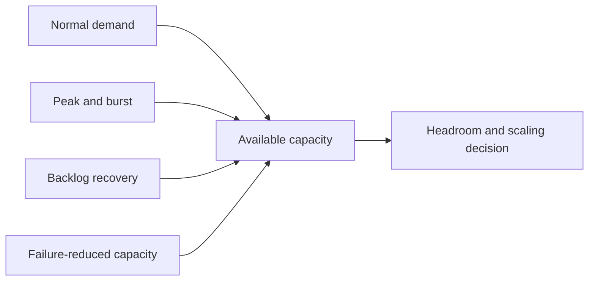
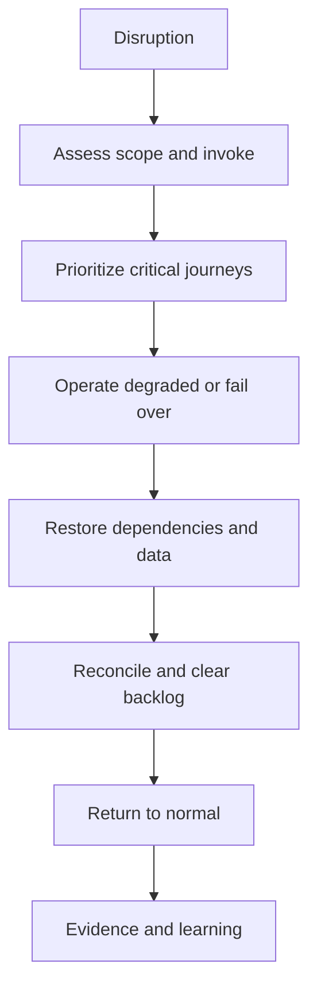
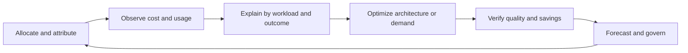

Capacity, continuity, and cost are coupled architecture concerns. Capacity must absorb demand and recovery backlog; continuity must preserve prioritized outcomes under disruption; cost must remain accountable across normal, peak, failure, and growth conditions. FinOps supplies operational feedback, not merely monthly savings reports.

## Architectural Question

**What demand and disruption must the service absorb, which outcomes must continue or recover first, and what consumption and financial behavior is acceptable?**

## Demand Profile

Capture transaction mix, arrival rate, concurrency, payload, data volume, tenant skew, hot partitions, batch/background work, seasonality, campaigns, regulatory deadlines, growth ranges, and uncertainty. Separate sustained demand from bursts and recovery catch-up.

Average utilization is weak evidence. Examine percentiles, saturation curves, queue age, dependency limits, and scaling lead time.

## Capacity Record

| Field | Discovery content |
|---|---|
| Workload | Mix, distribution, growth, peak, source |
| Resource/bottleneck | Compute, memory, storage, I/O, connection, quota, people |
| Current limit | Measured saturation and failure behavior |
| Headroom | Required margin and rationale |
| Scaling | Unit, trigger, lead time, upper bound, state movement |
| Degradation | Priority, admission, shedding, queueing, communication |
| Cost | Fixed/variable unit, marginal behavior, commitment |
| Evidence | Test, telemetry, forecast, confidence, owner |

Include human capacity for support, reviews, exception queues, and recovery.

## Continuity Scenarios

Discover loss or degradation of region, data center, provider, network, identity, key management, control plane, critical dependency, workforce location, supplier, and data integrity. For each scenario define priority capabilities, maximum tolerable disruption, degraded behavior, RTO/RPO, invocation authority, dependency order, communication, reconciliation, return to normal, and exercise evidence.

Continuity is broader than disaster recovery. It may include manual alternatives, alternate suppliers, demand prioritization, or controlled suspension.

## Recovery Capacity

Failover capacity must include concurrent demand, replay, data synchronization, reconciliation, and backlog clearance. A secondary region sized only for normal requests may remain degraded indefinitely after restoration.

Define recovery-time budget across detection, decision, provisioning, data restore, dependency readiness, validation, traffic shift, and reconciliation.

## Cost Model

Connect cost to capability, service, environment, tenant/product where meaningful, workload driver, and owner. Include compute, storage, transfer, managed services, licenses, observability, security, support, engineering operations, commitments, idle resilience, migration, and exit.

Use unit economics such as cost per completed order, active account, processed document, or analytical workload, with quality and volume context. Lower unit cost is not success if failures or latency rise.

## FinOps Decision Loop

Make anomalies actionable with accountable owners and context. Some shared costs require transparent allocation rather than false precision.

## Optimization Tradeoffs

Assess rightsizing, scheduling, autoscaling, storage lifecycle, caching, compression, batching, query efficiency, data transfer, license utilization, commitments, architecture simplification, and demand shaping. Consider resilience, performance, delivery, and lock-in consequences.

Committed discounts can reduce price while increasing exit and forecast risk. Optimization that removes all headroom can weaken incident recovery.

## Sustainability

Where material, capture energy/carbon objectives, workload location/time flexibility, resource efficiency, hardware/service lifecycle, data retention, and measurement limitations. Align sustainability with cost and performance without double-counting benefit.

## Common Failure Modes

- Forecasting with averages and one growth percentage.
- Ignoring downstream quotas and human queues.
- Testing peak capacity without failure or backlog recovery.
- Treating DR as infrastructure failover only.
- Allocating cost without a decision owner or workload driver.
- Optimizing monthly spend while increasing risk or delivery burden.
- Buying commitments before demand and exit uncertainty are understood.
- Assuming multi-region deployment proves continuity.

## Completion Criteria

Demand, limits, headroom, scaling, degradation, continuity, recovery capacity, cost drivers, allocation, and ownership are evidenced. Critical scenarios have exercised recovery and reconciliation. Forecast ranges and uncertainty are explicit. Optimization decisions protect governing quality and transition needs, with operational measures and reassessment triggers.

## Interview Questions

### How much capacity headroom is enough?

Enough to cover detection and scaling lead time, burst and forecast uncertainty, failure-reduced capacity, and recovery work for the priority outcome. Derive it from scenarios rather than a universal percentage.

### Is active-active always best for continuity?

No. It can improve availability but adds data consistency, routing, testing, operational, and cost complexity. Compare business objectives with active-passive, pilot light, restore, and degraded alternatives.

### What makes a useful cloud cost metric?

It is attributable to an owner and workload/outcome, normalized enough for comparison, timely, and paired with quality. Raw monthly spend alone rarely explains the architecture decision.

## Summary

Capacity, continuity, and cost discovery connect demand and disruption to accountable resource behavior. They ensure architecture remains performant, recoverable, and economically sustainable under realistic operating conditions.

With the core discovery domains complete, continue to [modernization drivers and scope](/architecture-discovery/modernization/).
