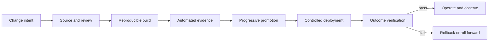

Delivery discovery establishes how a change moves from intent to verified production outcome. It examines code, data, configuration, infrastructure, policy, environments, approvals, evidence, rollback, and ownership. Architecture that ignores delivery mechanics can be structurally elegant but impossible to change safely.

## Architectural Question

**How does each material change reach production, what constrains independent and safe delivery, and what evidence proves deployment and rollback readiness?**

## Change Types

Map distinct paths for application code, database/schema, data correction, infrastructure, platform, configuration, secret/certificate, policy/rules, ML model, integration contract, and third-party release. Each has different authority, sequencing, evidence, and rollback semantics.

## Delivery-Flow Record

| Field | Discovery content |
|---|---|
| Trigger/owner | Change intent, accountable service owner |
| Source | Repository, artifact, configuration, data/model provenance |
| Build/test | Automation, dependencies, representative evidence |
| Promotion | Environment sequence, gates, approvals, segregation |
| Deployment | Unit, strategy, window, dependency coordination |
| Data change | Compatibility, migration, backfill, validation |
| Verification | Technical, business, control, and operational signals |
| Rollback/recovery | Safe reversal, roll-forward, data treatment |
| Traceability | Change, artifact, decision, evidence, actor |

## Environment Discovery

For each environment capture purpose, owners, access, data, scale, topology, integrations, configuration, controls, cost, refresh, drift detection, and disposal. Determine which differences are intentional and which invalidate evidence.

Production-like does not require full production size, but tests must represent the characteristic under evaluation. Synthetic or masked data must preserve relevant distribution and relationships without creating privacy risk.

## Deployment Independence

Analyze where releases require coordinated teams, shared windows, synchronized schemas, manual environment work, vendor action, or central approval. Identify the real coupling: contract, shared database, batch cutoff, organization, control, or tooling.

Independent deployment is valuable only when runtime compatibility, ownership, observability, and recovery also support it.

## Progressive Delivery

Discover feasibility of canary, blue/green, feature flags, traffic shadowing, tenant/region waves, and dark launch. Define exposure unit, success measures, guardrails, decision authority, rollback, and maximum duration.

Feature flags need owners, security review where relevant, lifecycle, default behavior, configuration audit, and removal. Permanent flags create state-space debt.

## Data and Contract Change

Use expand/migrate/contract where appropriate. Define backward/forward compatibility, dual-read/write duration, backfill, reconciliation, consumer adoption, rollback limit, and retirement evidence. Database rollback may not undo external business effects.

## Release Controls

Translate control intent into evidence: peer review, artifact integrity, test results, vulnerability policy, approvals, segregation, change record, production identity, and audit. Automate objective controls and use human judgment for material risk and exceptions.

Emergency change needs defined authority, minimum evidence, communication, monitoring, rollback, and retrospective review. It should not become the normal path.

## Delivery Measures

Use change lead time, deployment frequency, change failure, restore time, batch size, queue time, approval wait, rework, rollback success, environment failure, and percentage of automated evidence. Segment by service and change type. Optimize outcome and safety, not raw deployment count.

## Common Failure Modes

- Mapping only application code and ignoring data/configuration changes.
- Calling a test environment representative without evidence.
- Using manual approval to compensate for missing automation and ownership.
- Assuming rollback restores data and external effects.
- Leaving compatibility and feature flags indefinitely.
- Measuring pipeline duration while ignoring queues and coordination.
- Designing target architecture without a viable delivery transition.

## Completion Criteria

Material change types have evidenced delivery paths, owners, environments, gates, deployment strategies, verification, and recovery. Coordination and drift are explicit. Data and contract evolution are safe. Measures reveal delay and failure, and target architecture work includes necessary delivery-platform and operating-model changes.

## Interview Questions

### Is rollback always the safest deployment response?

No. Schema changes, external effects, and data migrations may make rollback unsafe. Decide per change whether to revert, roll forward, disable, compensate, or reconcile.

### Why do environments drift?

Manual changes, separate configuration sources, long-lived data, differing integrations, permissions, scale, and patch cycles. Use immutable/reproducible infrastructure, configuration ownership, reconciliation, and purposeful differences.

### How do you balance governance and delivery speed?

Automate repeatable evidence and policy, use risk-based gates, make ownership explicit, and reserve human review for consequential uncertainty and exceptions.

## Summary

Delivery discovery exposes whether architecture can evolve safely. It connects every change type to environments, controls, compatibility, progressive exposure, outcome verification, and recovery.

Next, assess [capacity, continuity, cost, and FinOps](/architecture-discovery/operational/capacity-continuity-cost-and-finops/).
