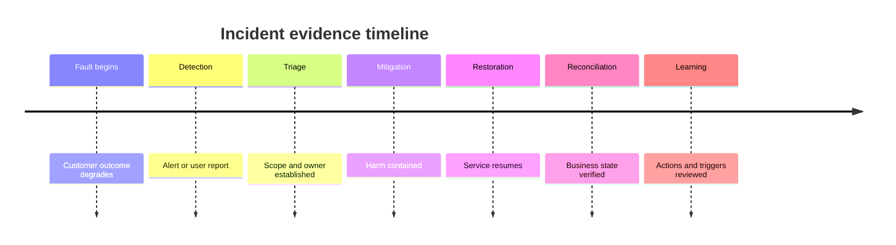
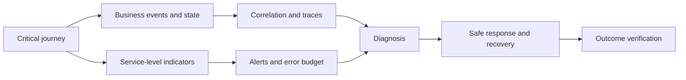

Reliability discovery uses operating evidence to understand how service outcomes fail, how quickly the organization knows, how safely it responds, and whether recovery is verified. Observability is the ability to answer operational questions from system evidence—not the presence of a logging product.

## Architectural Question

**How reliably are critical outcomes delivered today, what failure patterns and blind spots exist, and what evidence supports detection, diagnosis, recovery, and improvement?**

## Outcome-Based Baseline

Establish indicators at the business-service boundary:

- successful and correct outcome rate;
- latency and completion-time distributions;
- availability of critical journeys and degraded modes;
- pending, duplicate, lost, or ambiguous outcomes;
- backlog age and recovery throughput;
- reconciliation differences and oldest unresolved item;
- control effectiveness and data-quality failures;
- customer/support impact and error-budget consumption.

Component CPU and HTTP status are supporting signals, not substitutes.

## Incident Evidence

Review a representative period and select high-impact, recurring, slow-detection, slow-recovery, security/control, data-integrity, and near-miss cases. Capture trigger, blast radius, outcome impact, timeline, detection source, decision points, dependency behavior, communication, recovery, reconciliation, contributing conditions, and action effectiveness.

Measure time to detect, engage, understand, mitigate, restore, reconcile, and learn separately. “MTTR” can conceal the dominant delay.

## Observability Questions

For each critical scenario, operators should be able to answer:

1. Is the business outcome succeeding for each material segment?
2. Where is work waiting, failing, repeating, or becoming uncertain?
3. Which deployment, configuration, dependency, tenant, or data condition correlates?
4. What is the current blast radius and risk?
5. Which safe action can contain or restore service?
6. Did recovery converge and preserve controls?

Design telemetry from these questions.

## Telemetry Model

Correlate business identifiers with metrics, events, logs, and traces while protecting sensitive data. Record event semantics, labels/cardinality, sampling, retention, access, clock, data quality, owner, and cost.

Avoid logging secrets or personal data by default. Discover the minimum evidence required for diagnosis, audit, and nonrepudiation.

## Alerts and Actionability

An alert needs an owned symptom, affected service, threshold/window, severity, likely consequence, diagnostic context, runbook, escalation, and safe first action. Tune for detection quality and operator capacity. Page on conditions requiring timely human action; use tickets or dashboards for slower work.

Track false positives, missed incidents, duplicate alerts, pages per shift, acknowledgement, escalation, and action success.

## SLO and Error Budget

Define indicators and objectives from prioritized quality scenarios. Specify population, measurement point, window, exclusions, segmentation, data quality, and decision policy. Error budgets should influence release and reliability investment, not merely decorate dashboards.

An SLO below a contractual commitment provides no operating margin. A target far above business need may impose wasteful cost.

## Recovery and Runbooks

Evaluate whether runbooks are current, accessible during failure, safe, least-privileged, tested, and explicit about prerequisites, decisions, validation, rollback, escalation, and evidence. Automate repeatable action while preserving control and observability.

Recovery is complete only when priority journeys, data, integrations, controls, and reconciliation are verified and backlog is manageable.

## Learning System

Incident review should identify conditions and improve architecture, tests, operations, ownership, and decision triggers without blame. Track actions to validated outcome, recurring causes, unowned dependencies, and accepted risks. Closing a ticket is not proof that recurrence is reduced.

## Common Failure Modes

- Measuring infrastructure uptime instead of business outcomes.
- Aggregating away tenant, channel, or dependency failures.
- Treating log volume as observability maturity.
- Alerting on every anomaly without an actionable response.
- Ending incident timing at service restart rather than reconciliation.
- Writing runbooks that require unavailable systems or unsafe access.
- Completing postmortems without validating corrective actions.

## Completion Criteria

Critical services have outcome-based baselines, meaningful incident evidence, answerable observability questions, owned actionable alerts, SLO/error-budget policy, tested recovery, and improvement traceability. Blind spots, data limitations, recurrent causes, and residual operational risk are explicit.

## Interview Questions

### What is the difference between monitoring and observability?

Monitoring evaluates known conditions and thresholds. Observability enables investigation of unanticipated internal state from evidence. Effective operations need both, anchored to service outcomes.

### Why is MTTR insufficient?

It blends detection, engagement, diagnosis, mitigation, restore, and reconciliation and averages unlike incidents. Separate distributions reveal where architecture or operating-model investment helps.

### What should page an operator?

A condition that threatens a meaningful service outcome and requires timely human judgment or action. The page must identify ownership, context, and a safe response.

## Summary

Reliability discovery turns production history into architecture evidence. Outcome indicators, incident timelines, observability questions, actionable alerts, recovery verification, and learning reveal what the target must improve.

Next, discover [delivery, environments, and release constraints](/architecture-discovery/operational/delivery-environment-and-release-discovery/).
