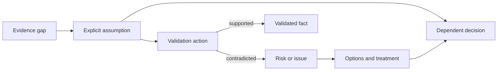
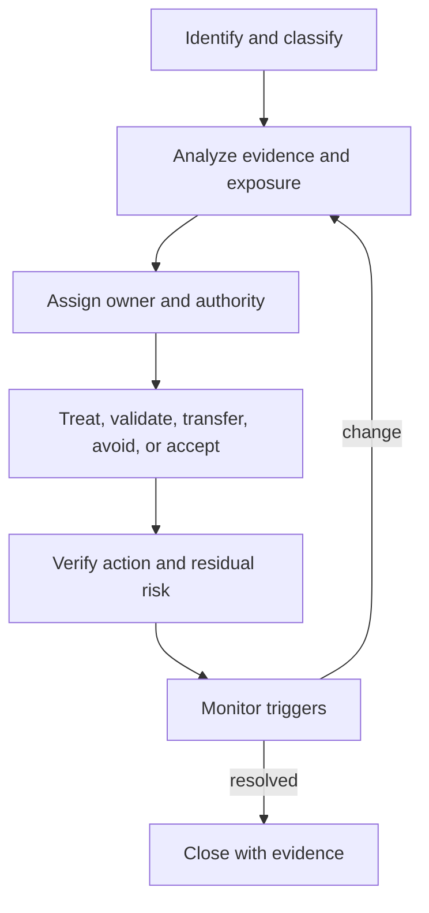

Architecture discovery operates under uncertainty. Risk and assumption management makes uncertainty visible, assigns ownership, and connects validation or treatment to decisions. It is not a spreadsheet maintained separately from architecture; it is part of the evidence and decision lifecycle.

## Architectural Question

**Which uncertain conditions could change outcomes or architecture decisions, and how will they be validated, treated, owned, accepted, and reassessed?**

## Controlled Vocabulary

| Record | Meaning | Example |
|---|---|---|
| Risk | Uncertainty that may affect an objective | Partner capacity may not support peak |
| Assumption | Belief temporarily treated as true | Existing identifiers are globally unique |
| Issue | Condition already occurring | Reconciliation backlog exceeds target |
| Dependency | Required external outcome or input | Identity platform must support workload identity |
| Constraint | Current boundary the option must respect | Data processing limited to approved regions |
| Decision | Accountable choice among alternatives | Use cohort-based transition routing |
| Finding | Evidence-backed observation | Four teams release through one database window |

Link records without collapsing them. A weak assumption can create a risk; validation can turn it into a finding; the finding can require a decision.

## Risk Statement

Use cause–event–effect:

> Because consumer usage of the legacy event is incomplete, retirement may remove a required regulatory reporting feed, causing reporting failure and delayed decommissioning benefits.

This identifies why uncertainty exists, what might happen, and which outcome is affected. “Integration risk” does not.

## Assumption Record

Capture statement, rationale, source, scope, confidence, consequence if false, decisions depending on it, validation method, owner, due date, and trigger. Assumptions should leave the register by validation, decision, or expiry—not remain permanently “open.”

## Risk Taxonomy

Use categories for coverage, not prioritization: business/outcome, domain/process, quality, integration, data, security/compliance, technology/lifecycle, operations, delivery, supplier/commercial, organization/skills, transition, and decision/governance.

Cross-cutting risks deserve special attention. One identity, data, supplier, or platform condition may affect many services and waves.

## Evidence and Confidence

Record source, observation date, scope, quality, contradictions, and confidence. Separate uncertainty about probability from uncertainty about impact or exposure. When evidence is weak and consequence is high, prioritize validation rather than inventing a precise score.

## Register Structure

Minimum fields include ID, type, statement, affected objectives, scope, owner, evidence, confidence, likelihood, impact, proximity, exposure, treatment, actions, dependencies, residual risk, acceptor, dates, state, and review triggers.

Maintain relationships to requirements, quality scenarios, options, ADRs, controls, migration waves, tests, incidents, and deliverables.

## Governance Flow

Risk owner is accountable for response; action owners deliver treatment; acceptance authority owns residual business consequence. These roles may differ.

## Assumption Burn-Down

Prioritize assumptions by decision sensitivity, consequence if false, validation lead time, reversibility, and deadline. Validate foundational assumptions before making expensive or irreversible commitments. Track the number and age of high-consequence assumptions, not just total register size.

## Risk Relationships

Avoid duplicate entries for one systemic cause. Represent a shared dependency risk once and link affected outcomes, then capture service-specific consequences where materially different. Portfolio aggregation should reveal concentration, common-mode control, and cumulative exceptions.

## Common Failure Modes

- Calling known problems risks to avoid action.
- Recording single-word categories instead of cause–event–effect.
- Treating assumptions as meeting notes without owners or deadlines.
- Using numerical precision unsupported by evidence.
- Assigning every risk to the project manager or architect.
- Closing risks when actions are scheduled rather than verified.
- Maintaining a register disconnected from architecture decisions.

## Completion Criteria

Material uncertainty is classified and linked to affected outcomes and decisions. Risks and assumptions have evidence, confidence, owners, deadlines, treatment/validation, residual exposure, authority, and triggers. Closure requires evidence, and portfolio views expose concentration and dependent decisions.

## Interview Questions

### What is the difference between a risk and an issue?

A risk is uncertain; an issue is already true. They require different governance: risks need prevention or contingency, while issues need resolution and impact containment.

### Which assumption should be tested first?

The one with high decision sensitivity and consequence, long validation lead time, or low reversibility. Cheap-to-test assumptions may also be advanced when they unlock scope quickly.

### Who owns architecture risk?

The role accountable for the affected outcome owns the response. Architects identify systemic consequences and options; action and acceptance authorities must be explicit.

## Summary

Risk and assumption management makes architecture uncertainty actionable. Controlled records, traceable evidence, validation, ownership, and triggers keep decisions honest as context changes.

Next, perform [risk analysis, ownership, and treatment](/architecture-discovery/risk/risk-analysis-ownership-and-treatment/).
