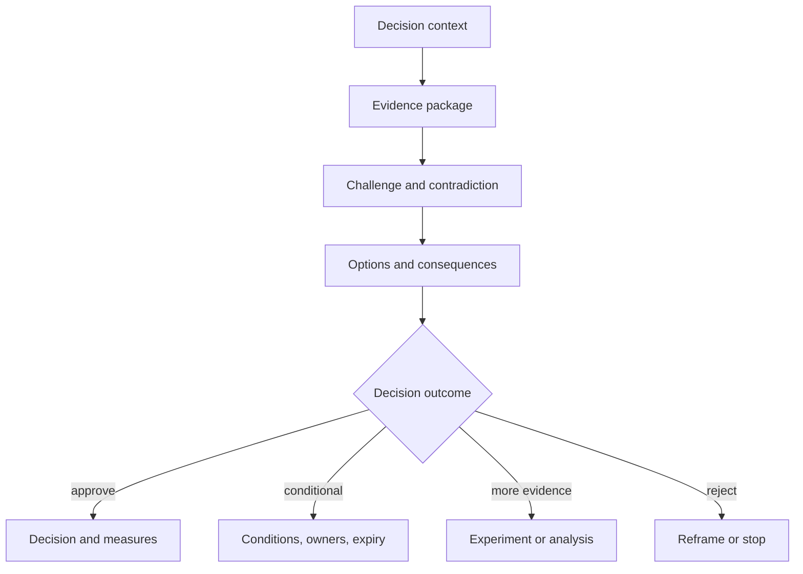
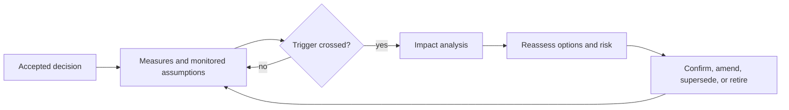

Architecture review is an accountable evidence gate for consequential decisions. It should improve decision quality, expose uncertainty, and establish conditions—not reward presentation quality or enforce undocumented preferences. Reassessment keeps decisions valid when assumptions, workload, obligations, dependencies, or evidence change.

## Architectural Question

**What evidence and authority are required at each decision gate, and which changes must trigger a review of the accepted architecture?**

## Review Types

| Review | Purpose |
|---|---|
| Discovery scope | Validate charter, stakeholders, questions, evidence access |
| Option review | Challenge context, criteria, alternatives, experiments, tradeoffs |
| Decision review | Authorize recommendation, conditions, residual risk, dissent |
| Readiness review | Verify delivery, security, data, operations, recovery, support |
| Transition review | Accept cohort/wave entry, coexistence, rollback, exit evidence |
| Post-implementation | Compare outcomes, fitness, incidents, cost, and assumptions |

Use risk-based depth. Not every change requires a board meeting.

## Review Inputs

Minimum input set:

- decision context, scope, outcomes, and accountable authority;
- relevant findings and evidence confidence;
- business, functional, quality, data, integration, security, and operational requirements;
- constraints, assumptions, dependencies, and unresolved questions;
- viable options and rejected alternatives;
- tradeoff, cost, transition, and risk analysis;
- validation/experiment results and limitations;
- recommendation, conditions, fitness measures, and triggers.

Reviewers should receive material early enough to analyze it.

## Participants and Rights

Include the decision owner and representatives for affected outcomes, domain/data, engineering, operations, security/risk, delivery, finance/commercial, and dependencies as material. Distinguish contributor, challenger, approver, risk acceptor, and recorder.

An architecture board should not accept business, security, operational, or financial risk beyond delegated authority.

## Evidence Gate

Possible outcomes must be defined before the meeting. Silence is not approval.

## Review Record

Capture date, scope, decision, participants/roles, evidence considered, questions, contradictions, options, outcome, rationale, dissent, accepted risks, conditions, actions, owners, due dates, waivers, expiry, and reassessment triggers. Link to the ADR and evidence rather than duplicating artifacts.

## Conditions and Waivers

Conditional approval specifies what may proceed, required evidence or control, owner, deadline, monitoring, consequence of failure, and follow-up authority. A waiver includes policy/requirement, gap, scope, compensating control, residual risk, acceptor, expiry, and trigger.

Do not automatically convert overdue conditions into acceptance.

## Reassessment Triggers

Trigger review when material context changes:

- workload, criticality, geography, user, tenant, or data classification;
- regulation, contract, standard, or provider responsibility;
- architecture boundary, dependency, product lifecycle, or cost;
- incident, control failure, recovery exercise, or threat evidence;
- assumption invalidation or experiment result;
- quality threshold, error budget, fitness, or benefit variance;
- transition-state duration, migration sequence, or ownership change.

## Lightweight Governance

Automate objective conformance and evidence checks. Use asynchronous review for bounded familiar decisions and synchronous review for cross-domain, irreversible, high-uncertainty, or high-consequence choices. Publish criteria, service levels, escalation, and examples.

Track review lead time, rework causes, conditional approvals, overdue actions, repeated waivers, decision reversals, and outcome quality. Speed without decision quality is not success.

## Common Failure Modes

- Reviewing polished documents rather than decision evidence.
- Inviting many stakeholders without defining authority.
- Enforcing unwritten preferences as standards.
- Approving with vague “address later” conditions.
- Recording actions but not decision rationale and dissent.
- Scheduling calendar reviews instead of monitoring triggers.
- Requiring the same process for every risk level.
- Letting boards accept risks they do not own.

## Completion Criteria

Review types, evidence gates, participants, authority, outcomes, records, conditions, waivers, and service levels are explicit. Decisions have monitored triggers. Objective checks are automated where appropriate, and consequential reviews preserve rationale, dissent, ownership, expiry, and follow-through.

## Interview Questions

### What makes an architecture review effective?

A clear decision, right authority, relevant evidence, viable alternatives, explicit quality/risk/transition consequences, constructive challenge, and recorded outcome with conditions and triggers.

### How do you avoid an architecture review board becoming a bottleneck?

Publish standards and paved roads, automate conformance, use risk-based review, delegate bounded decisions, make asynchronous evidence possible, and measure queue/rework causes.

### When should an ADR be revisited?

When a recorded assumption, context, dependency, workload, obligation, incident, cost, or fitness measure crosses its trigger—not because the document is old alone.

## Summary

Architecture reviews govern decisions, not documents. Evidence gates, explicit authority, conditional outcomes, and active triggers preserve decision quality without unnecessary centralized control.

Next, synthesize [discovery findings into architecture options](/architecture-discovery/risk/from-discovery-findings-to-architecture-options/).
