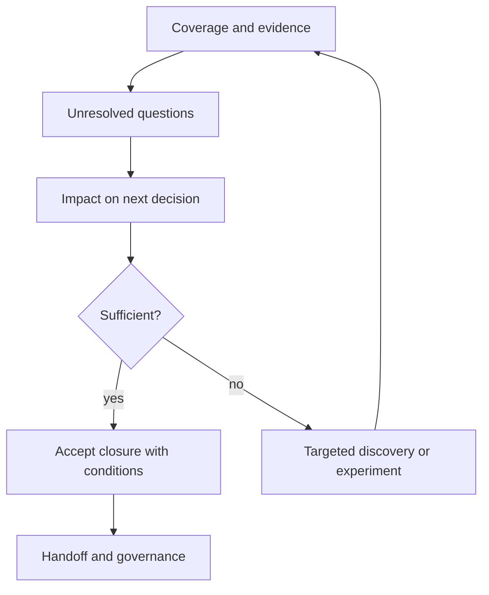
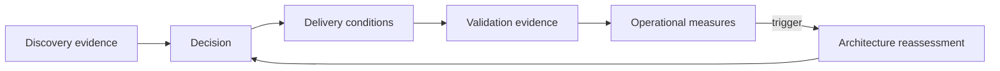

Discovery closure is an evidence-based decision that the engagement has answered its bounded architectural questions sufficiently for the next commitments. It does not mean every uncertainty is removed. Handoff transfers accountable decisions, conditions, measures, and unresolved work into delivery and governance without losing context.

## Architectural Question

**Is the evidence sufficient for the authorized next decision, and are every condition, uncertainty, deliverable, owner, and review trigger carried forward?**

## Closure Criteria

Confirm:

- chartered questions and scope have disposition;
- priority stakeholders and decision authorities participated;
- findings cite evidence and confidence;
- contradictions and exclusions are visible;
- requirements and quality scenarios are measurable and owned;
- current state and dependencies are adequate for the decision;
- viable options and recommendation have traceable evaluation;
- risks, assumptions, conditions, and accepted residual exposure are governed;
- transition, operations, delivery, data, security, and recovery are addressed;
- outcomes, fitness measures, and reassessment triggers are assigned.

## Coverage Matrix

Use a matrix by architectural question rather than page count:

| Question | Evidence | Decision/output | Owner | State |
|---|---|---|---|---|
| Why change? | Drivers, baseline, outcome | Approved outcomes/scope | Sponsor | Accepted |
| What behavior? | Journeys, scenarios, rules | Functional boundary | Product/domain | Accepted |
| How well? | Quality scenarios | Budgets and gates | Service/risk owner | Conditional |
| What depends? | Data/integration/estate | Dependency decisions | Domain/platform | Accepted |
| Which option? | Evaluation and experiments | ADR/recommendation | Decision authority | Accepted |
| How transition? | States, waves, readiness | Roadmap and entry gates | Program/service | Open action |

An open item is acceptable only when its impact, owner, due date, and decision gate are explicit.

## Closure Review

Possible outcomes: close, close with conditions, extend targeted discovery, rescope, pause, or stop. Record rationale and authority.

## Handoff Package

Provide a navigable set, not one giant document:

- executive decision brief;
- scope, context, outcomes, and measures;
- relevant current-state views and evidence;
- requirements and quality scenarios;
- options, evaluation, recommendation, and ADRs;
- risk/assumption/decision registers;
- transition states, waves, dependencies, and readiness;
- data, security, operational, and delivery conditions;
- artifact index with owners, status, and source links;
- open actions, exceptions, triggers, and next reviews.

## Ownership Transfer

Handoff is complete when recipients understand and accept responsibilities. Conduct walkthroughs for product/domain teams, delivery, platform, operations, security, data, risk, and benefit owners as relevant. Capture acknowledgement, questions, and ownership changes.

Do not transfer risk by emailing documents. The original accountable authority remains responsible until responsibility is explicitly accepted.

## Decision Continuity

Keep stable identifiers and links in delivery backlogs, tests, dashboards, runbooks, waivers, and ADRs. Avoid copying requirements into disconnected tools without provenance.

## Unresolved Work

Classify remaining work as assumption validation, design elaboration, implementation task, dependency negotiation, control evidence, readiness action, risk treatment, or future decision. State consequence if late and the gate it blocks.

## Artifact Quality

Every handed-off artifact needs purpose, audience, owner, version/status, scope, evidence date, decisions supported, dependencies, and lifecycle. Archive workshop drafts that are superseded while preserving audit-relevant source evidence.

## Common Failure Modes

- Declaring discovery complete because workshops ended.
- Requiring every unknown to be resolved before any decision.
- Delivering one large document without an artifact index.
- Transferring actions without accountable acceptance.
- Losing assumptions and rejected alternatives during delivery.
- Copying requirements until source and version are unclear.
- Closing before operational, transition, or benefit ownership exists.

## Completion Criteria

The authorized closure decision is supported by coverage and evidence. Open items have materiality, owners, dates, and gates. Recipients accept decisions, conditions, risks, measures, and responsibilities. Artifacts remain traceable into delivery, validation, operations, benefits, and reassessment.

## Interview Questions

### When is discovery complete?

When evidence is sufficient for the bounded next decision, material uncertainty is governed, and ownership and conditions are accepted. Completeness is decision-relative, not absence of unknowns.

### What belongs in an architecture handoff?

Decision context and outcomes, evidence, requirements, options and decisions, risks/assumptions, transition, controls, operations, measures, open actions, owners, and review triggers—organized for the audiences who act on them.

### How do you prevent architecture drift after handoff?

Link decisions to delivery conditions and fitness measures, automate conformance where useful, retain owners, monitor assumptions and triggers, and schedule review based on change or evidence.

## Summary

Closure converts discovery into an accountable next commitment. A traceable handoff preserves decisions, uncertainty, conditions, ownership, and feedback so architecture continues through delivery and operation.

Continue with the [architecture deliverable guides](/architecture-discovery/deliverables/), beginning with the Business Requirements Document.
