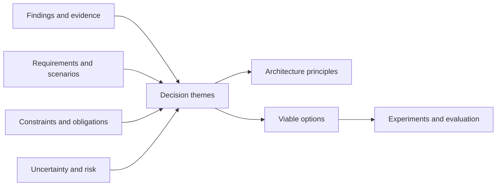
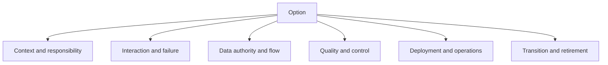

Synthesis turns discovery evidence into coherent architecture choices. It is not a summary of workshop notes and not a preferred diagram drawn early. It identifies the few decisions that shape outcomes, groups related findings, defines option boundaries, and preserves uncertainty so alternatives can be evaluated fairly.

## Architectural Question

**Which materially different architecture approaches can satisfy the evidenced outcomes, requirements, constraints, and transition conditions?**

## Prepare Decision Themes

Cluster findings around decisions rather than document sections. Typical themes include domain ownership, interaction style, data authority, quality tactics, identity/trust, operating model, platform responsibility, transition, and sourcing.

For each theme assemble:

- outcome and affected actors;
- findings and evidence confidence;
- governing functional and quality scenarios;
- obligations and genuine constraints;
- assumptions, dependencies, risks, and deadlines;
- current-state strengths worth preserving;
- decision authority and required validation.

## Option Anatomy

An architecture option is a coherent bundle of decisions. Record:

| Field | Content |
|---|---|
| Intent | Outcome and problem addressed |
| Scope | Capabilities, actors, data, regions, lifecycle |
| Structure | Responsibilities, boundaries, ownership |
| Interactions | Commands, events, queries, consistency, failure |
| Data | Authority, flow, lifecycle, migration |
| Quality/control | Tactics for governing scenarios and obligations |
| Operations | Service ownership, deployment, observability, recovery |
| Transition | Intermediate states, dependencies, coexistence, exit |
| Economics | Cost drivers, skills, sourcing, opportunity |
| Uncertainty | Assumptions, experiments, residual risks |

Do not define options as vendor A versus vendor B when the fundamental operating and domain choices remain unstated.

## Generate Meaningful Alternatives

Use deliberate contrasts such as centralized versus domain-owned decisioning, synchronous authoritative workflow versus durable asynchronous coordination, shared platform versus managed service, incremental extraction versus replacement, or common data product versus replicated contextual views.

Include “improve and retain” and “do minimum required” where viable. They expose the incremental value and risk of transformation.

## Preserve Invariants

Every option must satisfy mandatory obligations, business invariants, critical data integrity, and explicit transition safety. If an option cannot meet a gate, eliminate it with rationale rather than dilute the requirement.

## Avoid Premature Technology

Describe needed capabilities and properties before products. For example, “durable ordered delivery within account scope with replay and consumer isolation” is an input to technology selection. A broker name is not the requirement.

## Current Strengths and Reuse

Discovery may reveal reliable components, trusted data, effective controls, experienced teams, and stable interfaces. Options should reuse them when doing so improves outcomes. Modernization is not a requirement to replace everything.

## Architecture Views

Create only views needed to distinguish options: context, capability/domain, runtime interaction, data authority, deployment/trust, transition, and operating model. Apply consistent scope and notation so differences are visible.

## Option Quality Check

An option is viable when it addresses the full decision context, passes mandatory gates, explains significant tradeoffs, identifies transition and operating model, has sufficient evidence, and can be evaluated independently. Combine superficial variants; split options whose responsibility or risk models materially differ.

## Common Failure Modes

- Turning findings into one predetermined target architecture.
- Organizing synthesis by workshop rather than decision.
- Comparing products before defining architecture properties.
- Ignoring current strengths and retain options.
- Creating alternatives that differ only cosmetically.
- Describing end states without transition or ownership.
- Hiding uncertainty to make the recommendation look complete.

## Completion Criteria

Material findings trace into decision themes and a bounded set of genuinely different viable options. Each option covers structure, interaction, data, quality, security, operations, transition, economics, and uncertainty at decision-appropriate depth. Eliminated options have rationale and unresolved claims have experiments.

## Interview Questions

### How many architecture options should be presented?

Enough to cover materially different viable approaches, usually two to four. Do not create artificial variants, but avoid presenting one recommendation as if no choice existed.

### How do you prevent solution bias during discovery?

Separate findings from decisions, agree criteria and gates before product evaluation, generate alternatives with diverse stakeholders, and make assumptions and rejected options visible.

### What is the difference between a principle and an option?

A principle guides repeated choices; an option is a coherent candidate architecture for a particular decision context. Principles do not replace option evidence.

## Summary

Synthesis converts discovery into a fair option space. Decision themes, coherent alternatives, mandatory gates, transition, and explicit uncertainty create the foundation for recommendation.

Next, perform [option evaluation and recommendation](/architecture-discovery/risk/option-evaluation-and-recommendation/).
