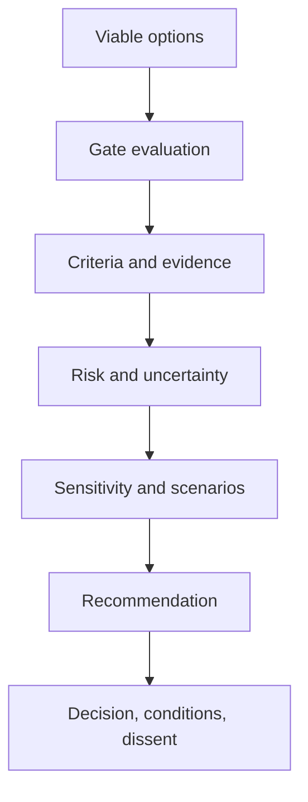
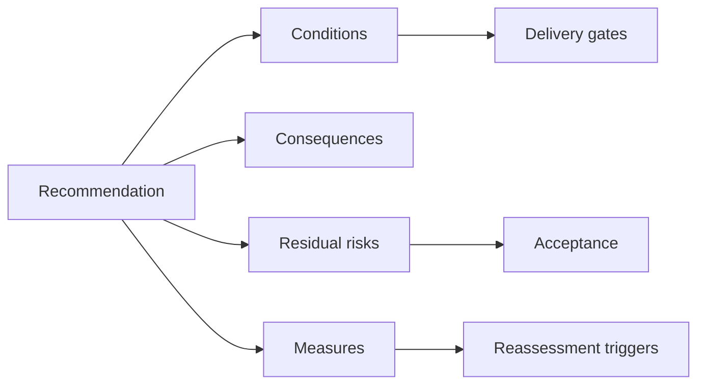

Option evaluation makes tradeoffs explicit and recommends an architecture with evidence, not a winner produced by arithmetic. It compares whole operating and transition architectures, tests consequential uncertainty, and records the conditions under which the recommendation remains valid.

## Architectural Question

**Which viable option best satisfies governing outcomes and constraints with acceptable risk, cost, transition, and uncertainty—and why?**

## Evaluation Model

Separate:

1. **Mandatory gates** — obligation, invariant, deadline, or governing quality threshold.
2. **Weighted criteria** — value, fit, changeability, reliability, cost, operability, transition, and strategic option value.
3. **Risk analysis** — scenario exposure and treatment.
4. **Uncertainty** — evidence confidence and experiments.
5. **Portfolio effects** — concentration, reuse, capacity, and sequencing.

Agree criteria, definitions, weights, and authority before scoring named options.

## Evaluation Record

| Criterion | Required evidence |
|---|---|
| Outcome/value | Baseline, expected change, benefits owner |
| Functional/domain fit | Scenarios, rules, ownership boundaries |
| Quality | Governing scenarios and validation |
| Data/integration | Authority, contracts, consistency, migration |
| Security/compliance | Threats, controls, obligations, residual gaps |
| Operations/delivery | Ownership, support, deployment, recovery |
| Transition | Coexistence, dependencies, reversibility, exit |
| Economics | Range, unit drivers, run/change/exit costs |
| Organization | Skills, capacity, operating-model change |
| Uncertainty | Confidence, sensitivity, experiment result |

## Scoring Discipline

Use anchored scales and cite evidence. Scores summarize analysis; they do not replace it. Mandatory failures remain visible. Show ranges for cost and benefit, and conduct sensitivity analysis.

If modest weight or estimate changes reverse the ranking, the decision is sensitive. Seek evidence, stage commitment, or state the fragility.

## Experiments

Test claims that are consequential, uncertain, and decision-sensitive: recovery, saturation, compatibility, data conversion, operator diagnosis, change effort, supplier behavior, or cost. Record representative conditions and limitations. Do not use a vendor-managed happy-path demo as decisive evidence.

## Cost and Benefits

Compare total run, change, transition, coexistence, control, support, skills, commercial, and exit cost over a meaningful horizon. Include benefits delay and realization risk. Avoid treating internal labor as free or assigning every strategic benefit entirely to technology.

## Risk-Adjusted Recommendation

State which risks each option avoids, reduces, creates, transfers, or leaves. Include secondary and concentration risk. Prefer staged commitment when learning is valuable and reversibility exists.

## Recommendation Structure

The recommendation should state:

- selected option and bounded scope;
- outcome and decisive reasons;
- alternatives rejected and why;
- governing evidence and limitations;
- consequences and tradeoffs;
- implementation/transition conditions;
- required experiments and gates;
- residual risks and acceptance authority;
- measures, owners, expiry, and reassessment triggers;
- dissenting views and unresolved questions.

## Dissent and Decision Rights

Record material dissent with evidence and consequence. The recommendation is advisory until the accountable authority decides. Architecture, security, operations, finance, and business owners must not accept risks outside their delegated rights.

## Common Failure Modes

- Creating criteria after a preferred option is known.
- Averaging away a mandatory failure.
- Comparing products instead of whole architectures.
- Using scores without evidence or anchored definitions.
- Ignoring transition, coexistence, skills, and exit cost.
- Hiding sensitivity and dissent.
- Recommending without conditions or triggers.

## Completion Criteria

All viable options have consistent gate, criteria, risk, cost, transition, and uncertainty evidence. Sensitivity is understood. The recommendation states decisive rationale, consequences, conditions, dissent, residual risks, owners, measures, and triggers, enabling an authorized decision.

## Interview Questions

### Should the highest-scoring option always win?

No. Scores summarize weighted evidence. Mandatory gates, risk concentration, sensitivity, uncertainty, transition feasibility, and accountable judgment may dominate.

### How do you present uncertain costs?

Use ranges, assumptions, confidence, workload drivers, scenario/sensitivity analysis, and decision thresholds. Do not disguise weak evidence with a precise total.

### What if no option satisfies every requirement?

Expose the conflict, revisit scope or requirement authority, generate scoped/degraded alternatives, test assumptions, and escalate the explicit tradeoff. Do not silently weaken a governing requirement.

## Summary

Evaluation produces a defensible recommendation when gates, evidence, tradeoffs, uncertainty, risk, cost, and transition remain visible. Conditions and triggers keep the decision valid after approval.

Next, complete [discovery closure and architecture handoff](/architecture-discovery/risk/discovery-closure-and-architecture-handoff/).
