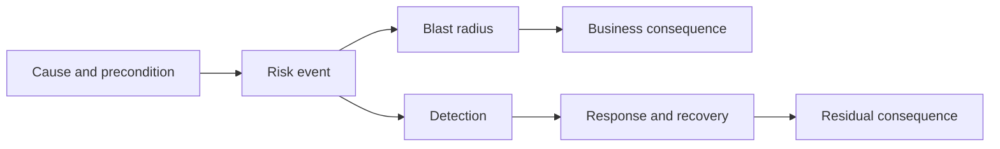
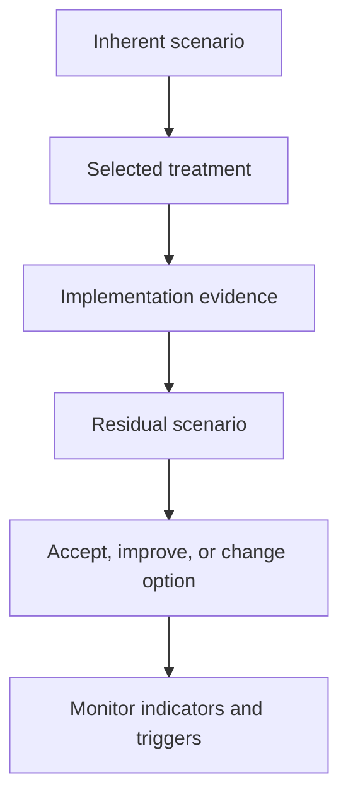

Risk analysis determines which uncertainty warrants evidence, prevention, contingency, transfer, acceptance, or a different architecture option. The goal is not a mathematically impressive score; it is a transparent decision about exposure and action.

## Architectural Question

**How material and urgent is each risk, which treatment changes exposure most effectively, and who owns the response and residual decision?**

## Analysis Dimensions

| Dimension | Discovery question |
|---|---|
| Likelihood | Under which conditions could the event occur? |
| Impact | Which outcomes, actors, controls, money, safety, or reputation? |
| Exposure | How much scope, duration, or concentration is at risk? |
| Proximity | When could it materialize and when must action begin? |
| Detectability | How quickly and reliably would it be known? |
| Recoverability | Can harm be contained, reversed, or reconciled? |
| Velocity | How quickly does impact grow after onset? |
| Uncertainty | How credible are likelihood, impact, and control claims? |

Use calibrated qualitative bands or ranges with anchored definitions. Add narrative for threshold risks.

## Scenario Analysis

Analyze a plausible chain, not an isolated component failure:

Include dependency and control failure, human action, data state, operational response, and duration. Use incident evidence, tests, models, expert judgment, and external commitments.

## Treatment Options

- **Avoid:** remove the exposure or choose another option.
- **Reduce likelihood:** improve prevention, isolation, compatibility, or readiness.
- **Reduce impact:** limit blast radius, degrade safely, protect state, improve recovery.
- **Validate:** reduce uncertainty with an experiment or evidence.
- **Transfer/share:** allocate selected financial or operational responsibility contractually.
- **Accept:** tolerate residual exposure under authorized conditions.

Treatment may combine options. Insurance or supplier contracts do not transfer all operational, regulatory, or reputational consequence.

## Treatment Record

Capture target risk reduction, action, owner, dependencies, cost/effort range, due date, leading measure, verification, contingency, resulting residual risk, acceptance authority, and trigger. Prefer actions that change the risk mechanism over generic “monitoring.”

## Ownership

Distinguish:

- risk owner accountable for managing exposure;
- action owner responsible for treatment delivery;
- control/service owner responsible for ongoing operation;
- acceptance authority empowered to tolerate residual consequence;
- review body that challenges evidence and aggregation.

Ownership follows outcome accountability, not authorship of the register.

## Residual Risk

Reassess after treatment using evidence. Do not mechanically subtract control percentages. State remaining scenario, scope, assumptions, monitoring, recovery, and conditions. Secondary risk introduced by the treatment—such as concentration, complexity, or transition—must also be recorded.

## Risk-Based Experiments

For uncertain high-consequence risks, define hypothesis, representative condition, threshold, owner, timebox, result, limitations, and decision impact. Examples include recovery exercise, load saturation, provider failover, data migration rehearsal, schema compatibility, threat simulation, or operational game day.

## Portfolio Prioritization

Review risks by shared dependency, control, supplier, data domain, migration wave, and acceptance authority. Several medium risks can combine into unacceptable concentration. Consider action-resource bottlenecks and last responsible date, not only severity.

## Treatment Economics

Compare expected consequence and strategic option value with treatment, delay, operational burden, and opportunity cost. Some treatment is mandatory regardless of simple expected value. Use ranges and sensitivity rather than invented precision.

## Common Failure Modes

- Multiplying arbitrary likelihood and impact numbers as if objective.
- Ignoring proximity, velocity, detectability, and recovery.
- Choosing monitoring without a response decision.
- Assigning treatment but no verification.
- Treating transfer as removal of accountability.
- Accepting inherent risk without reassessing controls.
- Prioritizing individual entries while missing concentration.

## Completion Criteria

Material risks have scenario-based analysis, evidence, calibrated exposure, proximity, uncertainty, and accountable ownership. Treatments are specific, verified, economically understood, and linked to residual risk. Acceptance and portfolio aggregation expose concentration, secondary risk, and reassessment triggers.

## Interview Questions

### How do you quantify architecture risk?

Use available incident, reliability, financial, threat, workload, and dependency data; calibrated ranges; scenario models; and sensitivity. Preserve uncertainty instead of manufacturing exact probability.

### What is a good mitigation action?

It changes a specific cause, likelihood, blast radius, detection, or recovery mechanism; has an owner and deadline; and produces evidence that residual exposure changed.

### When should risk be accepted?

When authorized owners understand the residual scenario, alternatives, obligations, compensating conditions, duration, monitoring, and consequence, and acceptance is preferable to further treatment within the decision context.

## Summary

Risk analysis turns uncertainty into proportionate action. Scenario evidence, explicit ownership, verified treatment, residual exposure, and portfolio concentration support defensible architecture choices.

Next, govern [architecture reviews and reassessment triggers](/architecture-discovery/risk/architecture-reviews-and-reassessment-triggers/).
