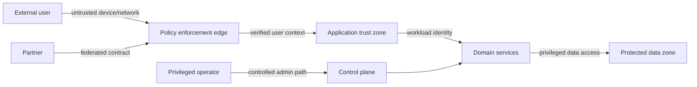
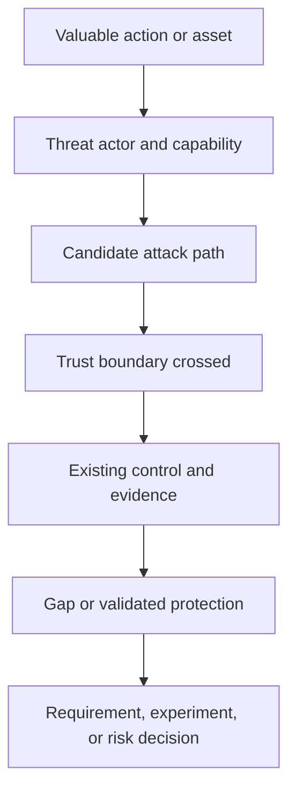

Security discovery identifies what must be protected, from whom, across which trust transitions, under which operating conditions, and with what evidence. Its purpose is not to paste a standard control list onto a design. It establishes context for threat modeling, security requirements, architecture options, and accountable risk decisions.

## Architectural Question

**Which assets and outcomes are exposed to which actors and abuse paths, and where must trust be established, constrained, monitored, and recoverable?**

## Begin with Business Harm

Assets include more than databases:

- money, inventory, safety, and service continuity;
- identity, credentials, permissions, secrets, and keys;
- personal, confidential, regulated, and decision data;
- business rules, models, code, configurations, and supply chain;
- audit evidence, logs, backups, and recovery mechanisms;
- reputation, contractual commitments, and legal standing.

For each asset capture owner, value, confidentiality/integrity/availability consequence, critical business actions, lifecycle, exposure, and recovery need. Prioritize scenarios by plausible harm rather than asset count.

## Actor and Identity Discovery

Include customers, employees, administrators, operators, developers, partners, auditors, services, devices, workloads, scheduled jobs, vendors, and attackers. Record identity authority, assurance, lifecycle, delegation, privilege, context, and accountability.

Distinguish authentication from authorization and trust. A valid identity may still be unauthorized; an authorized workload may be compromised; a trusted network location does not prove user intent.

| Actor concern | Discovery questions |
|---|---|
| Identity proofing | How was identity established and at what assurance? |
| Authentication | Which credentials and factors apply under which risk? |
| Authorization | Which resource/action/context decision is made where? |
| Delegation | Can one actor act for another, with what scope and expiry? |
| Privilege | Which high-impact actions exist and how are they controlled? |
| Lifecycle | Join, change, leave, disable, recover, review? |
| Evidence | Can consequential action be attributed and explained? |

## Trust Boundaries

A trust boundary exists where identity, ownership, control, assurance, policy, tenancy, network, execution, or data-handling assumptions change. Boundaries may occur between browser and service, partner and enterprise, tenant and platform, workload and control plane, region and provider, build and runtime, or human operator and production.

For every crossing capture initiator, identity, credentials/tokens, data, protocol, authorization, validation, encryption, replay protection, logging, rate/abuse controls, failure, and owner.

## Trust Assumption Record

Do not draw a boundary without stating its assumptions:

| Field | Example question |
|---|---|
| Parties and owner | Who controls each side? |
| Assurance | What evidence establishes identity and integrity? |
| Permitted actions | What may cross, in which direction and context? |
| Data handling | What classification and purpose constraints apply? |
| Enforcement | Where is policy evaluated and fail-safe behavior defined? |
| Monitoring | What misuse, drift, or compromise is detected? |
| Lifecycle | How are credentials, contracts, and access revoked? |
| Failure/recovery | What happens when trust cannot be established? |

## Abuse-Case Discovery

Start from valuable business actions and ask how an actor could misuse them:

- submit, repeat, alter, or reorder a transaction;
- impersonate another actor or abuse delegated authority;
- bypass an approval or segregation-of-duties rule;
- enumerate, exfiltrate, poison, or destroy data;
- exploit stale privilege, recovery, support, or admin workflows;
- exhaust capacity or prevent recovery;
- compromise a dependency, artifact, secret, or observability path;
- conceal action by altering evidence or time.

Write observable scenarios with precondition, attacker capability, path, asset, consequence, current control, detection, response, and evidence confidence.

## Current Control Evidence

Policy statements do not prove operation. Examine configurations, access reviews, telemetry, incident records, penetration findings, recovery exercises, key rotation, account lifecycle, build attestations, and control tests. Record scope, date, owner, exceptions, and confidence.

Separate preventive, detective, responsive, and recovery controls. Defense in depth requires independent failure assumptions, not several controls sharing the same identity provider or administrator.

## Discovery Procedure

1. Select critical outcomes, assets, business actions, and data classes.
2. Enumerate human, machine, external, privileged, and adversarial actors.
3. Map trust boundaries and identity/authorization context across interactions.
4. Walk normal, administrative, support, failure, and recovery journeys.
5. Generate abuse cases and plausible attack paths.
6. Inspect current controls and operational evidence.
7. Identify assumptions, gaps, experiments, requirements, and owners.
8. Validate with business, engineering, identity, security operations, privacy, risk, and dependency owners.

## Common Failure Modes

- Starting with a generic control checklist rather than assets and harm.
- Treating internal networks or managed cloud services as trusted by default.
- Modeling customers but omitting administrators and workloads.
- Showing boundaries without identity and policy semantics.
- Assessing normal use but not support, recovery, and emergency paths.
- Treating documented configuration as operating evidence.
- Producing threats without owners, requirements, or decisions.

## Completion Criteria

Critical assets, actions, actors, identities, privileges, trust boundaries, and abuse cases are explicit. Current controls have evidence and ownership. Material assumptions and gaps connect to measurable requirements, threat-model work, experiments, compliance obligations, operational response, and risk decisions.

## Interview Questions

### What is a trust boundary?

It is a transition where security assumptions or authority change. Crossing it requires explicit identity, validation, authorization, protection, monitoring, failure, and ownership semantics.

### How is security discovery different from threat modeling?

Discovery establishes scope, assets, actors, architecture context, evidence, obligations, and unresolved assumptions. Threat modeling systematically analyzes threats and mitigations using that context; findings feed back into discovery and decisions.

### Is zero trust a product or network architecture?

No. It is a strategy of explicit verification, least privilege, assumed breach, and continuous evaluation across identities, devices, workloads, and resources. Product choices implement parts of it.

## Summary

Security discovery grounds protection in business harm, identity, trust transitions, abuse paths, and operating evidence. It supplies the context needed for security architecture without prematurely prescribing controls.

Next, map [compliance obligations to controls and evidence](/architecture-discovery/security/compliance-controls-and-evidence/).
