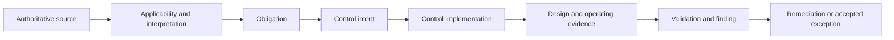
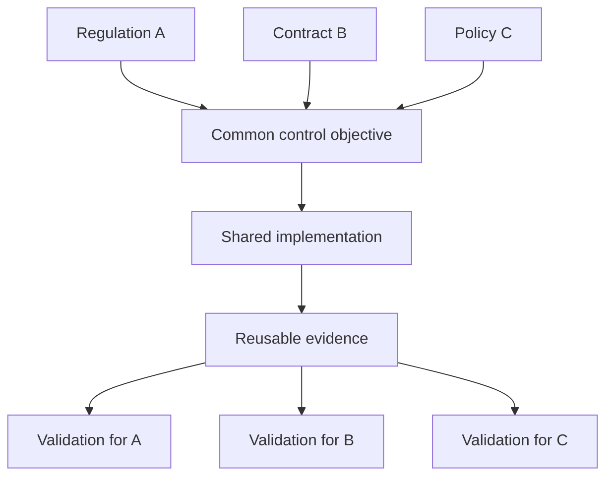

Compliance discovery translates applicable law, regulation, contract, policy, and standard into scoped architecture obligations and verifiable controls. Compliance is not proof of security, and a control statement is not proof of operation. The work must preserve source interpretation, accountability, evidence quality, exceptions, and change.

## Architectural Question

**Which obligations apply to which outcomes, data, actors, systems, locations, and lifecycle stages, and what evidence demonstrates that their control intent operates effectively?**

## Establish Applicability

For every candidate obligation identify jurisdiction, entity, product, customer, data class, processing purpose, geography, provider, lifecycle stage, effective date, and interpretation owner. Record exclusions and rationale.

Do not copy an entire framework into project scope. A precise applicability decision is more useful than hundreds of unqualified requirements.

## Obligation-to-Evidence Chain

Maintain traceability to the source version and accountable legal, compliance, privacy, security, or risk interpretation. Architects should not invent legal conclusions.

## Control Record

| Field | Required content |
|---|---|
| Obligation | Source, clause, version, interpretation, scope |
| Control objective | Risk or outcome the control addresses |
| Owner/operator | Accountable owner and performing role |
| Implementation | Process, technology, people, provider responsibilities |
| Frequency/trigger | Continuous, event-driven, periodic, lifecycle stage |
| Evidence | Artifact, telemetry, sample, retention, access |
| Validation | Method, population, sampling, result, reviewer |
| Exceptions | Gap, impact, compensating control, authority, expiry |
| Dependencies | Shared service, vendor, data, identity, process |

Differentiate control design—whether a control could meet intent—from operating effectiveness—whether it consistently did so over the required period.

## Shared Responsibility

Cloud and SaaS attestations cover only stated provider scope. Map responsibility among enterprise, provider, platform team, product team, operations, and users. Identify inherited controls, required customer configuration, evidence access, incident notification, subcontractors, location, exit, and residual gaps.

A provider certification is input evidence, not automatic acceptance for the enterprise use case.

## Evidence Quality

Evidence should be relevant, complete, accurate, timely, reproducible, protected, and attributable. Strong evidence examples include configuration snapshots with scope, immutable audit events, access-review decisions, tested restore results, policy enforcement telemetry, change approvals, and incident response exercises.

Weak evidence includes screenshots without scope or date, self-attestation without corroboration, policy documents without operation, and samples that exclude high-risk populations.

## Evidence Automation

Automate evidence collection where sources and semantics are reliable:

- configuration and policy conformance;
- identity and privileged-access lifecycle;
- encryption/key rotation state;
- vulnerability and patch posture;
- deployment and approval provenance;
- logging, retention, backup, and recovery checks;
- data-location and asset-inventory reconciliation.

Automation needs control owner validation, exception handling, data-quality monitoring, access protection, retention, and auditability. A green dashboard is not sufficient if coverage is unknown.

## Control Rationalization

Several frameworks may express similar intent. Map them to a common control objective while retaining source traceability. This reduces duplicate implementation and testing without erasing differences in scope, evidence period, frequency, or authority.

## Privacy and Records Considerations

Discover purpose limitation, minimization, consent or other basis, transparency, subject rights, automated decisions, sharing, residency, retention, legal hold, deletion, breach notification, and processor/subprocessor obligations. Connect these to data flow and lifecycle—not a detached privacy section.

## Compliance Change

Track source version, interpretation date, affected controls, architecture decisions, systems, evidence, owners, and implementation deadlines. Define monitoring and impact-review triggers for regulation, provider scope, product, geography, data use, and architecture change.

## Common Failure Modes

- Treating all framework clauses as equally applicable.
- Confusing certification or policy with control effectiveness.
- Omitting customer duties in shared responsibility.
- Gathering screenshots manually without coverage or provenance.
- Consolidating controls while losing source-specific differences.
- Designing evidence only shortly before audit.
- Allowing findings and exceptions without owners or expiry.

## Completion Criteria

Applicable obligations and exclusions are interpreted by accountable authorities. Material obligations map to control intent, implementation, owners, dependencies, evidence, and validation. Shared responsibility and privacy/data lifecycle are explicit. Evidence quality and automation coverage are known. Exceptions and regulatory-change triggers are governed.

## Interview Questions

### Does compliance mean a system is secure?

No. Compliance demonstrates specified obligations and control evidence for a defined scope and period. Threats, misconfiguration, design weaknesses, or new attack paths may remain.

### What is continuous compliance?

It is ongoing evaluation of control-relevant state and evidence with accountable response. It does not eliminate periodic judgment, sampling, interpretation, or audit.

### How should architects handle legal ambiguity?

Record the question, facts, alternatives, impact, and owner; obtain an authoritative interpretation; trace the resulting obligation and assumptions; and define reassessment triggers. Do not make silent legal assumptions.

## Summary

Compliance discovery converts authoritative obligations into scoped, owned, testable control evidence. It creates an evidence lifecycle that supports design, operation, audit, and change rather than a one-time checklist.

Next, govern [security gaps and risk acceptance](/architecture-discovery/security/security-gaps-and-risk-acceptance/).
