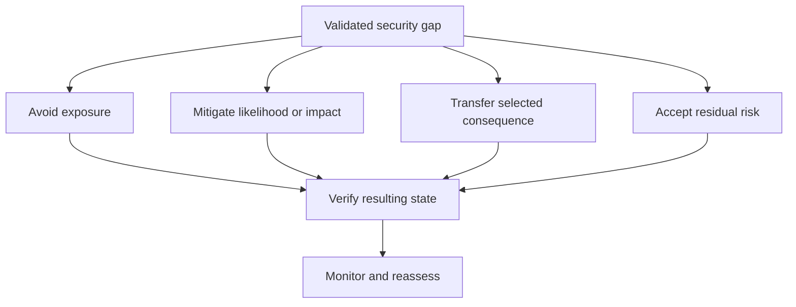
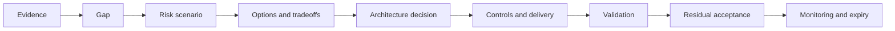

A security gap is the difference between required protection and evidenced current capability. Risk acceptance is an accountable business decision to tolerate defined residual exposure for a bounded scope and time. It is not a way to close findings administratively or transfer accountability to a security team.

## Architectural Question

**Which security exposures remain after current and proposed controls, who can accept their business consequences, and under what conditions must the decision expire or be revisited?**

## Distinguish the Records

| Record | Meaning |
|---|---|
| Finding | Evidence-backed observation about current state |
| Vulnerability | Weakness that may be exploited |
| Threat scenario | Actor, path, asset, and consequence |
| Control gap | Required control intent not adequately met |
| Risk | Uncertainty and consequence affecting an objective |
| Issue | Harm or noncompliance already occurring |
| Exception | Authorized deviation from a requirement or policy |
| Acceptance | Decision to tolerate residual risk within conditions |

These may link to one another but should not be collapsed into a vague “risk item.”

## Security Gap Record

Capture:

- stable identifier and concise statement;
- affected assets, outcomes, actors, environments, tenants, and data;
- threat path and preconditions;
- current controls and evidence limitations;
- likelihood/exploitability and impact rationale;
- legal, contractual, compliance, and customer implications;
- treatment alternatives and estimated effort;
- compensating controls and their independence;
- residual exposure and monitoring;
- owner, acceptance authority, expiry, and review triggers.

Avoid unsupported numerical precision. Use calibrated ranges and explain evidence, uncertainty, and assumptions.

## Treatment Options

Transfer through insurance or contract rarely transfers regulatory accountability, reputation, or operational impact. Remediation may combine treatments.

## Compensating Controls

A compensating control must address the same control objective with sufficient effectiveness. Record coverage, independence, operating burden, evidence, failure mode, duration, and owner. Extra logging is not a meaningful compensation if nobody monitors or responds.

Test whether the compensating control shares the same identity, administrator, platform, or failure path as the missing control. Apparent layers may fail together.

## Acceptance Authority

The acceptor must own the affected business outcome and have delegated authority for the exposure. Security explains threat and control evidence; architecture explains options and systemic consequence; operations explains detectability and recovery; legal/compliance interpret obligations. None should silently accept business risk alone.

Acceptance cannot override a prohibition or mandatory obligation without an authorized interpretation and process.

## Time-Bounded Decision

Every acceptance should include:

| Field | Decision |
|---|---|
| Scope | Exact assets, environments, users, data, and operations |
| Residual risk | Scenario and consequence after compensating controls |
| Rationale | Why acceptance is preferable now |
| Conditions | Required controls, monitoring, restrictions, communication |
| Owner/authority | Remediation owner and accountable acceptor |
| Dates | Effective, expiry, milestones, next review |
| Triggers | Incident, exploit, exposure, volume, architecture or obligation change |
| Evidence | Approval, control operation, remediation and closure proof |

Expiry should trigger decision, not automatic renewal.

## Prioritization

Consider business consequence, exploitability, exposure, attacker capability, control strength, data and privilege, blast radius, detectability, recoverability, concentration, obligation, and proximity. Add uncertainty: a poorly understood internet-facing privileged path may deserve urgent investigation even before risk is precisely scored.

Use consistent organizational criteria, but allow scenario detail to drive treatment. Severity labels without path and consequence are not enough.

## Link to Architecture Decisions

If a selected option depends on a temporary exception, the architecture decision must show that condition and reassessment trigger. Otherwise the exception becomes an invisible permanent dependency.

## Closure Evidence

Closing a gap requires evidence that treatment is implemented and effective for the stated scope. Examples include configuration plus runtime verification, abuse-case test, access review, recovery exercise, penetration retest, telemetry, or removal of exposure. Ticket status alone is not proof.

When risk is accepted rather than remediated, “closed” should not hide ongoing exposure. Use a state that remains reportable and monitored until expiry or elimination.

## Portfolio View

Aggregate risks by shared dependency, asset, attack path, control, domain, and accepting authority. Individually tolerable exceptions can combine into concentration risk. Monitor acceptance age, repeated renewals, overdue actions, untested compensations, and exposure growth.

## Common Failure Modes

- Equating scanner severity with business risk.
- Closing a finding because a remediation ticket exists.
- Letting a project or security analyst accept enterprise consequence.
- Using vague scope such as “the platform.”
- Adding compensating controls without evidence or operational owner.
- Renewing exceptions automatically.
- Hiding accepted risks from architecture and operational views.
- Ignoring cumulative and common-mode exposure.

## Completion Criteria

Material gaps have evidence, scoped threat scenarios, treatment alternatives, accountable owners, residual exposure, and validation. Accepted risks have authorized, time-bound decisions, independent compensating controls, monitoring, expiry, and triggers. Portfolio review exposes concentration and repeat acceptance.

## Interview Questions

### Who should accept security risk?

The accountable business authority that owns the affected outcome and has delegated risk authority, informed by security, architecture, operations, legal/compliance, and evidence owners.

### What makes a compensating control credible?

It addresses the same objective, covers the defined scope, operates independently enough to reduce exposure, has an owner and service level, and produces evidence that is tested and monitored.

### When is a security finding closed?

When evidence demonstrates the weakness or exposure is removed or reduced to the agreed state. If residual risk is accepted, it remains visible and governed until expiry or elimination.

## Summary

Security risk governance connects evidence and threat scenarios to architecture options, treatment, accountable acceptance, and operational monitoring. Time-bounded decisions prevent unresolved exposure from disappearing into project administration.

Continue with [technology estate and lifecycle assessment](/architecture-discovery/technology/).

For implementation patterns, use the separate [Security Architecture handbook](/security-architecture/) rather than treating discovery findings as a control design.
