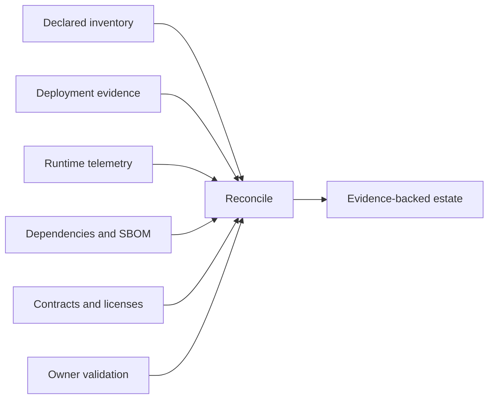
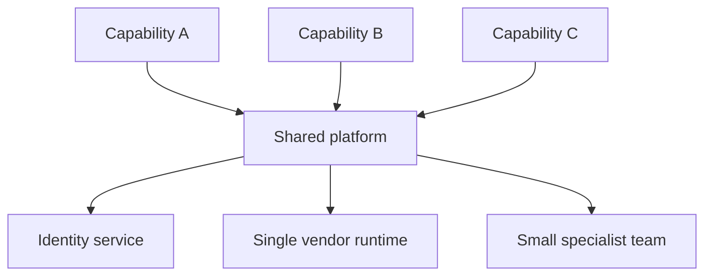

Technology estate discovery establishes what the enterprise actually runs, who owns it, what it supports, how it changes, and where lifecycle, concentration, licensing, skills, or operational risk constrains architecture. It is not a product inventory exercise: technology facts matter only when connected to business capabilities, workloads, dependencies, and outcomes.

## Architectural Question

**Which technology assets and services enable the scoped outcomes, what condition and lifecycle are they in, and which risks or opportunities materially affect architecture options?**

## Assessment Scope

Include application runtimes, databases, messaging, integration platforms, identity, networks, hosting, cloud services, data platforms, observability, delivery toolchains, developer platforms, security controls, devices, commercial products, SaaS, and critical open-source components.

Also include the operating ecosystem: teams, skills, vendor support, contracts, licenses, environments, deployment mechanisms, recovery, and shared services. A supported product can still be operationally obsolete if nobody can safely change or restore it.

## Estate Record

| Field | Discovery content |
|---|---|
| Identity | Product/service, version, deployment, environment |
| Purpose | Capability, workload, users, data, critical scenarios |
| Ownership | Product, technical, operational, commercial, data/security |
| Lifecycle | Vendor/community status, internal status, dates, roadmap |
| Runtime | Hosting, topology, scale, dependencies, resilience |
| Change | Source, build, deploy, test, release, rollback, frequency |
| Operations | SLOs, incidents, telemetry, runbook, recovery evidence |
| Economics | License, support, consumption, exit and migration cost |
| Skills | Capacity, concentration, learning, recruitment, supportability |
| Evidence | Source, observation date, confidence, contradictions |

## Evidence Sources

Reconcile CMDB and asset inventories with deployment manifests, cloud APIs, package/SBOM data, license systems, network/runtime telemetry, code repositories, support contracts, incident records, vulnerability and patch systems, recovery exercises, and team validation.

No single source is authoritative for every fact. Record observed-versus-declared differences and last verified date.

## Lifecycle Dimensions

Vendor end-of-support is only one dimension:

- security maintenance and vulnerability response;
- compatibility with operating systems, runtimes, protocols, and hardware;
- vendor/community health and roadmap;
- internal adoption and approved-use status;
- skills availability and key-person concentration;
- license and commercial sustainability;
- recoverability and installation media/configuration availability;
- data portability, contract exit, and replacement feasibility.

Use states such as strategic, supported, tolerated, restricted, migrate, and retire with explicit definitions, owner, target date, and exceptions.

## Workload Fit

Assess technology against actual workload characteristics: transaction mix, concurrency, state, volume, growth, latency, consistency, availability, recovery, data sensitivity, tenancy, geography, integration, change rate, and operational model. Avoid rating a product “good” or “legacy” without context.

One platform may be appropriate for a stable runoff workload and unsuitable for a rapidly changing regulated channel.

## Dependency and Concentration Risk

Map shared runtimes, databases, libraries, identity, network, build systems, vendor services, support teams, and licenses. Look for common-mode failure, synchronized end-of-life, single-provider exposure, rare skills, one maintenance window, and one recovery path.

Shared technology may reduce cost while increasing blast radius and coordination. Record both.

## Estate Health Assessment

Use evidence-based dimensions rather than a single red/amber/green score:

| Dimension | Example evidence |
|---|---|
| Supportability | Support dates, patch lag, known incompatibility |
| Reliability | Incidents, failure rates, restore exercises |
| Changeability | Lead time, deployment frequency, regression scope |
| Security | Exposure, dependency freshness, control evidence |
| Operability | Telemetry, runbooks, intervention safety, ownership |
| Economics | Unit cost, license trajectory, support burden |
| Portability | Data export, standards, proprietary dependency, exit test |
| Skills | Coverage, on-call depth, recruitment, training lead time |

Record evidence, confidence, consequence, and affected outcomes. Weighted composite scores can support triage but must not hide decisive risks.

## Discovery Procedure

1. Bound the estate by capabilities, workloads, and critical journeys.
2. Collect declared, deployed, runtime, commercial, and human evidence.
3. Normalize identities and versions while preserving environment differences.
4. Link assets to owners, data, dependencies, outcomes, and lifecycle.
5. Assess workload fit, operations, security, change, cost, skills, and exit.
6. Validate critical records with accountable owners.
7. Identify constraints, debt, experiments, risks, and transition dependencies.
8. Establish freshness and ongoing ownership for the resulting inventory.

## Common Failure Modes

- Treating the CMDB as complete without runtime reconciliation.
- Calling technology legacy based on age alone.
- Capturing versions but not workload, ownership, or recovery.
- Ignoring SaaS, open-source, build, and control-plane dependencies.
- Assessing vendor support without internal skills or exit feasibility.
- Using one health score that conceals critical dimensions.
- Producing a snapshot without freshness and lifecycle governance.

## Completion Criteria

Scoped technology records are reconciled, owned, and linked to capabilities, workloads, data, dependencies, operations, economics, skills, and lifecycle. Critical risks and confidence are explicit. The evidence supports constraint, debt, modernization, and option-evaluation decisions without preselecting a target product.

## Interview Questions

### When is technology legacy?

When its fit, supportability, changeability, risk, economics, skills, or recovery materially impede outcomes—not merely because it is old. Context and evidence determine disposition.

### How do you discover shadow technology?

Compare declared inventory with cloud billing, network/runtime telemetry, identity and access logs, repositories, package data, procurement, expense, SaaS discovery, and team interviews.

### What is the most important lifecycle date?

There is no single date. External support, security fixes, contract renewal, internal skills, compatibility, regulatory deadlines, and migration lead time together determine the last responsible decision point.

## Summary

Estate discovery connects technology facts to workload and enterprise consequence. Verified lifecycle, ownership, dependency, operational, economic, and skills evidence defines the real option space.

Next, distinguish [standards, constraints, and technical debt](/architecture-discovery/technology/standards-constraints-and-technical-debt/).
