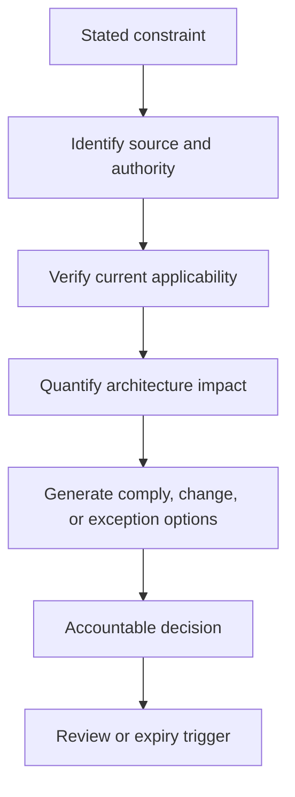
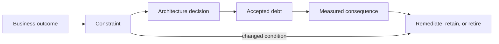

Architecture discovery must distinguish what is truly fixed from what is merely familiar. Standards can reduce risk and cognitive load; constraints bound the option space; preferences guide only when evidence is otherwise equal; technical debt describes a consequence of past tradeoffs that now affects outcomes. Conflating these categories produces false inevitability.

## Architectural Question

**Which technology conditions are mandatory, governed, preferred, temporary, or debt—and what evidence, authority, consequence, exception, and expiry applies to each?**

## Classification

| Category | Meaning | Required evidence |
|---|---|---|
| Obligation | Legal, regulatory, contractual, or safety requirement | Source, interpretation, scope, authority |
| Constraint | Condition the engagement cannot currently change | Owner, rationale, consequence, review trigger |
| Standard | Governed approved approach for repeatable needs | Decision body, version, applicability, exception path |
| Paved road | Supported implementation that reduces delivery burden | Service commitments, adoption evidence, fit boundaries |
| Preference | Default or experience-based choice, not mandatory | Rationale and decision owner |
| Assumption | Unverified belief used temporarily | Confidence, validation owner, due date |
| Debt | Past decision whose current consequences impede outcomes | Evidence, impact, remediation options |

Never label “must use” without identifying the source and authority.

## Standards Discovery

For each applicable standard capture purpose, scope, version, owner, effective date, supported implementation, evidence, known limitations, exception process, and review cycle. Determine whether it governs an outcome, interface, data, security control, platform, language, or operational practice.

A standard may be valid yet unsuitable for a workload outside its design envelope. The exception process should compare risk and total enterprise cost rather than reward local novelty or enforce conformity blindly.

## Constraint Challenge

Use this sequence:

Examples include fixed regulatory deadlines, approved cloud regions, existing commercial commitments, data-residency requirements, limited migration windows, hardware interfaces, and skills capacity. A historical choice or sponsor preference is not automatically a constraint.

## Technical Debt as Outcome Impact

Record debt as a specific condition and consequence:

> Shared database coupling requires coordinated release and regression testing across six teams, increasing median change lead time from two to nine days and contributing to four production incidents in twelve months.

This is more actionable than “monolith technical debt.”

Debt categories may include architecture coupling, code quality, data inconsistency, test gaps, platform obsolescence, security exposure, operational toil, documentation/knowledge concentration, build/release fragility, and deferred migration.

## Debt Record

| Field | Content |
|---|---|
| Condition | Observable design or implementation state |
| Origin | Decision and context, if known |
| Consequence | Outcome, risk, cost, delay, incident, control impact |
| Scope | Capabilities, teams, data, environments, dependencies |
| Evidence | Measures, incidents, change records, assessment |
| Trajectory | Stable, compounding, triggered by growth/change |
| Options | Retain, contain, remediate, replace, retire |
| Economics | Cost of delay, remediation, transition, residual risk |
| Owner/trigger | Accountable decision and reassessment condition |

Do not assume all debt should be repaid. Some is a rational, bounded tradeoff. The decision depends on future change and risk.

## Constraint and Debt Interaction

Constraints can cause or preserve debt. For example, a license commitment may defer platform exit, while a deadline may justify a temporary adapter. Record the expected removal date, containment, and architectural seam. Temporary solutions without explicit expiry become invisible permanent architecture.

## Exception Governance

A standard exception includes scope, alternative, evidence, additional risk/cost, compensating controls, owner, approval authority, duration, operational support, and reintegration or retirement plan. Exceptions should be discoverable when standards or platforms change.

Measure recurring exceptions. Many similar exceptions may indicate a missing paved road or an outdated standard.

## Common Failure Modes

- Treating stakeholder preference as an immutable constraint.
- Applying a standard without checking workload fit or current version.
- Using “technical debt” for any disliked technology.
- Calculating debt only as remediation effort, not consequence and trajectory.
- Prioritizing debt by engineer frustration without business evidence.
- Granting exceptions without support and expiry.
- Creating standards that mandate products but provide no usable paved road.

## Completion Criteria

Obligations, constraints, standards, paved roads, preferences, assumptions, and debt are explicitly classified and evidenced. Each material item has source, scope, authority, consequence, owner, exception or treatment path, and review trigger. Debt connects to measurable outcomes and future change rather than aesthetics.

## Interview Questions

### How do you challenge a technology constraint diplomatically?

Ask for source, purpose, authority, current applicability, consequence, and exception path. Present evidence and options while respecting the business or control intent; do not simply reject it as technical conservatism.

### How should technical debt be prioritized?

By expected impact on outcomes, risk, change, cost, operations, and strategic options, adjusted for trajectory and remediation economics. Pair repayment with the change that benefits from it when possible.

### Are standards always beneficial?

No. Good standards reduce repeated decision cost and improve interoperability/support. Poor or stale standards can impose mismatch and systemic concentration. Govern applicability, evidence, exceptions, and evolution.

## Summary

Clear classification prevents accidental policy from narrowing architecture. Evidence-backed standards, constraints, exceptions, and debt create a governable option space and reveal where enterprise investment has the highest value.

Next, convert discovery into [technology decision inputs](/architecture-discovery/technology/technology-decision-inputs/).
