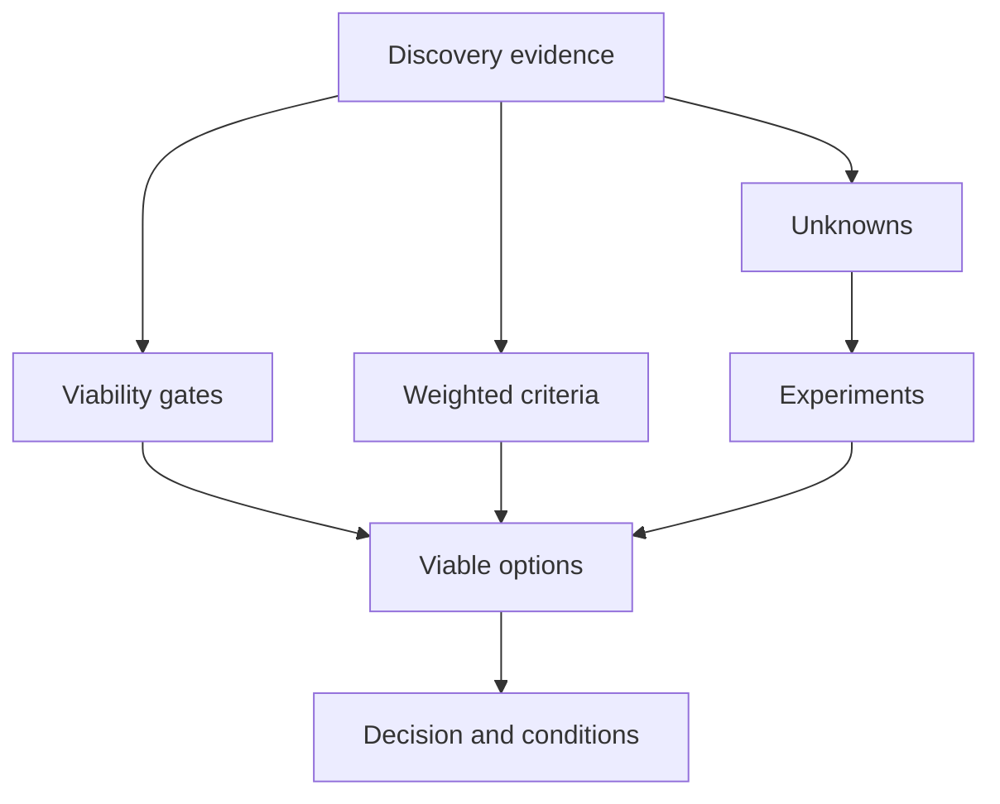

Technology selection should be the result of discovery, not its starting point. Decision inputs translate outcomes, workload, quality scenarios, constraints, operational readiness, transition, cost, skills, and uncertainty into criteria that can distinguish viable options and support an architecture decision record.

## Architectural Question

**Which evidenced characteristics and tradeoffs must a technology option satisfy, and what experiments are needed before a defensible decision can be made?**

## Decision Context

Write a concise context before listing products:

- business outcome and decision deadline;
- capability and workload boundary;
- current state and reason change is needed;
- governing quality scenarios;
- obligations, constraints, standards, and dependencies;
- transition/coexistence requirements;
- decision authority, affected owners, and review triggers.

This prevents feature matrices from replacing architecture reasoning.

## Workload Profile

Capture dimensions that materially differentiate options:

| Dimension | Examples |
|---|---|
| Interaction | Transactional, analytical, streaming, batch, search, workflow |
| State | Size, growth, access pattern, consistency, history, locality |
| Demand | Rate, concurrency, burst, seasonality, tenant skew |
| Response | Percentiles, deadline, completion, backlog recovery |
| Resilience | Failure scope, degradation, RTO/RPO, reconciliation |
| Security/data | Classification, isolation, residency, audit, key ownership |
| Change | Schema/rule volatility, release frequency, compatibility |
| Operations | Support model, telemetry, automation, intervention, skills |
| Economics | Unit, fixed, transfer, license, support, exit, transition cost |

Use ranges and distributions. A single projected peak or storage total hides shape and uncertainty.

## Criteria Hierarchy

Separate gates from weighted criteria:

- **viability gates:** mandatory obligation, non-negotiable workload or recovery need;
- **governing criteria:** highest-consequence quality and transition scenarios;
- **differentiators:** valuable characteristics that rank viable options;
- **preferences:** low-consequence defaults used only after stronger criteria;
- **unknowns:** hypotheses requiring evidence.

Assign weights with accountable stakeholders before scoring vendors. Document rationale and sensitivity: if a small weight change reverses the result, the recommendation is fragile.

## Evaluate Architecture, Not Product Alone

An option includes topology, operating model, integrations, security, data migration, support, and transition—not just a product. A managed service and self-operated product may use similar technology but produce different ownership, control, cost, and recovery outcomes.

Evaluate ecosystem maturity, roadmap, interoperability, portability, concentration, community/vendor health, skills, support boundaries, and exit. Verify contractual claims against representative behavior.

## Architecture Experiments

Use experiments for material uncertainty, not ceremonial proofs of concept. Each experiment defines:

1. hypothesis linked to a decision criterion;
2. representative workload, data, environment, failure, or change;
3. measurable success and failure thresholds;
4. options/configurations compared;
5. owner, timebox, cost, and evidence capture;
6. limitations and extrapolation risk;
7. decision impact and follow-up.

Examples include saturation and recovery, cross-region data behavior, schema evolution, tenant isolation, restore/reconciliation, operator diagnosis, representative change effort, portability, and cost at demand shapes.

## Total Cost and Value

Include license/subscription, infrastructure, transfer, storage, environments, operations, support, security controls, observability, specialist skills, delivery friction, migration, coexistence, compliance, downtime, and exit. Relate cost to workload and outcome using ranges and sensitivity.

Cheapest unit price can produce highest total cost if it requires bespoke operations or creates change coordination.

## Operational Readiness

Assess service ownership, on-call coverage, telemetry, incident path, safe configuration, backup/restore, capacity, patching, vulnerability response, vendor escalation, release/rollback, quotas, limits, and failure drills. If the operating model is not ready, include enabling work and residual risk in the option.

## Transition and Reversibility

Evaluate data movement, compatibility, coexistence, cutover, in-flight work, rollback, dual operation, training, support, contract timing, and decommission. Distinguish reversible experiments from high-lock-in commitments. Favor staged evidence where uncertainty is high.

## ADR-Ready Output

The resulting decision record should contain context, decision drivers, viable options, evidence, experiments, tradeoffs, decision, consequences, dissent, assumptions, implementation conditions, residual risks, owners, and reassessment triggers. Link rather than copy full discovery artifacts.

## Common Failure Modes

- Starting with a preferred product and reverse-engineering criteria.
- Scoring features unrelated to workload and outcomes.
- Mixing mandatory gates with weighted preferences.
- Comparing products without operating and transition architecture.
- Running a happy-path demo rather than a decision experiment.
- Ignoring cost sensitivity, skills, recovery, and exit.
- Treating a score as the decision without narrative tradeoffs.
- Recording no conditions or triggers after selection.

## Completion Criteria

The decision context, workload, gates, weighted criteria, options, experiments, operations, economics, transition, and uncertainty are evidenced and owned. Scoring is sensitivity-tested and does not conceal decisive tradeoffs. The output is sufficient for an accountable ADR and identifies validation conditions and reassessment triggers.

## Interview Questions

### How do you avoid biased technology selection?

Agree outcome-based gates and criteria before evaluating named products, include diverse owners, expose assumptions, test important unknowns, use sensitivity analysis, and record dissent and conflicts of interest.

### What makes a good proof of concept?

It tests a consequential uncertain criterion under representative conditions with predefined thresholds and produces reusable decision evidence. A guided vendor demo is not a proof.

### When should a technology decision be revisited?

When workload, obligation, cost, provider roadmap, architecture, operating readiness, incident evidence, or a stated assumption crosses an agreed trigger—not simply on an arbitrary calendar.

## Summary

Technology decisions become defensible when products are evaluated as operating and transition architectures against evidenced workload, quality, constraint, cost, and risk. Experiments reduce uncertainty; ADRs preserve accountable tradeoffs.

Continue with [service ownership and the operating model](/architecture-discovery/operational/).
