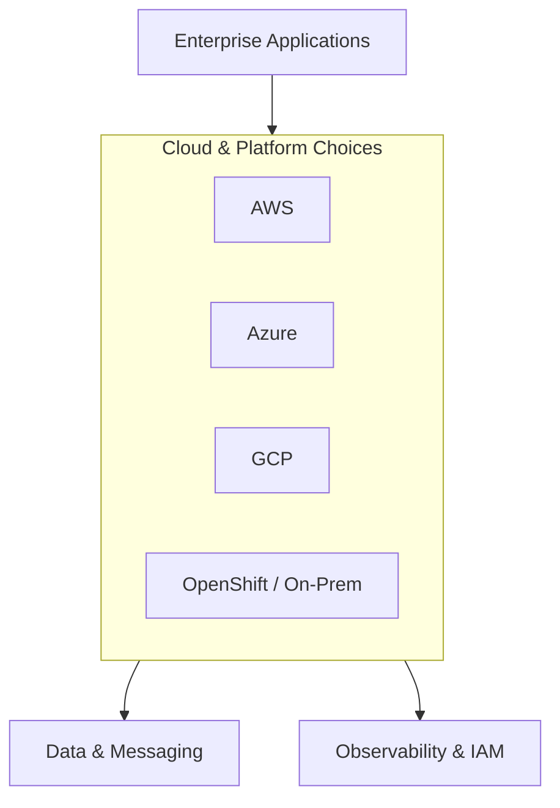

## 1. Executive Summary

This page maps **equivalent services** across AWS, Azure, GCP, and OpenShift/on-prem Kubernetes so architects can compare apples-to-apples during migration or multi-cloud planning.

---

## 2. What Problem It Solves

Teams evaluating cloud or hybrid strategy need a **capability matrix** — not marketing feature lists. Procurement, security, and engineering must align on the same service names and gaps.

---

## 3. Where It Fits in Architecture

---

## 4. When to Choose Each Provider

| Provider | Strong when |
| :--- | :--- |
| **AWS** | Broadest service catalog, startup/SaaS ecosystem, mature IAM patterns |
| **Azure** | Microsoft stack, hybrid Active Directory, enterprise EA agreements |
| **GCP** | Data analytics, ML/BigQuery, GKE-centric cloud-native |
| **OpenShift / On-Prem** | Data residency, regulated industries, existing DC investment |

---

## 5. When Not to Choose

- Multi-cloud **by default** without operational justification
- Lift-and-shift without mapping **managed service equivalents**
- Ignoring **egress and support** cost in TCO models

---

## 6. Service Equivalence Table


| Capability | AWS | Azure | GCP | OpenShift / On-Prem |
| :--- | :--- | :--- | :--- | :--- |
| **Compute** | EC2 | Virtual Machines | Compute Engine | Worker Nodes |
| **Kubernetes** | EKS | AKS | GKE | OpenShift |
| **Serverless** | Lambda | Azure Functions | Cloud Functions | Knative / OpenShift Serverless |
| **Queue** | SQS | Service Bus | Pub/Sub | Kafka / RabbitMQ |
| **Streaming** | Kinesis / MSK | Event Hubs | Pub/Sub / Dataflow | Kafka / Pulsar |
| **Object Storage** | S3 | Blob Storage | Cloud Storage | MinIO / Ceph |
| **Relational DB** | RDS / Aurora | Azure SQL | Cloud SQL | PostgreSQL Operator |
| **NoSQL DB** | DynamoDB | Cosmos DB | Firestore / Bigtable | Cassandra / Mongo Operator |
| **Cache** | ElastiCache | Azure Cache for Redis | Memorystore | Redis Operator |
| **API Gateway** | API Gateway | API Management | Apigee / Gateway | Kong / NGINX |
| **Monitoring** | CloudWatch | Azure Monitor | Cloud Monitoring | Prometheus / Grafana |
| **Logging** | CloudWatch Logs | Log Analytics | Cloud Logging | ELK / Loki |
| **IAM** | IAM | Entra ID + RBAC | Cloud IAM | OAuth / LDAP + RBAC |
| **Secrets** | Secrets Manager | Key Vault | Secret Manager | Vault |
| **DevOps / CI-CD** | CodePipeline | Azure DevOps | Cloud Build | Tekton / Jenkins / GitLab |


---

## 7. Trade-offs

| Dimension | Multi-cloud hope | Reality |
| :--- | :--- | :--- |
| **Portability** | Write once, run anywhere | Lowest-common-denominator features |
| **Skills** | Hire generic cloud engineers | Deep provider knowledge still required |
| **Cost** | Arbitrage pricing | Egress and dual tooling eat savings |

---

## 8. Real-World Example

**BFSI hybrid:** Core ledger on-prem OpenShift for residency; customer-facing mobile API on AWS with RDS and SQS; analytics landing in Snowflake fed from both via CDC.

---

## 9. Failure Scenarios

- **Shadow IT** accounts without central IAM
- **Unpatched** self-managed data plane on-prem
- **Network** hairpinning — on-prem apps calling cloud APIs without ExpressRoute/Direct Connect planning

---

## 10. Best Practices

1. Start from **capabilities**, not provider logos.
2. Maintain a **living equivalence sheet** updated quarterly.
3. Standardize **observability and IAM** patterns early.

---

## 11. Interview Answer


"I map each business capability to managed services on the target cloud — compute, data, messaging, identity, and observability. I explain why AWS/Azure/GCP/OpenShift fits the regulatory, skill, and commercial constraints. I avoid 'multi-cloud by default' unless exit strategy or residency truly requires it."


---

## 12. Related Topics

- [AWS](/cloud-handbook/aws-cloud/) · [Azure](/cloud-handbook/azure-cloud/) · [GCP](/cloud-handbook/gcp-cloud/) · [OpenShift / On-Prem](/cloud-handbook/openshift-on-prem-kubernetes/)
- [EKS vs AKS vs GKE](/interview-prep/eks-vs-aks-vs-gke/)
