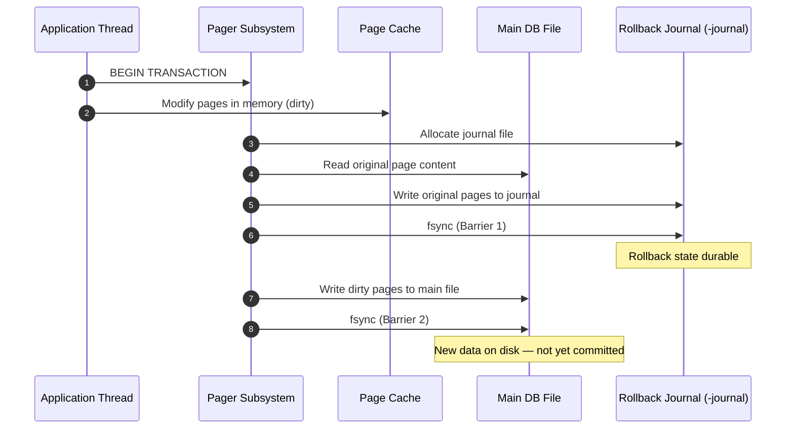
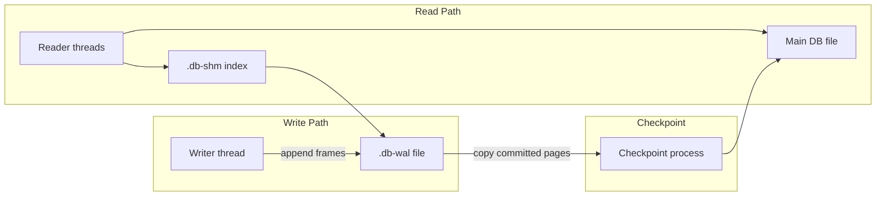

To guarantee strict ACID compliance without a client-server coordinator, an embedded database engine must handle persistent storage anomalies directly. If a power loss or crash occurs midway through a write transaction, the physical data blocks on disk risk entering a corrupted, partially updated state. SQLite prevents this degradation by executing an explicit Two-Phase Commit protocol enforced through persistent journaling subsystems.

---

## The Mission

The core mission of the storage subsystem is to ensure **Atomicity** (all operations succeed or the entire transaction rolls back completely) and **Durability** (committed states survive uncoordinated system failures). Because a single relational update might modify multiple disjointed 4 KB page blocks scattered across a large database file, the storage architecture cannot update physical tables in place without risking a partial write failure. If the system crashes mid-write, the database structure breaks.

To eliminate this vulnerability, the system decouples memory modifications from physical file persistence by using a dedicated synchronization sequence managed across strict storage boundaries.

| ACID Property | Journaling Mechanism |
| :--- | :--- |
| **Atomicity** | Rollback journal restores original pages; WAL replay discards incomplete frames |
| **Consistency** | B-Tree invariants enforced before commit boundary is crossed |
| **Isolation** | `SHARED` / `RESERVED` / `EXCLUSIVE` lock progression during journal writes |
| **Durability** | `fsync` barriers before journal invalidation (commit marker) |

---

## Commit Phase 1: Roll-back Journal Generation

When a mutation transaction begins, the engine coordinates modifications inside an in-memory page cache. Pages that are altered in RAM but not yet persisted to the main database file are marked as **dirty pages**. Before a single dirty page block can be written back to the primary database file on disk, the Pager subsystem must execute **Phase 1** of the commit protocol:

1. **Journal Allocation:** The Pager issues platform-specific system calls through the Virtual File System (VFS) to allocate a temporary asynchronous ledger file called the **rollback journal** (appended as `-journal` to the database file path).
2. **Original State Ingestion:** The Pager extracts the original, unmodified binary content of the target data pages directly from the database file and writes them into the rollback journal.
3. **The First Barrier (`fsync`):** The engine executes a strict kernel flush command (`fsync`). The execution thread blocks until the OS file controller confirms that the original page states are fully persisted onto physical storage. This guarantees that if a crash occurs immediately afterward, the engine can read the journal to roll the database back to its exact pre-transaction state.
4. **Main Page Modification:** With the rollback state secured on disk, the Pager flushes the modified dirty pages from memory into the primary database file. The engine executes a second `fsync` call to ensure the updated blocks are written to physical storage. At this exact boundary, the primary file contains the new data, but the transaction is still uncommitted.



---

## Commit Phase 2: The Finalization Purge

Once all modified memory pages are securely written to the primary database file, the system transitions immediately into **Phase 2** to finalize the transaction status:

1. **Journal Invalidation:** The Pager invalidates the temporary rollback journal. This is achieved by truncating the file length to zero, zeroing out the structural binary header bits, or issuing a system file delete command through the VFS.
2. **Atomic Ingestion State:** The invalidation of the journal file acts as the atomic commit boundary. If a crash occurs *prior* to this purge, the crash recovery mechanism handles the active journal file on boot and rolls back the changes; if a crash occurs a fraction of a second *after* invalidation, the transaction state is recognized as fully committed because the primary file contains the data and no rollback record exists.
3. **Lock Release Loop:** The engine clears all high-level shared or exclusive storage locks, allowing concurrent application threads to access the updated data structure.

```text
  Phase 1                          Phase 2 (Commit Boundary)
  ───────                          ─────────────────────────
  [ -journal ]                     [ -journal ]  ◄── deleted / truncated
  contains originals               (absent = COMMITTED)
         │                                  │
         ▼                                  ▼
  [ Main DB ]                      [ Main DB ]
  pages updated                    pages updated + locks released
```

The commit marker is not a separate flag inside the database header — it is the **absence** of a valid rollback journal. This design avoids an extra `fsync` on a metadata page while still providing a crash-recoverable atomic boundary.

---

## Write-Ahead Logging (WAL) Mode

While standard rollback journaling ensures safety, it limits concurrency: an exclusive write lock blocks all active application readers, and active readers completely stall incoming writers. To scale performance under heavy traffic, production engines use **Write-Ahead Logging (WAL) mode**.

```text
 Traditional Roll-Back Journaling Mode (Exclusive Access)
 ┌────────────────────────────────────────────────────────┐
 │  [ Memory Cache ] ──► [ Main DB File ] (Locked)        │
 │         └─── Writes Original State ──► [ -journal ]  │
 └────────────────────────────────────────────────────────┘

 Advanced Write-Ahead Logging (WAL) Mode (Concurrent Access)
 ┌────────────────────────────────────────────────────────┐
 │  [ Concurrent Readers ] ──► Reads from [ Main DB File ]│
 │  [ Parallel Writer ]    ──► Appends to [ .db-wal ]   │
 └────────────────────────────────────────────────────────┘
```

WAL mode completely inverts the persistent write pathway:

- **The Log Append Path:** The primary database file remains untouched during mutations. The Pager appends new transaction data blocks sequentially to a separate, persistent WAL file (`.db-wal`).
- **Concurrent Execution:** Because the primary database file is never modified directly during active writes, concurrent threads can continue reading old page versions from the main database file without blocking. Concurrently, the single writing thread appends new transaction blocks to the end of the WAL file. Readers use a shared-memory index file (`.db-shm`) to seamlessly map reads across the main file and active WAL segments.
- **The Checkpoint Phase:** As the WAL file expands (typically reaching a 1,000-page threshold), a background **checkpoint** operation copies committed WAL frames back into the main database file and truncates the log. Checkpoints run automatically or on `PRAGMA wal_checkpoint`, balancing read amplification against WAL file growth.



| Mode | Write Path | Reader Concurrency | Commit Marker |
| :--- | :--- | :--- | :--- |
| **Rollback journal** | Overwrite main DB pages | Blocked during writes | Journal file deleted |
| **WAL** | Append to `.db-wal` | Readers use DB + WAL index | WAL frame header + `fsync` |

WAL trades slightly more complex crash recovery for dramatically better read/write overlap — the pattern PostgreSQL, MySQL InnoDB, and SQLite all converge on at scale. The Pager and VFS layers described in [SQLite Architecture Teardown](/database-handbook/sqlite-architecture-teardown/) remain the enforcement boundary; only the durability pathway changes.
