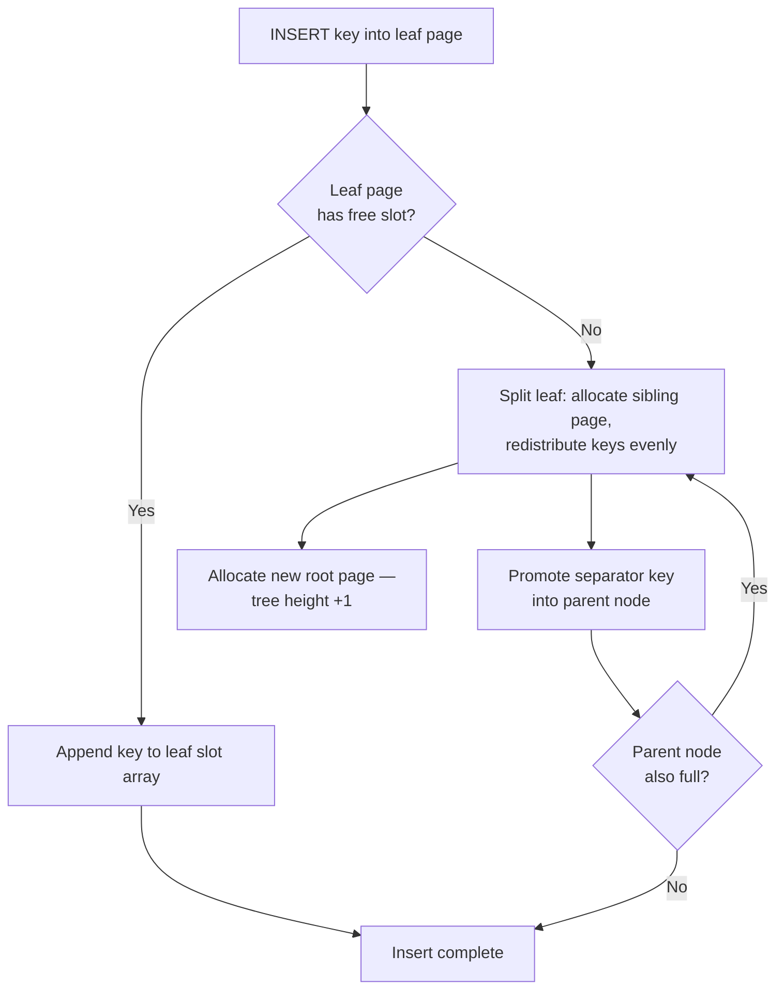

Relational database systems handle immense datasets while guaranteeing predictable, low-latency performance. At the heart of this capability lies the B+ Tree storage architecture. To understand why modern storage engines rely on this structural layout, we must look beneath software abstractions and examine physical hardware constraints.

---

## The Disk Platter Reality

Traditional hard disk drives (HDDs) and sequential block storage systems operate on a mechanical foundation. Physical disks are organized into concentric rings called **tracks**, which are subdivided into pie-shaped sections called **sectors**. The intersection of a track and a sector defines a **file block** (typically 4 KB or 16 KB in production filesystems).

```text
   Physical Disk Platter Geometry
         ┌───────────────┐
      .──────── Track ─────────.
   .─╱         ▒▒▒▒▒▒▒         ╲─.
 .╱            ▒▒▒▒▒▒▒            ╲.
╱     ┌──────── Sector ───────┐    ╲
│      │                       │     │
│       ▼                       ▼      │
│ ░░░░░░░░░░░░░░░░░░░░░░░░░░░░░░░░░░░  │ ◄─ Storage Block (e.g., 4KB)
│       ▲                       ▲      │
│      │                       │     │
╲     └───────────────────────┘    ╱
 ╲                               ╱
  `─.                         .─'
     `─.───────────────────.─'
```

When a software application requests a single byte from block storage, the hardware controller cannot retrieve that isolated byte directly. Instead, the storage subsystem swaps the **entire fixed-size page block** containing that byte from disk into system RAM.

Mechanical storage operations introduce significant latency bottlenecks. A standard CPU cache or RAM lookup registers speeds in nanoseconds, but a random disk block search requiring mechanical head movement (seek time) and platter rotation latency takes milliseconds — a performance gap of up to five orders of magnitude. Therefore, the metric that defines storage engine efficiency is the minimization of random physical disk page swaps.

If a database utilized a standard Binary Search Tree (BST) to store 1 million records, traversing the index hierarchy from root to leaf would require $\log_2(1{,}000{,}000) \approx 20$ sequential node evaluations. Because a BST allocates nodes dynamically across memory blocks, each jump down the tree risks triggering a separate, uncoordinated disk block read, culminating in up to 20 random I/O operations per search. Under production traffic workloads, this approach causes immediate I/O starvation.

---

## Why B+ Trees Rule Relational Storage

The B+ Tree layout optimizes performance under these block storage constraints by focusing on a massive **fan-out factor** ($M$). An $M$-way balanced tree allows each internal storage node to maintain up to $M$ child pointers and $M-1$ search keys.

By packing multiple search keys and child page pointers into a single node, the engine aligns the size of an individual index node exactly with the database's native storage block profile (e.g., an 8 KB page cell).

$$Node\_Size = (M - 1) \cdot Key\_Size + M \cdot Pointer\_Size \le Page\_Size$$

For a production storage engine using an order of $M = 100$ (where each node points to a maximum of 100 children), the structural index depth drops drastically compared to binary trees. The maximum disk page accesses required to look up a distinct entry within a 1-million-row dataset is calculated as:

$$\text{Disk Accesses} = \log_{100}(1{,}000{,}000) = 3 \text{ physical I/O operations}$$

```text
            High Fan-Out B+ Tree Hierarchy (M=100)
                       ┌───────────────┐
                       │   [ Root ]    │
                       └───────┬───────┘
             ┌─────────────────┼─────────────────┐  (Level 1: 100 Nodes)
             ▼                 ▼                 ▼
      ┌─────────────┐   ┌─────────────┐   ┌─────────────┐
      │  Internal   │   │  Internal   │   │  Internal   │
      └──────┬──────┘   └──────┬──────┘   └──────┬──────┘
   ┌─────────┴───┐         ┌───┴─────────┐         ┌───┴─────────┐ (Level 2: Leaf Nodes)
   ▼             ▼         ▼             ▼         ▼             ▼
┌─────────┐   ┌─────────┐   ┌─────────┐   ┌─────────┐   ┌─────────┐   ┌─────────┐
│ [Leaf]  ├──►│ [Leaf]  ├──►│ [Leaf]  ├──►│ [Leaf]  ├──►│ [Leaf]  ├──►│ [Leaf]  │
└─────────┘   └─────────┘   └─────────┘   └─────────┘   └─────────┘   └─────────┘
└───  Linked List Sequence Array for O(1) Horizontal Range Traversal  ───┘
```

This structural compression ensures that the root node and primary branching pages remain permanently cached inside the database engine's in-memory buffer pool. As a result, finding any specific record often requires only a single physical disk read to fetch the final target leaf page — with upper-level pages served entirely from RAM.

---

## Node Splitting & Structural Growth

Unlike standard binary trees that grow downward at the leaf boundary level, a B+ Tree grows **upward toward the root node**. The insertion workflow enforces structural balance through a systematic node-splitting protocol:

1. **Leaf Insertion Evaluation:** The storage engine performs a coordinate search to locate the correct target leaf page block. If the page cell has available space, the entry appends sequentially into the slot array.
2. **Page Split Boundary:** If the page block is completely full, the engine allocates a new, empty sibling page block. The keys are split evenly: the first $\lceil M/2 \rceil$ elements remain in the original block, while the remaining keys copy over to the new sibling block.
3. **Parent Promotion Loop:** The lowest key value of the new sibling page block is promoted upward into the parent branching node to act as a separation marker. If the parent node is also full, this split-and-promote routine cascades recursively up the tree hierarchy. If the root node splits, a new top-level root node page is created, increasing the overall height of the tree structure uniformly by exactly one level.

This structural balance guarantees that every leaf node remains at the exact same depth level, preventing index degradation and ensuring stable access times regardless of high write volume.



---

## B-Tree vs. B+ Tree

Modern relational database systems use the B+ Tree variant rather than the standard B-Tree design due to specific architectural differences:

| Architectural Metric | Classic B-Tree | Advanced B+ Tree |
| :--- | :--- | :--- |
| **Data Payload Placement** | Interspersed across all levels (Root, Branching, and Leaf nodes). | Stored **exclusively** within the bottom Leaf node pages. |
| **Branching Node Structure** | Contains Key, Data Payload Reference, and Child Pointer. | Contains **only** separating Keys and Page Pointers. |
| **Horizontal Node Links** | None. Nodes are completely isolated across structural branches. | Leaf pages link sequentially via a **doubly linked list**. |
| **Range Scan Efficiency** | Highly inefficient. Requires multiple parent-child vertical tree traversals. | Optimized performance. Traverses horizontally across leaf pointers. |

Because branching nodes in a B+ Tree store only separating keys and child pointers — without inline data payloads — they achieve a significantly higher fan-out density per page block. This layout allows a single 8 KB internal page to reference thousands of downstream pages, lowering the overall tree height.

Additionally, the doubly linked leaf array unlocks the power of **sequential range scans**. For a query such as `WHERE age BETWEEN 20 AND 30`, the engine performs a single vertical descent to locate the starting leaf page, then walks horizontally across sibling leaf pointers to collect matching rows. The cost scales with the size of the result set ($O(k)$) rather than re-traversing the tree for every qualifying key ($O(k \cdot \log N)$). This is why PostgreSQL, MySQL InnoDB, and SQL Server all standardize on B+ Tree indexes for primary and secondary key structures.

| Operation | B-Tree | B+ Tree |
| :--- | :--- | :--- |
| Point lookup | $O(\log N)$ | $O(\log N)$ — shallower tree due to higher fan-out |
| Range scan | $O(k \cdot \log N)$ — repeated vertical descent | $O(\log N + k)$ — one descent + horizontal leaf walk |
| Leaf duplication | Keys may appear in internal nodes | Keys appear once in leaves; internal nodes hold copies as separators only |

The B+ Tree is not merely a theoretical optimization — it is the structural contract between the query planner and the storage layer that makes predictable, page-aligned I/O the default behavior for relational workloads at scale.
