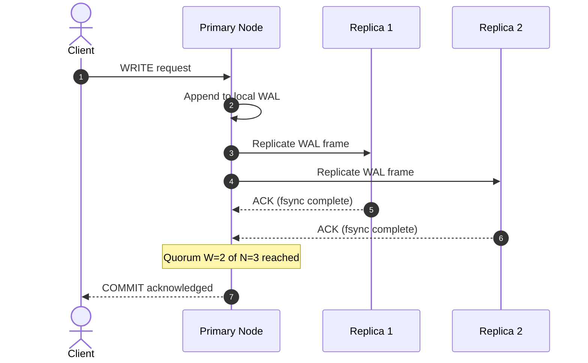
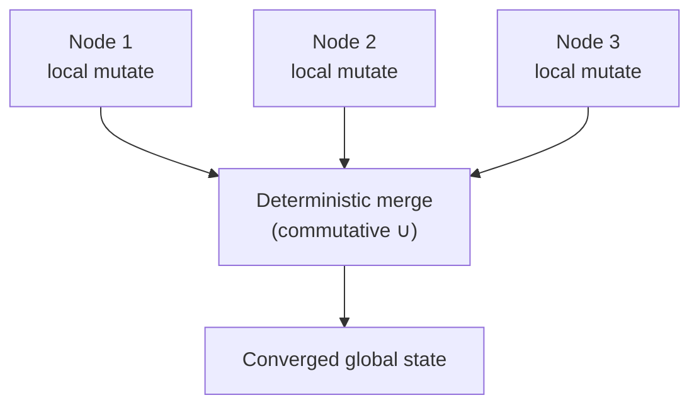

When a database architecture scales beyond a single physical machine into a distributed cluster, replicating data across independent nodes introduces coordination challenges. In a distributed system, network partitions are an inevitable physical reality. Managing data consistency across a cluster requires evaluating replication protocols under the unified frameworks of the **CAP** and **PACELC** theorems.

---

## Strong Consistency Frameworks

**Strong consistency** guarantees linearizability across a distributed cluster. When an application client commits a write mutation to any node, all subsequent read requests across the cluster must instantly view that update or its newer variants.

Achieving this standard requires synchronous replication protocols. The primary coordinator node intercepts incoming writes but blocks the client response until it coordinates the transaction state across a defined network quorum:

$$W + R > N$$

Here, $W$ represents the write quorum, $R$ is the read quorum, and $N$ represents the global replication factor. If a cluster utilizes a replication factor of $N=3$, a standard quorum configuration enforces $W=2$ and $R=2$.

The primary node streams the [Write-Ahead Log (WAL)](/database-handbook/acid-two-phase-commit-journaling/) payload to the replica ring and waits. Only after a strict majority of nodes write the log to disk and return network acknowledgements does the primary commit locally and acknowledge the client.



Strong consistency ensures complete data correctness, but it introduces distinct performance trade-offs:

- **Latency Inflation:** Write operations are bound by network latency, as they require round-trip acknowledgements across a majority of nodes before completing.
- **Availability Degradation:** If a network partition isolates a majority of nodes, the remaining minority cluster cannot achieve quorum validation. Under the CAP theorem, the system selects a strict **CP (Consistency / Partition Tolerance)** posture, rejecting incoming application writes to prevent data divergence.

| Quorum Config ($N=3$) | $W$ | $R$ | Write Latency | Read Guarantee |
| :--- | :---: | :---: | :--- | :--- |
| **Strong** | 2 | 2 | 2× network RTT | Always latest committed |
| **Eventual (async)** | 1 | 1 | Local only | May read stale replica |

---

## Eventually Consistent Networks

To unlock massive global scale and ensure high write availability, architectures shift toward **eventual consistency**. Under this model, the primary node writes payloads directly to its local storage tier, returns an immediate success acknowledgement to the client, and offloads replication to asynchronous out-of-band communication streams.

Eventually consistent networks frequently deploy a decentralized, shared-nothing **multi-primary or active-active topology**. Because nodes accept localized mutations independently without network consensus blocks, the architecture prioritizes an **AP (Availability / Partition Tolerance)** optimization profile under the CAP theorem.

The core trade-offs of this availability focus are mapped by the **PACELC Theorem**:

$$\text{IF there is a Partition (P)} \to \text{Choose Availability (A) over Consistency (C);}$$

$$\text{ELSE (E)} \to \text{Choose Latency (L) over Consistency (C).}$$

Even during normal, partition-free operations ($E$), an eventually consistent system trades away immediate consistency ($C$) to deliver single-digit millisecond latency ($L$). Replicas synchronize state asynchronously using an anti-entropy **gossip protocol**, where nodes continuously exchange localized generation logs to reconcile data differences.

This model introduces a transient consistency window where lagging nodes return stale data to read queries. The system runs the risk of read anomalies (e.g., breaking monotonic read guarantees) until the asynchronous replication logs catch up across all cluster instances.

```text
  CAP vs PACELC Decision Space
  ┌─────────────────────────────────────────────────────┐
  │  CAP (during partition)                             │
  │    CP ──► Strong quorum (PostgreSQL sync replica)   │
  │    AP ──► Multi-primary + conflict resolution       │
  ├─────────────────────────────────────────────────────┤
  │  PACELC (normal operation, no partition)            │
  │    EL ──► Async replication, low write latency       │
  │    EC ──► Sync quorum even when network is healthy   │
  └─────────────────────────────────────────────────────┘
```

| System Profile | CAP Posture | PACELC (no partition) | Example |
| :--- | :--- | :--- | :--- |
| **Banking ledger** | CP | EC | PostgreSQL synchronous streaming replica |
| **Social feed counter** | AP | EL | Cassandra, DynamoDB |
| **Session store** | AP | EL + CRDT | Riak, Redis Cluster with conflict merge |

The [Transactional Outbox](/database-handbook/transactional-outbox-pattern/) pattern bridges these worlds at the application layer — atomic local writes with eventual broker delivery — without requiring cluster-wide 2PC.

---

## Conflict Resolution Pipelines

Because decentralized multi-primary nodes accept concurrent updates to identical keys independently during network partitions, data divergence is inevitable. Reconciling these differences requires robust conflict resolution pipelines applied at the storage tier:

### 1. Last-Write-Wins (LWW)

This approach resolves conflicts by using absolute wall-clock timestamps to determine the final state. When two mutations clash, the update with the highest timestamp is preserved, and the older variant is discarded.

- **Operational Risk:** LWW is highly vulnerable to clock drift anomalies across server hardware. If microsecond clocks drift out of sync across nodes, younger mutations can be silently dropped by older nodes, leading to quiet data loss.

```sql
-- LWW merge at read time (conceptual)
SELECT value, updated_at
FROM item_state
WHERE item_id = 'sku-42'
ORDER BY updated_at DESC
LIMIT 1;  -- highest timestamp wins
```

### 2. Conflict-Free Replicated Data Types (CRDTs)

Advanced distributed data stores replace destructive timestamp overrides with mathematically resilient **CRDT structures**. These data structures are engineered to merge divergent states deterministically without requiring centralized network coordination.

```text
   State-Based Convergent CRDT (PN-Counter)
Node 1 State (Local Mutate)        Node 2 State (Local Mutate)
┌───────────────────────────┐      ┌───────────────────────────┐
│ P:[A:3, B:1] │ N:[A:0, B:0]│      │ P:[A:1, B:1] │ N:[A:0, B:2]│
└─────────────┬─────────────┘      └─────────────┬─────────────┘
              │                                  │
              └──────────────► [ MERGE ] ◄───────┘
                              │
                              ▼ (Enforces Commutative Least Upper Bound)
                    ┌───────────────────────────┐
                    │ P:[A:3, B:1] │ N:[A:0, B:2]│ ──► Final Value = 2
                    └───────────────────────────┘
```

CRDT operations rely on formal mathematical fields that enforce three core algebraic properties during state merges:

- **Commutativity:** The order in which concurrent updates are applied does not affect the final merged result ($A \sqcup B = B \sqcup A$).
- **Associativity:** Grouping operations does not alter the final state resolution ($(A \sqcup B) \sqcup C = A \sqcup (B \sqcup C)$).
- **Idempotency:** Replaying duplicate or out-of-order replication messages does not corrupt the data state ($A \sqcup A = A$).

Common implementations include:

| CRDT Type | Use Case | Merge Rule |
| :--- | :--- | :--- |
| **G-Counter** (Grow-Only Counter) | Page views, metrics | Per-node increment vectors; merge = element-wise max |
| **PN-Counter** (Positive-Negative) | Inventory adjustments | G-Counter pair (increments + decrements); value = sum(P) − sum(N) |
| **OR-Set** (Observed-Remove Set) | Tag collections, cart items | Add wins over remove using unique op IDs |
| **LWW-Register** | Single-value fields with metadata | Timestamped value; highest timestamp wins (clock-aware) |
| **RGA / YATA** | Collaborative text editing | Character-level ordering with tombstones |



### LWW vs CRDT Selection

| Criterion | Last-Write-Wins | CRDT |
| :--- | :--- | :--- |
| **Clock dependency** | High — NTP drift causes data loss | Low — merge is order-independent |
| **Implementation complexity** | Trivial | Moderate — type-specific merge logic |
| **Suitable data** | Single-writer fields, low contention | Counters, sets, collaborative state |
| **Replay safety** | Duplicate delivery may flip winner | Idempotent merge — safe at-least-once |

At-least-once delivery from the outbox relay pairs naturally with CRDT merges — the same idempotency principle as the [Transactional Inbox](/database-handbook/transactional-inbox-pattern/), but at the data structure layer instead of the row constraint layer.

Distributed consistency choices directly affect downstream systems — including [AI vector indexing](/database-handbook/ai-vector-indexing-rag-scaling/), where replica lag and partition behavior determine whether semantic search results reflect the latest embedded documents.
