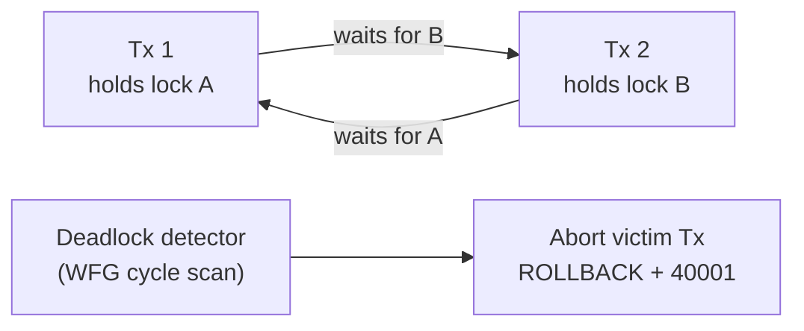

To preserve relational data integrity during concurrent updates, storage engines rely on pessimistic coordination frameworks. While [MVCC](/database-handbook/local-concurrency-mvcc/) shifts read pathways away from explicit locks, write operations must still acquire exclusive row-level locks to prevent competing transactions from corrupting data. Managing these simultaneous lock allocations requires analyzing lock graphs, handling deadlocks, and minimizing low-level memory latch contention.

---

## The Cyclic Dependency Trap

A **deadlock** represents a structural impasse where two or more independent transactions are indefinitely blocked because each holds a lock that the other requires to proceed. This anomaly stems from an uncoordinated resource mutation sequence across application workflows.

Consider two concurrent threads executing modifications across two account rows:

- **Transaction 1 Sequence:** Acquires an exclusive row lock on `Account_A`. It executes business mutations and attempts to acquire a secondary lock on `Account_B`.
- **Transaction 2 Sequence:** Concurrently acquires an exclusive row lock on `Account_B`. It completes its step and attempts to acquire a secondary lock on `Account_A`.

Neither transaction can proceed, and neither will release its held lock. The application worker threads stall, remaining blocked inside the connection pool indefinitely unless the database engine intervenes.

```text
  Classic Two-Resource Deadlock
  Tx 1: LOCK(A) ──► wait LOCK(B) ──X── blocked by Tx 2
  Tx 2: LOCK(B) ──► wait LOCK(A) ──X── blocked by Tx 1
```

| Prevention Rule | Mechanism |
| :--- | :--- |
| **Lock ordering** | Always acquire locks in canonical order (A before B) |
| **Timeout** | `lock_timeout` aborts waiter after N ms |
| **Engine detection** | WFG cycle detection → victim abort |

---

## Directed Wait-For Graph (WFG) Analysis

Database engines resolve lock impasses by running a background diagnostic cycle managed by the database lock controller. The engine constructs and maintains an internal memory map known as a **Directed Wait-For Graph (WFG)**.

- **Nodes ($V$):** Represent active transactions currently executing inside the engine.
- **Edges ($E$):** Represent directed blocking dependencies, where a directed edge $T_1 \to T_2$ indicates that Transaction $T_1$ is waiting for Transaction $T_2$ to release a required lock.

```text
       Directed Wait-For Graph Cycle Example
            ┌──────────────────┐
            │  Transaction 1   │
            └────────┬─────────┘
                     │
                     ▼ (Waiting for Lock on Account_B)
            ┌──────────────────┐
            │  Transaction 2   │
            └────────┬─────────┘
                     │
                     ▼ (Waiting for Lock on Account_A)
            [ Cycle Detected! ] ──► System Aborts Victim Transaction
```

The deadlock detector runs on a continuous background loop (configured by parameters like `deadlock_timeout` in PostgreSQL, default 1 second). It applies cycle-detection algorithms (e.g., depth-first search or Tarjan's strongly connected components algorithm) to identify recursive loops within the graph matrix.

Once a cycle is identified, the engine selects a **victim transaction** to break the dependency loop. The selection criteria balance operational cost metrics, prioritizing the abort of transactions with minimal CPU runtime, the lowest number of accumulated WAL bytes, or fewer modified rows. The engine forcibly aborts the victim transaction, rolls back its partial WAL entries to free its locks, and throws a transaction failure exception (`SQLSTATE 40001`) to signal the application tier to trigger a retry sequence.

```sql
-- PostgreSQL: inspect recent deadlocks in server logs
-- SET log_lock_waits = on;
-- SET deadlock_timeout = '1s';

-- Application retry on serialization / deadlock failure
-- SQLSTATE 40001 = serialization_failure (includes deadlock victim)
```



This is the same `SQLSTATE 40001` retry path used by [Serializable Snapshot Isolation](/database-handbook/local-concurrency-mvcc/) — application code should treat deadlock and serialization failures with a unified retry handler.

---

## System Latch Contention

While transactional locks manage logical, high-level row safety across transactions, the database engine must also coordinate short-lived, low-level concurrency access to internal memory structures, index pages, and buffer pool slots. This memory-tier coordination is managed via **latches** (read/write barriers or mutexes).

Under high-concurrency write conditions targeting narrow B+ Tree index paths (e.g., massive simultaneous inserts into an auto-incrementing primary key page), a **latch storm** can occur. Multiple threads concurrently attempt to modify the same physical page block in RAM. To preserve memory integrity, each thread must acquire an exclusive write latch on that specific page pointer.

If the modification forces an [index page split](/database-handbook/b-plus-tree-storage-mechanics/), the thread must scale its latches upward to lock parent branching nodes as well. This latch contention stalls the CPU execution pipeline, driving system CPU utilization toward 100% due to thread context-switching and spinlock loops, which severely degrades overall transaction processing speeds.

| Lock Type | Scope | Duration | Visible to App? |
| :--- | :--- | :--- | :--- |
| **Transaction lock** | Logical row / table | Entire transaction | Yes — `pg_locks` |
| **Latch** | Buffer page / B+ Tree node | Microseconds | No — internal only |
| **Advisory lock** | Application-defined key | Session or transaction | Yes — `pg_advisory_lock` |

### Mitigating Latch Storms

| Cause | Mitigation |
| :--- | :--- |
| **Monotonic `BIGSERIAL` PK** — all inserts hit right-most leaf | Switch to [UUIDv7 / ULID](/database-handbook/primary-key-selection-strategies/) |
| **UUIDv4 random inserts** — page splits across tree | Switch to time-ordered keys |
| **Hot index page** — single partition of outbox pollers | [Advisory lock sharding](/database-handbook/outbox-inbox-performance-tuning/) |
| **`ACCESS EXCLUSIVE` DDL** — blocks all access | [Expand & contract migrations](/database-handbook/zero-downtime-migration-frameworks/) |

---

## Global Coordination Frameworks

When data processing scales past a single database node into a sharded multi-primary or distributed architecture, local Wait-For Graph diagnostics are insufficient. A deadlock can span multiple independent physical hardware nodes across the network — a **distributed deadlock**.

Distributed database clusters coordinate these transactional locks using one of two global topologies:

### Distributed Lock Manager (DLM)

The cluster designates a centralized coordinator or maps a decentralized hash ring to track lock ownership globally. Nodes broadcast lock requests over private networks to secure validation before executing mutations. However, this network round-trip overhead increases transaction latencies.

```text
  Distributed Lock Manager Topology
  ┌─────────┐     lock request      ┌─────────────┐
  │ Shard A ├──────────────────────►│ DLM Cluster │
  └─────────┘                       └──────┬──────┘
  ┌─────────┐     lock request             │
  │ Shard B ├──────────────────────────────┤
  └─────────┘                              │
  ┌─────────┐     lock grant/deny          ▼
  │ Shard C │◄───────────────────── [ Lock Registry ]
  └─────────┘
```

**Trade-off:** Correct global ordering at the cost of network latency on every contested resource.

### Timestamp-Based Prevention Protocols

High-scale architectures frequently replace active cycle detection with prevention rules based on unique transaction creation timestamps, using one of two explicit strategies:

- **Wait-Die Strategy:** If an older transaction requests a resource held by a younger transaction, the older transaction is allowed to wait. If a younger transaction requests a resource held by an older transaction, the younger transaction immediately dies (aborts and retries).
- **Wound-Wait Strategy:** If an older transaction requests a resource held by a younger transaction, the older transaction **wounds** (preemptively aborts) the younger holder and takes the lock. If a younger transaction requests a resource held by an older transaction, the younger transaction waits.

| Protocol | Older waits on younger? | Younger waits on older? | Deadlock possible? |
| :--- | :---: | :---: | :---: |
| **Wait-Die** | Yes (wait) | No (die/retry) | No |
| **Wound-Wait** | No (wound younger) | Yes (wait) | No |
| **WFG detection** | Either may wait | Either may wait | Detected + victim abort |

Neither Wait-Die nor Wound-Wait requires a global WFG scan — deadlocks are structurally impossible because timestamp ordering breaks cycles before they form. The cost is increased transaction aborts under high contention.

### Module 4 Coordination Summary

| Layer | Problem | Tool |
| :--- | :--- | :--- |
| **Query planning** | Bad join → long snapshots | [CBO statistics](/database-handbook/cost-based-query-optimization/) |
| **Transaction isolation** | Write skew | `SERIALIZABLE` or `FOR UPDATE` |
| **Row locks** | Deadlock cycles | WFG detection → victim `40001` retry |
| **Page latches** | Hot B+ Tree leaf | Time-ordered PKs, shard advisory locks |
| **Distributed** | Cross-shard deadlock | DLM or timestamp prevention |

Lock graphs, latches, and distributed coordinators are the enforcement layer beneath MVCC visibility rules — understanding all three is required to keep a high-throughput PostgreSQL cluster stable under concurrent write load.
