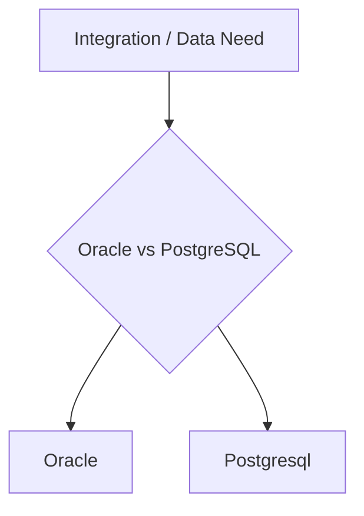

## 1. Executive Summary

**Oracle vs PostgreSQL** — Enterprise RDBMS TCO vs open-source PostgreSQL capability. Use this comparison in architecture reviews and interviews to justify a choice with trade-offs, not slogans.

---

## 2. What Problem It Solves

Architects face **option overload** — vendors, cloud defaults, and team familiarity pull in different directions. A structured comparison prevents **resume-driven architecture**.

---

## 3. Where It Fits in Architecture

---

## 4. When to Choose Oracle

- Workload characteristics align with its sweet spot (see table below)
- Team operational maturity matches the product
- Enterprise support, licensing, or cloud bundle favors it

---

## 5. When Not to Choose / Choose Alternative

- Non-functional requirements (latency, ordering, cost) clearly favor the other side
- Existing platform standard or skill pool points elsewhere
- Managed service removes ops burden you cannot staff

---

## 6. Popular Tools / Products

See detailed topic pages for each option in the [Technology Playbook index](/technology-playbook/).

---

## 7. Trade-offs


| Capability | Oracle | Postgresql |
| :--- | :--- | :--- |
| Primary model | See product docs | See product docs |
| Ops burden | Team-dependent | Team-dependent |
| Best fit | Match to access pattern | Match to access pattern |




---

## 8. Real-World Example

**Notification platform:** High fan-out and replay → log-oriented broker. **Task queue with routing keys and priority** → classic AMQP. **Serverless glue** → cloud-native queue with pay-per-use.

---

## 9. Failure Scenarios

- Choosing based on **brand** without load testing representative traffic
- Ignoring **egress/ licensing** cost at scale
- **Hybrid** deployment without clear ownership of upgrades and security patches

---

## 10. Best Practices

1. Run a **two-week POC** with production-like volume skew (not happy-path only).
2. Document decision in an **ADR** with rejected alternatives.
3. Revisit when **scale doubles** or team skills shift.

---

## 11. Interview Answer


"There is no universal winner in **Oracle vs PostgreSQL**. I compare delivery semantics, ops model, ordering, replay, and team skills. I give a concrete scenario — for example peak checkout events vs nightly batch — and map each option to that scenario before recommending one."


---

## 12. Related Topics

- [Technology Decision Matrix](/technology-playbook/how-to-choose-database/)
- [Interview Preparation module](/technology-playbook/)
