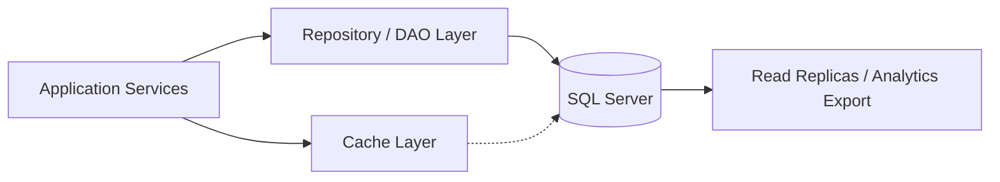

## 1. Executive Summary

**Microsoft SQL Server** is a **relational** store. Microsoft stack relational database — T-SQL, SSIS, and Azure SQL sibling.

---

## 2. What Problem It Solves

| Scenario | Why SQL Server |
| :--- | :--- |
| Primary application datastore | ACID transactions, JOINs, reporting, and strong schema governance |
| Performance-sensitive read path | Tunable indexes and caching layers |
| Regulated enterprise workloads | Mature backup, audit, and HA options (verify per edition/cloud) |

---

## 3. Where It Fits in Architecture

---

## 4. When to Choose

- Access patterns align with **relational** strengths (acid transactions, joins, reporting, and strong schema governance)
- Team has operational experience or a managed cloud service reduces toil
- Licensing and support model fit enterprise procurement (especially for Oracle/SQL Server)
- Ecosystem drivers exist — ORM support, CDC tools, cloud marketplace

---

## 5. When Not to Choose

- You need heavy cross-entity JOINs but picked a key-value or wide-column store
- Operational team cannot run clustered/sharded infrastructure without managed service
- Workload is pure batch analytics but you chose an OLTP primary store
- Vendor lock-in risk unacceptable and migration path is unclear

---

## 6. Popular Tools / Products

| Category | Related options |
| :--- | :--- |
| **Same class** | See [Databases module](/technology-playbook/) for peers in relational |
| **Cloud managed** | RDS/Aurora, Azure SQL/Cosmos, Cloud SQL/BigQuery equivalents |
| **Migration** | AWS DMS, Debezium CDC, logical replication (PostgreSQL) |

---

## 7. Trade-offs


| Dimension | SQL Server strength | Watch out for |
| :--- | :--- | :--- |
| **Data model** | Optimized for relational access paths | Misfit patterns cause performance cliffs |
| **Consistency** | Tunable per product (strong vs eventual) | Misconfigured replicas cause stale reads |
| **Ops** | Mature tooling in enterprise | HA/sharding complexity without managed service |
| **Cost** | Predictable at moderate scale | License + IO + egress at cloud scale |


---

## 8. Real-World Example

**Fintech ledger:** PostgreSQL or Oracle for double-entry accounts with strict ACID. **Inventory notifications:** Redis cache for hot SKU counts with DB as source of truth. **Customer 360 search:** Elasticsearch/OpenSearch for fuzzy name lookup across CRM + support tickets.

**Reporting:** Nightly ETL from OLTP into Snowflake/BigQuery/ClickHouse — never run heavy BI on primary OLTP without guardrails.

---

## 9. Failure Scenarios

| Risk | Symptom | Prevention |
| :--- | :--- | :--- |
| Connection pool exhaustion | Random timeouts under load | Pool sizing, RDS proxy, circuit breakers |
| Missing indexes | Full table scans, p95 latency spikes | Query review, EXPLAIN in CI |
| Replication lag | Users see stale balances | Monitor lag, read-your-writes routing |
| Backup without restore test | Data loss discovered too late | Quarterly restore drills |

---

## 10. Best Practices

1. Match **access patterns** to storage model before brand selection.
2. Use **managed services** until team proves self-hosted cost advantage.
3. Define **RPO/RTO** and test backups — especially for finance workloads.
4. Separate **OLTP vs analytics** paths early (CDC to warehouse).
5. Document **data classification** — PII encryption and key rotation.

---

## 11. Interview Answer


"For **Microsoft SQL Server**, I'd choose it when workloads need acid transactions, joins, reporting, and strong schema governance and the team can operate it responsibly. I'd compare it against other **relational** options on ops burden, licensing, and cloud managed offerings. I'd also state what I would **not** store there — for example heavy analytics on OLTP or graph traversals on plain relational without extension."


---

## 12. Related Topics

- [How to Choose a Database](/technology-playbook/how-to-choose-database/)
- [Databases module index](/technology-playbook/)
- Compare: search [Interview Preparation](/technology-playbook/) comparisons involving this technology
