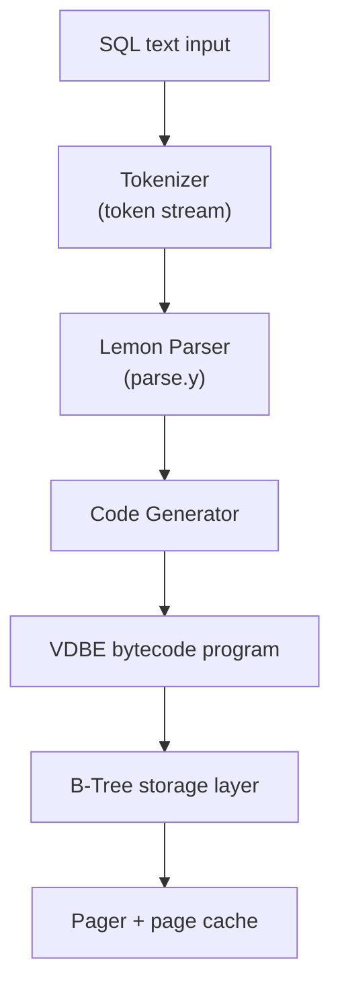

SQLite is unique among modern relational systems because it operates inside the same process space as the host application. It bypasses traditional client-server networking layers entirely, functioning as a lightweight, zero-configuration storage framework. To truly understand its design, we must analyze its structural internals from its amalgamation compilation architecture down to its byte-code execution layers.

---

## The Single-Translation Amalgamation Strategy

Unlike traditional engines developed as dozens of split modules, production-grade SQLite compiles using the **Amalgamation Strategy**. Over a hundred separate C source files and internal headers are combined into a single, massive file: `sqlite3.c`.

This design choice delivers substantial runtime benefits:

- **Interprocedural Optimization:** Standard multi-file compilation setups isolate translation units, blocking cross-file optimization boundaries. Because SQLite compiles as a single translation unit, the compiler executes global register allocations, inlines internal function pipelines, and eliminates dead code paths across all subsystems. This delivers performance gains of 5% to 10%.
- **Simplified Integration:** Developers drop the unified `sqlite3.c` and `sqlite3.h` files directly into a host application's build tree. This approach guarantees cross-platform portability across mobile devices, IoT hardware, and desktop clients without external runtime dependencies.

---

## The Compilation Framework

The compilation framework acts as the front end of the database engine, transforming declarative SQL text into low-overhead executable bytecode.

```text
       SQL Text Ingestion
               │
               ▼
┌──────────────────────────────────────┐
│  Tokenizer (sqlite3RunParser)        │ ──► Generates discrete syntax tokens
└──────────────────────────────────────┘
               │
               ▼ (Token Stream)
┌──────────────────────────────────────┐
│  Lemon Parser Generator (parse.y)    │ ──► Enforces strict structural syntax
└──────────────────────────────────────┘
               │
               ▼ (Parse Tree / Action Routines)
┌──────────────────────────────────────┐
│            Code Generator            │ ──► Compiles target VDBE Bytecode
└──────────────────────────────────────┘
```

1. **The Tokenizer (`sqlite3RunParser`):** The input query text (e.g., `CREATE TABLE courses...`) feeds directly into the tokenizer engine. The function scans the incoming character array character by character, matching characters against discrete groups to output numeric token IDs (such as `TK_CREATE` or `TK_ID`).
2. **The Lemon Parser Pipeline:** SQLite replaces traditional Yacc/Bison configurations with the **Lemon Parser Generator** (`parse.y`), a highly optimized parser architecture engineered to prevent memory leaks. Lemon validates token streams against structural grammar layouts. If a query sequence satisfies syntax criteria, Lemon invokes matching action routines like `sqlite3StartTable`.
3. **Internal Cascading Operations:** During a routine execution check like `CREATE TABLE`, the front end doesn't simply allocate a storage pointer. It runs multiple nested internal operations — querying metadata from the primary catalog (`sqlite_master`), initializing temporary tables (`sqlite_temp_master`) to process new schemas, creating secondary indices to enforce unique constraints, and updating physical tracking ledgers before passing the transaction downstream.

---

## The Virtual Database Engine (VDBE)

The **Virtual Database Engine (VDBE)** forms the computational core of SQLite, acting as a specialized bytecode interpreter. Every SQL statement compiles directly into a prepared VDBE program containing sequential instructions composed of an operational command code (**Opcode**) and three target parameters (**Operands**).

An application executes these operations by calling the standard database statement pipeline (`sqlite3_step`). Under the hood, this call maps directly to `sqlite3VdbeExec`, which acts as a massive bytecode processing engine structured around a continuous execution loop:

```c
// Simplified logical architecture of the core VDBE execution engine
int sqlite3VdbeExec(Vdbe *p) {
  Op *aOp = p->aOp;    // Array of bytecode instructions
  Op *pOp;             // Current instruction pointer

  for (pOp = &aOp[p->pc]; 1; pOp++) {
    switch (pOp->opcode) {
      case OP_Goto: {
        p->pc = pOp->p1;
        break;
      }
      case OP_Integer: {
        p->aMem[pOp->p2].u.i = pOp->p1;
        break;
      }
      case OP_OpenRead: {
        // Open a read cursor on a specific B-Tree root page
        break;
      }
      case OP_Halt: {
        return SQLITE_OK;
      }
      // Thousands of additional highly optimized bytecode case statements...
    }
  }
}
```

The VDBE views datasets logically as structured rows, tables, and column vectors. It processes data inputs iteratively without performing complex cost optimizations, passing execution instructions down to the lower B-Tree layer.

| VDBE Component | Responsibility |
| :--- | :--- |
| **Opcode array (`aOp`)** | Sequential bytecode program compiled from SQL |
| **Program counter (`pc`)** | Current instruction index; updated by `OP_Goto` branches |
| **Memory registers (`aMem`)** | Typed slots holding integers, strings, rows, and cursors |
| **Cursors** | Active B-Tree iterators opened via `OP_OpenRead` / `OP_OpenWrite` |



---

## The Pager & Virtual File System (VFS) Boundary

The bridge between abstract logical operations and physical persistence is managed by two layers: the **Pager** and the **Virtual File System (VFS)**.

The Pager acts as the core controller for data transactions, cache management, and lock enforcement. It coordinates the page cache subsystem by loading 4 KB data chunks into RAM using a strict LRU eviction flow, handles transaction durability boundaries, and manages database concurrency states via sequential locking levels (`SHARED`, `RESERVED`, `EXCLUSIVE`).

```text
               [ VDBE Execution Layer ]
                          │
                          ▼
               [ B-Tree Storage Layer ]
                          │
                          ▼ (Requests Page Numbers)
               [ Pager Management Layer ]
               ┌────────────────────────┐
               │  • Page Cache (LRU)    │
               │  • Transaction Log     │
               │  • File-Level Locking  │
               └────────────────────────┘
                          │
                          ▼ (Platform-Independent Primitives)
      [ Virtual File System (VFS) Interface Layer ]
        ┌───────────────────┬───────────────────┐
        ▼                   ▼                   ▼
   [ VFS POSIX ]       [ VFS Win32 ]       [ VFS Custom ]
  (Unix open/fsync)   (Windows OS API)     (Bare-Metal IoT)
```

Because SQLite runs on diverse host environments, the Pager avoids making direct platform system calls. Instead, it interacts with storage via the VFS interface layer.

The VFS abstracts platform-specific file operations into standard, unified interfaces. When running on Linux, the Pager routes via the POSIX VFS driver using standard system primitives (`open`, `read`, `fsync`); when running on Windows, it seamlessly shifts to the Win32 subsystem. This architectural isolation allows SQLite to maintain strict data consistency and ACID guarantees across varied platforms without requiring modifications to its underlying B-Tree indexing layer.

| Layer | Role | Key Primitives |
| :--- | :--- | :--- |
| **VDBE** | Bytecode execution, row/cursor logic | `sqlite3_step`, `sqlite3VdbeExec` |
| **B-Tree** | On-disk index and table storage | Page-level key lookup, leaf traversal |
| **Pager** | Cache, journaling, locking | LRU page cache, `SHARED`/`EXCLUSIVE` locks |
| **VFS** | OS abstraction | `xOpen`, `xRead`, `xWrite`, `xSync`, `xLock` |

The Pager/VFS boundary is where SQLite's in-process design meets the host operating system — and where the journaling mechanics covered in [Two-Phase Commit Journaling](/database-handbook/acid-two-phase-commit-journaling/) enforce durability at the physical block level.
