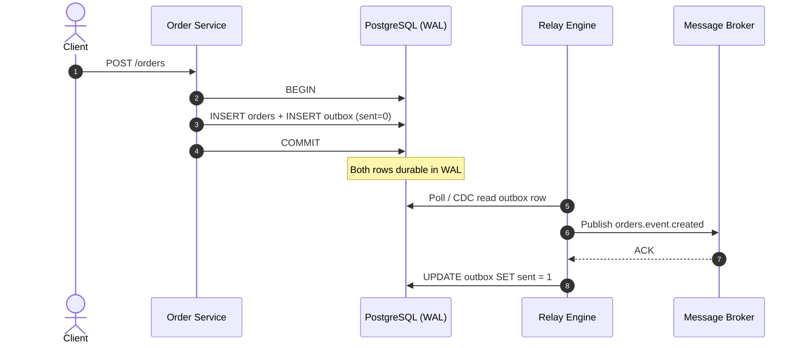

In distributed architectures, microservices must frequently execute an internal state mutation and notify downstream systems or external message brokers about the change. Coordinating these dual events reliably across network boundaries presents a fundamental engineering challenge. The Transactional Outbox pattern provides a robust framework to achieve eventual consistency without relying on unsafe, distributed two-phase transactions.

---

## The Synchronous Failure Trap

A common multi-tier architecture anti-pattern involves executing a local database mutation and immediately executing a synchronous HTTP post or broker publish call inside the same application block:

```text
  The Anti-Pattern: Direct Remote Notification Pathway
┌──────────────────┐      1. Commit State      ┌──────────────────┐
│  Order Service   ├──────────────────────────►│  Local Database  │
└────────┬─────────┘                           └──────────────────┘
         │
         │ 2. Asynchronous Remote Call (Unsafe)
         ▼
┌──────────────────┐
│  Message Broker  │ ──► [ Network Drop / Broker Hiccup Trigger Failure ]
└──────────────────┘
```

This structural layout exposes the system to severe **temporal coupling** anomalies:

- **Partial Commit Failure:** If the local database commit finishes successfully, but the secondary message broker step drops due to an unhandled network error, an operational inconsistency occurs. The application tier retains the state change, but downstream services remain completely unaware of the event.
- **Connection Depletion:** If the downstream broker or microservice experiences processing latencies, the upstream database transaction must remain held open. This rapidly blocks active worker pools, spikes API latencies, and can exhaust available connection pools.

Distributed Two-Phase Commit protocols (2PC) address this gap but introduce heavy lock contention, high network round-trip overhead, and function as single points of failure across independent service domains.

| Approach | Consistency | Operational Cost |
| :--- | :--- | :--- |
| **Direct broker publish after commit** | At-risk — broker failure after DB commit | Low complexity, high data-loss risk |
| **Distributed 2PC (XA)** | Strong — but fragile across domains | High latency, lock contention, coordinator SPOF |
| **Transactional Outbox** | Eventual — atomic local write | Moderate complexity, production-standard |

---

## Outbox Table Schema Design

The Transactional Outbox pattern bypasses external network operations during the primary transaction loop by leveraging the host database engine as the absolute state ledger. The architecture introduces a highly optimized, dedicated operational table — the `outbox` table — into the service's primary data store.

A production-grade outbox schema utilizes the following exact relational layout:

```sql
CREATE TABLE outbox (
    id             UUID PRIMARY KEY,
    aggregate_type VARCHAR(255) NOT NULL,
    aggregate_id   VARCHAR(255) NOT NULL,
    topic          VARCHAR(255) NOT NULL,
    payload        JSONB NOT NULL,
    sent           SMALLINT DEFAULT 0 NOT NULL,
    created_at     TIMESTAMP WITH TIME ZONE DEFAULT CURRENT_TIMESTAMP NOT NULL
);

-- Crucial partial index to eliminate full table scans during execution loops
CREATE INDEX idx_outbox_unsent ON outbox (created_at) WHERE sent = 0;
```

| Column | Purpose |
| :--- | :--- |
| `id` | A unique time-ordered identifier (UUIDv7 or ULID) for deduplication and chronological ordering |
| `aggregate_type` / `aggregate_id` | Domain entity reference for traceability and downstream routing |
| `topic` | Target message broker exchange or routing key destination |
| `payload` | Serialized domain event containing the exact state update data |
| `sent` | Binary state flag (`0` = pending, `1` = acknowledged) coordinating the relay pipeline |
| `created_at` | Insert timestamp; drives `ORDER BY` in polling queries |

The partial index on `WHERE sent = 0` is critical — it keeps relay polling off the full table scan path as the outbox grows.

---

## Dual-Mutation Mechanics

When an application layer receives a request, it initiates a single database transaction context. The write path wraps the core operational update and the outbox event capture within a unified atomic block:

```javascript
// Sample application transaction wrapper executing atomic outbox insertion
async function createOrder(orderData) {
    const tx = await db.beginTransaction();
    try {
        // 1. Mutate primary domain state table
        const orderId = await db.orders.insert(orderData, { transaction: tx });

        // 2. Format outbox event payload
        const outboxEvent = {
            id: generateUUIDv7(),
            aggregate_type: 'Order',
            aggregate_id: orderId,
            topic: 'orders.event.created',
            payload: JSON.stringify({
                id: orderId,
                status: 'PENDING',
                amount: orderData.amount
            }),
            sent: 0
        };

        // 3. Insert event record into the outbox ledger inside the same transaction context
        await db.outbox.insert(outboxEvent, { transaction: tx });

        // Atomic local engine commit point — writes both blocks to the WAL log
        await tx.commit();
        return { success: true, id: orderId };
    } catch (error) {
        await tx.rollback();
        throw error;
    }
}
```

Because both insertions run within the same local transaction context, the engine guarantees complete data atomicity. Either both records commit to physical storage via the Write-Ahead Log (WAL), or the changes roll back entirely, preventing partial distributed state corruption.



The broker is never contacted inside the request transaction — network failure cannot orphan a committed domain row without a matching outbox record.

---

## The Relay Engine

Once the transaction commits, a detached, highly optimized asynchronous processing component — the **Relay Engine** — takes over to distribute the data downstream. Production systems deploy this extraction step using one of two primary strategies:

### Strategy A: Polling Publisher

The polling worker runs a continuous execution loop, querying the outbox table for un-routed records.

```text
     Polling Relay Ingestion Pathway
┌──────────────────┐     1. Batch Select (sent = 0)     ┌──────────────────┐
│  Outbox Poller   ├───────────────────────────────────►│   Outbox Table   │
└────────┬─────────┘                                    └──────────────────┘
         │
         ├─ 2. Bulk Publish ──────► [ Message Broker ]
         │
         └─ 3. Batch Update (sent = 1)
```

**Data flow:** The agent pulls a fixed batch of records:

```sql
SELECT *
FROM outbox
WHERE sent = 0
ORDER BY created_at ASC
LIMIT 100
FOR UPDATE SKIP LOCKED;
```

It pushes them to the external message broker, receives delivery acknowledgements, and updates `sent` to `1` or deletes the processed rows from the outbox.

**Trade-off:** This method introduces minor polling latencies and creates continuous read/write overhead on the primary database engine. Operational tuning for polling stress is covered in [Outbox/Inbox Performance Tuning](/database-handbook/outbox-inbox-performance-tuning/).

### Strategy B: Transaction Log Mining (CDC)

An advanced Change Data Capture (CDC) platform (such as Debezium or AWS DMS) tracks mutations by directly parsing the engine's internal transaction log streams.

```text
     CDC Relay Ingestion Pathway
┌──────────────────┐     WAL / logical replication     ┌──────────────────┐
│  Debezium CDC    ├──────────────────────────────────►│   Outbox Table   │
└────────┬─────────┘         (out-of-band)             └──────────────────┘
         │
         └─ Extract INSERT payload ──► [ Message Broker ]
```

**Data flow:** The CDC daemon reads raw binary WAL modifications out-of-band. When it intercepts an `INSERT` targeting the `outbox` table, it extracts the payload and publishes it directly to the designated message broker cluster.

**Trade-off:** This approach minimizes index read overhead on the active database cluster, enabling high event throughput, but increases infrastructure complexity.

| Relay Strategy | Latency | DB Read Load | Infra Complexity |
| :--- | :--- | :--- | :--- |
| **Polling publisher** | Seconds (poll interval) | Steady `SELECT` on partial index | Low — single worker process |
| **CDC / log mining** | Sub-second | Near-zero — reads WAL stream | High — Kafka Connect, Debezium, replication slots |

Downstream consumers that receive at-least-once delivery must pair with the [Transactional Inbox pattern](/database-handbook/transactional-inbox-pattern/) for idempotent ingestion.
