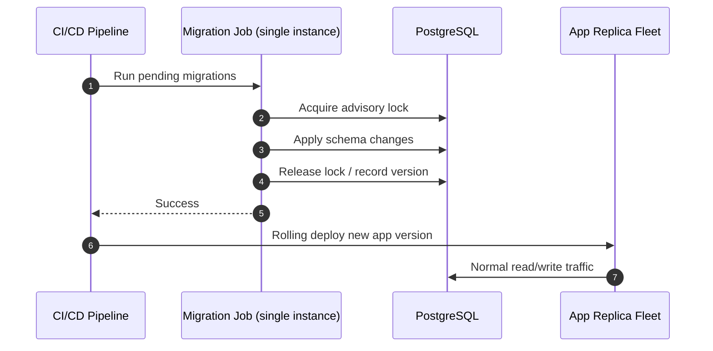
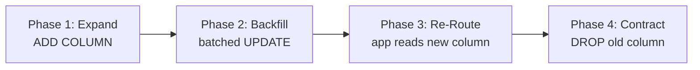

As relational systems scale to process continuous, high-volume transactional workloads, evolutionary changes to the physical schema present severe operational risks. Altering table parameters, introducing constraints, or dropping legacy fields can cause locking bottlenecks that quickly degrade cluster availability. Achieving zero-downtime schema evolution requires isolating execution paths, planning for lock behavior, and applying strict multi-phase decoupling strategies.

---

## The Concurrency Hazard

A common architecture flaw involves using an Object-Relational Mapper (ORM) system configured to automatically synchronize schemas on boot, or embedding migration execution logic directly within the application container's startup routine. When auto-scaling systems spin up multiple app replicas concurrently during a rolling deployment, this setup introduces severe operational risks:

- **Race Conditions:** Multiple distinct processes concurrently issue identical schema alteration instructions (`ALTER TABLE`) against the central storage engine, resulting in lock contention and aborted deployment sequences.
- **Connection Pool Exhaustion:** If a migration task stalls or takes longer than expected to alter data rows, the application instance blocks its startup thread. Under heavy traffic, incoming requests pile up, draining the available database connection pool and triggering a cascade failure across the system.

| Anti-Pattern | Failure Mode |
| :--- | :--- |
| `sequelize.sync()` on app boot | N replicas race on identical DDL |
| Flyway/Liquibase inside every pod | Duplicate migration attempts; startup deadlock |
| Manual `ALTER TABLE` on live cluster | Uncontrolled lock duration; no rollback gate |

---

## Decoupled Migration Pipelines

To eliminate these startup dependencies, modern engineering practices separate schema evolution from application deployment. Schema modifications are extracted from the primary runtime code and isolated within a dedicated, single-instance execution step.

```text
                 Decoupled CI/CD Migration Topology
┌──────────────────┐       1. Apply Schema Changes        ┌──────────────────┐
│  CI/CD Runner /  ├─────────────────────────────────────►│ Central Database │
│  K8s Migration   │                                      │     Cluster      │
│  Job             │                                      └──────────────────┘
└────────┬─────────┘
         │
         │ 2. Signal On Success (Bypasses Concurrency Hazards)
         ▼
┌──────────────────┐
│ Auto-Scaling App │ ──► Reads the updated schema structures cleanly
│  Replica Pods    │
└──────────────────┘
```

This decoupling is typically implemented using **CI/CD pipeline runners** or **Kubernetes Jobs / InitContainers**. The continuous deployment tool issues migration tasks to a single, isolated process container before initiating the rolling update of the primary application pods.

The database tracking ledger (such as Liquibase, Flyway, or `SequelizeMeta`) maintains a record of applied files, using advisory locks to ensure that exactly one runner alters the schema at any given time. If the migration script fails, the pipeline halts immediately, keeping the active application layer unaffected.



| Tool | Lock Mechanism | Typical Integration |
| :--- | :--- | :--- |
| **Flyway** | Schema history table + JDBC connection | CI step before deploy |
| **Liquibase** | `DATABASECHANGELOGLOCK` table | K8s Job or pipeline stage |
| **Alembic** | Manual single-runner discipline | Pre-deploy container |

---

## The Lock Escalation Storm

The core physical constraint during a schema modification is how the database engine handles locks. Standard Data Definition Language (DDL) modifications (such as `ALTER TABLE ADD COLUMN`, `DROP COLUMN`, or `CREATE INDEX`) require an **Access Exclusive Lock** on the target table.

This lock level is highly restrictive: it completely blocks all concurrent operations, preventing any application thread from reading or writing to the table.

```text
         The Mechanics of a Lock Escalation Storm
Incoming App Requests                   Active Database Engine Lock Queue
┌───────────────────────┐               ┌──────────────────────────────────┐
│ SELECT * FROM users   │ ──► [Wait] ──►│ Access Exclusive Lock (DDL Task) │
├───────────────────────┤               ├──────────────────────────────────┤
│ INSERT INTO users ... │ ──► [Wait] ──►│ [Blocks ALL incoming mutations]  │
└───────────────────────┘               └──────────────────────────────────┘
                        │
                        ▼
[ Result: Connection Pool Drains, API Gateway Timeouts, System Outage ]
```

If an engineer executes a DDL migration on a large production table (e.g., adding an un-indexed column with a default value across 100 million rows), the database engine must iterate through every page block on disk to write the data. The Access Exclusive Lock must be held for the entire duration of this write cycle.

As a result, all incoming application queries are forced into a serialization queue. Within seconds, the database connection pool saturates, API gateways hit timeout limits, and the application layer suffers a complete system outage. Lock graph analysis and victim selection mechanics are covered in [Lock Graphs & Deadlocks](/database-handbook/lock-graphs-deadlocks-latching/).

| PostgreSQL Lock Mode | Blocks Reads | Blocks Writes | Typical DDL |
| :--- | :---: | :---: | :--- |
| `ACCESS SHARE` | No | No | `SELECT` |
| `ROW EXCLUSIVE` | No | No | `INSERT`, `UPDATE`, `DELETE` |
| `ACCESS EXCLUSIVE` | **Yes** | **Yes** | `ALTER TABLE`, `DROP TABLE` |

### Mitigation: Non-Blocking DDL (PostgreSQL 11+)

PostgreSQL 11 introduced **fast column add** with a constant default — the default is stored in catalog metadata without rewriting every row:

```sql
-- Non-blocking on PostgreSQL 11+ (no full table rewrite for constant default)
ALTER TABLE entities ADD COLUMN optimized_name VARCHAR(255) DEFAULT NULL;
```

For index creation on live tables, use `CONCURRENTLY` to avoid `ACCESS EXCLUSIVE` locks:

```sql
CREATE INDEX CONCURRENTLY idx_entities_optimized_name ON entities (optimized_name);
```

---

## The Expand & Contract Strategy

To safely modify schemas on large production tables without acquiring long-running exclusive locks, engineers deploy a multi-phase pattern known as the **Expand and Contract Strategy**.

Consider a scenario where a production table needs to rename an operational column from `legacy_name` to `optimized_name`:

### Phase 1: Expand (Non-Breaking Ingestion)

The migration pipeline executes a non-breaking DDL change that adds the new column as a nullable field, ensuring it does not block existing application queries:

```sql
ALTER TABLE entities ADD COLUMN optimized_name VARCHAR(255) DEFAULT NULL;
```

The application tier is then updated with code that writes to **both** columns simultaneously while continuing to read exclusively from the old column field.

### Phase 2: Backfill & Sync

An asynchronous background worker script processes the legacy rows in small, managed batches to copy data from the old field to the new field:

```sql
-- Batch-managed data synchronization loop to avoid long-running locks
UPDATE entities
SET optimized_name = legacy_name
WHERE id IN (
    SELECT id FROM entities
    WHERE optimized_name IS NULL
    LIMIT 5000
);
```

Batching transitions the data migration into short, low-impact operations, allowing replication lag to remain near zero and preventing table lock escalation. Combine with [partial indexes](/database-handbook/advanced-schema-optimization/) on `WHERE optimized_name IS NULL` to accelerate backfill progress queries.

### Phase 3: Re-Route

Once the backfill script finishes synchronizing all rows, a zero-downtime application deployment switches the code's read path to target the new `optimized_name` column. The old `legacy_name` field is then removed from the application's write path.

### Phase 4: Contract (Legacy Cleanup)

After verifying that the application is running stably on the new column layout, the migration pipeline drops the old field from the database schema:

```sql
ALTER TABLE entities DROP COLUMN legacy_name;
```



| Phase | Schema State | App Behavior | Lock Risk |
| :--- | :--- | :--- | :--- |
| **Expand** | Both columns exist | Write both; read old | Low — nullable `ADD COLUMN` |
| **Backfill** | Both columns populated | Write both; read old | Low — batched `UPDATE` |
| **Re-Route** | Both columns exist | Write new; read new | None — app deploy only |
| **Contract** | New column only | Read/write new | Medium — `DROP COLUMN` (schedule off-peak) |

### Module 3 Migration Checklist

| Step | Action |
| :--- | :--- |
| 1 | Run migrations from a **single CI/CD job**, never from app boot |
| 2 | Audit DDL for `ACCESS EXCLUSIVE` duration before merge |
| 3 | Use **expand & contract** for column renames, type changes, and constraint swaps |
| 4 | Prefer `CREATE INDEX CONCURRENTLY` and nullable `ADD COLUMN` on hot tables |
| 5 | Validate [primary key](/database-handbook/primary-key-selection-strategies/) and index design before backfill — rewriting 100M rows twice is expensive |

Zero-downtime migration is not a single tool choice — it is a deployment topology discipline that keeps schema changes outside the request path and splits breaking alterations across multiple safe phases.
