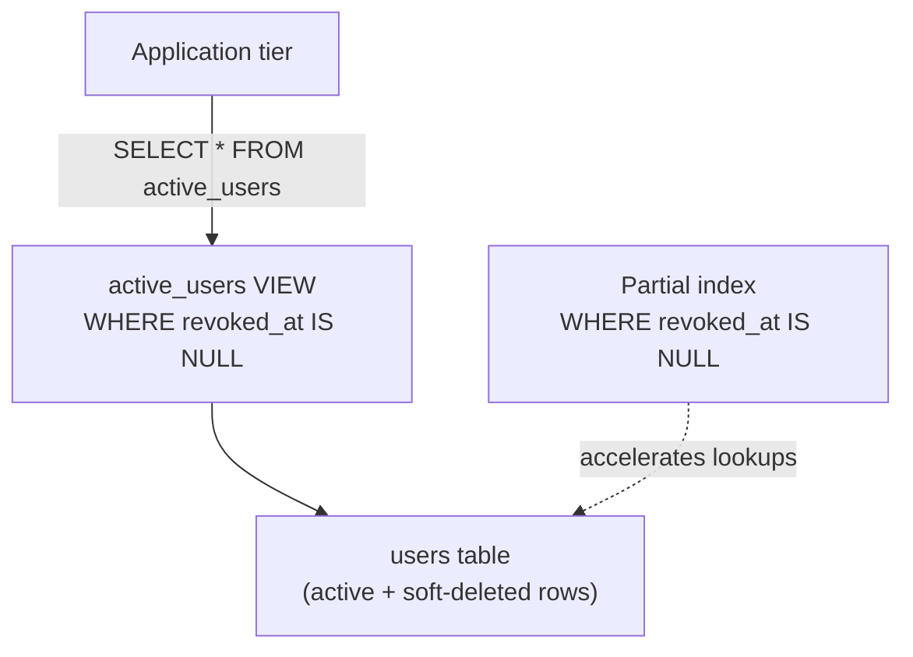

Enterprise data systems require optimization paradigms that balance high-throughput transactional performance with long-term schema flexibility. As datasets scale to hundreds of millions of rows, generic relational mappings degrade under storage bloat, index fragmentation, and unoptimized queries. To maintain sub-millisecond lookups, schema architectures must leverage advanced primitives: structured soft deletes, data abstraction views, partial conditional indexing, and polymorphic binary JSON structures.

---

## Soft Delete Infrastructure

Executing destructive data purges (`DELETE FROM tables WHERE...`) in a production enterprise environment introduces significant operational risks. Hard deletes permanently erase physical data records, complicate point-in-time recovery, break relational audit trails, and risk triggering slow, uncoordinated cascading locks across foreign-key constraints.

To preserve historical data states while satisfying compliance standards (such as GDPR anonymization requirements), production schemas deploy a **soft delete infrastructure**. The architecture replaces row destruction with state mutations, adding a nullable timestamp column to target tables:

```sql
ALTER TABLE entities ADD COLUMN revoked_at TIMESTAMP WITH TIME ZONE DEFAULT NULL;
```

When an application deletes a record, it executes an `UPDATE` path that populates `revoked_at` with the current timestamp, preserving the underlying row structure:

```sql
-- Application "delete" — no physical row removal
UPDATE entities
SET revoked_at = NOW()
WHERE id = $1 AND revoked_at IS NULL;
```

However, soft deletes introduce specific database-level trade-offs:

- **Table Bloat:** Soft-deleted records remain interspersed within active table data pages, inflating storage volume.
- **Scan Degradation:** Sequential table scans waste valuable memory and disk I/O processing dead rows, slowing down runtime read operations.
- **Constraint Complications:** Standard `UNIQUE` constraints (e.g., ensuring a unique active email or SKU) break because the database evaluates duplicate keys against soft-deleted rows alongside active rows.

| Hard Delete | Soft Delete |
| :--- | :--- |
| Row physically removed | Row retained with `revoked_at` timestamp |
| FK cascade triggers | No cascade; referential integrity preserved |
| Cannot recover without backup | Point-in-time restore from same row |
| No filter required in queries | Every query must exclude revoked rows |

---

## Abstraction Views

To shield application developers from the systemic complexity of filtering out inactive or soft-deleted records across dozens of independent database queries, the database architecture must separate the physical storage layer from the logical presentation layer using **data abstraction views**.

A view functions as a named, stored query definition. Rather than embedding conditional checks (`WHERE revoked_at IS NULL`) directly into application code, the engineer encapsulates this filtering logic inside a dedicated abstraction view layer:

```sql
CREATE VIEW active_users AS
SELECT id, username, email, created_at
FROM users
WHERE revoked_at IS NULL;
```

When an application issues `SELECT * FROM active_users`, the database engine intercepts the query and rewrites the statement to append the underlying conditional filters before generating the final execution plan.

Views allow engineers to enforce data access permissions, modularize complex multi-table joins, and change physical table structures transparently without requiring changes to the application tier. However, engineers must use cascading views cautiously: nesting views within other views masks the underlying schema complexity, making it difficult to optimize unperformant plans during debugging.



| View Pattern | Benefit | Risk |
| :--- | :--- | :--- |
| **Filter view** (`active_*`) | Single source of truth for soft-delete logic | Planner may not push predicates optimally |
| **Join view** | Hides multi-table complexity | Nested views obscure execution plans |
| **Security view** + `GRANT` | Row-level access control at DB layer | Must revoke direct table access |

---

## Partial & Conditional Indices

Filtering queries through an abstraction view provides clean code organization, but it does not automatically improve physical execution performance. If the underlying database query performs a full table scan over millions of soft-deleted rows to return a few active rows, performance drops sharply. To optimize these search paths, engineers apply **partial and conditional indices**.

A partial index includes a strict `WHERE` conditional clause, restricting index entries to a specific subset of rows:

```sql
-- Optimize unique constraints and lookups exclusively for active records
CREATE UNIQUE INDEX idx_users_active_email
ON users (email)
WHERE revoked_at IS NULL;
```

Partial indexing delivers substantial production benefits:

- **Storage Efficiency:** The B+ Tree excludes soft-deleted rows, significantly reducing the physical size of the index on disk and saving buffer pool memory.
- **Write Acceleration:** Because mutations to soft-deleted rows do not trigger updates to the partial index tree, the database minimizes write-amplification penalties and page split anomalies during historical data changes.
- **Constraint Resolution:** Bypassing inactive rows solves unique constraint conflicts. Users can register with a previously soft-deleted email address because the unique constraint validates keys solely within the active, non-null index space.

This is the same partial-index pattern used in [Outbox/Inbox Performance Tuning](/database-internals/outbox-inbox-performance-tuning/) (`WHERE sent = 0`) — restrict the B+ Tree to only the rows your hot-path queries touch.

| Index Type | Scope | Typical Use |
| :--- | :--- | :--- |
| **Full index** | All rows | Columns queried without filter predicates |
| **Partial index** | `WHERE` subset | Active rows, pending events, non-null fields |
| **Expression index** | Computed value | `LOWER(email)`, `date_trunc('day', created_at)` |

---

## Polymorphic JSONB Fields

Relational schemas provide rigid guarantees, but modern applications frequently process highly dynamic, non-normalized metadata configurations (such as varied tenant configurations, localized notification parameters, or custom third-party integration webhooks). Forcing these variable structures into traditional columns requires continuous database schema modifications or results in sparse empty columns. Advanced relational engines solve this by using decomposed Binary JSON (**JSONB**) structures.

Unlike standard text-based JSON options that store string payloads directly, JSONB parses the unstructured document into a decomposed binary format at write time. This format enables high-speed key-value lookups, nested path extractions, and polymorphic storage flexibility.

```sql
-- Embed a flexible settings field into a highly consistent relational table
CREATE TABLE customer_profiles (
    id       UUID PRIMARY KEY,
    name     VARCHAR(255) NOT NULL,
    settings JSONB NOT NULL DEFAULT '{}'::jsonb
);
```

To prevent the query planner from falling back to full table scans during deep JSON parameter searches, engineers deploy a **Generalized Inverted Index (GIN)**:

```sql
-- GIN path operator index — accelerates root-level JSON key containment (@>)
CREATE INDEX idx_profiles_settings_gin
ON customer_profiles USING gin (settings jsonb_path_ops);
```

The GIN layout breaks down nested JSON arrays and key-value properties into distinct components, mapping internal attributes directly to the parent row's physical block storage location.

This allows applications to run precise query operations across polymorphic attributes while maintaining the structural validation benefits of a core relational engine:

```sql
-- Sub-millisecond index lookup across dynamic, deeply nested polymorphic attributes
SELECT *
FROM customer_profiles
WHERE settings @> '{"theme": "dark", "notifications": {"email": true}}';
```

| GIN Operator Class | Best For | Trade-off |
| :--- | :--- | :--- |
| `jsonb_path_ops` | `@>` containment on fixed key paths | Smaller index; fewer operator types |
| `jsonb_ops` (default) | `?`, `?&`, `?\|`, `@>`, `@?`, `@@` | Larger index; broader query support |

### Schema Primitive Stack

| Layer | Primitive | Solves |
| :--- | :--- | :--- |
| **Retention** | Soft delete (`revoked_at`) | Audit trail, recovery, compliance |
| **Access** | Abstraction views (`active_*`) | Application-level filter consistency |
| **Performance** | Partial unique indexes | Active-row lookups without dead-row bloat |
| **Flexibility** | JSONB + GIN | Polymorphic metadata without schema migrations |

Pair time-ordered [primary keys](/database-internals/primary-key-selection-strategies/) with these primitives before tackling [zero-downtime migrations](/database-internals/zero-downtime-migration-frameworks/) on high-traffic tables — the index and view layer you build now determines how painful expand-and-contract becomes later.
