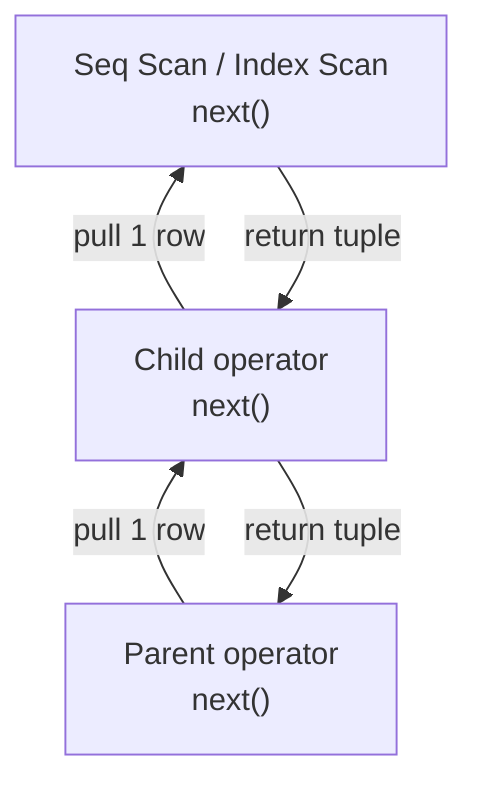

Declarative languages like SQL specify *what* data to retrieve, not *how* to physically retrieve it. Transforming a declarative text string into an optimized physical execution pipeline is the responsibility of the query compilation framework. At the center of this engine is the **Cost-Based Optimizer (CBO)** — an algorithmic planner that evaluates hardware costs to choose the most efficient path.

---

## Logical vs. Physical Tree Generation

The transformation pipeline runs through two distinct structural layers before a query executes:

1. **The Logical Plan:** The parser and analyzer tokenize the SQL string into an Abstract Syntax Tree (AST), checking schema visibility and syntax constraints. This structure is then transformed into a logical plan — a tree of relational algebra operators (such as `Project`, `Filter`, `Join`, and `Scan`) that models the logical intent of the query.
2. **The Physical Plan:** The Cost-Based Optimizer maps the logical plan into a physical plan. While a logical operator specifies a generic "Join," the physical plan designates the exact algorithm to use, such as a Hash Join, Merge Join, or Nested Loop Join.

```text
       Declarative SQL String
                 │
                 ▼
   ┌───────────────────────────┐
   │   Tokenizer & Parser      │ ──► Generates Abstract Syntax Tree (AST)
   └─────────────┬─────────────┘
                 │
                 ▼
   ┌───────────────────────────┐
   │   Logical Plan Developer  │ ──► Relational Algebra Node Map
   └─────────────┬─────────────┘
                 │
                 ▼
   ┌───────────────────────────┐
   │ Cost-Based Optimizer (CBO)│ ◄── Analyzes Catalog Statistics & Costs
   └─────────────┬─────────────┘
                 │
                 ▼
   ┌───────────────────────────┐
   │  Physical Execution Tree  │ ──► Executable Driver Pipelines
   └───────────────────────────┘
```

| Plan Layer | Describes | Example |
| :--- | :--- | :--- |
| **Logical** | *What* relational operation | `Join(Scan(orders), Scan(customers))` |
| **Physical** | *How* to execute it | `Hash Join` on `customer_id` using index `idx_orders_customer` |

---

## The CBO Engine Internal Metrics

To select the most efficient physical path, the CBO computes a cost metric for alternative plans. This value represents the estimated hardware resources (disk page fetches and CPU cycles) required to run the operation.

$$Total\_Cost = (Page\_Fetches \cdot sequential\_page\_cost) + (CPU\_Evaluations \cdot cpu\_tuple\_cost)$$

The optimizer relies heavily on database statistics kept inside the internal system catalogs. These catalogs compile metrics including table row counts, distinct value counts, null fractions, and data frequency **histograms**.

If data statistics become out of date, the optimizer's cost equations can fail. For example, if a table undergoes high write volumes but the catalog statistics are stale, the CBO might choose a slow Nested Loop Join over a fast Hash Join, causing query performance to degrade.

```sql
-- Refresh statistics after bulk load or high-churn migration backfill
ANALYZE orders;
ANALYZE customers;

-- Inspect what the planner chose
EXPLAIN (ANALYZE, BUFFERS, FORMAT TEXT)
SELECT o.id, c.name
FROM orders o
JOIN customers c ON o.customer_id = c.id
WHERE o.created_at > NOW() - INTERVAL '7 days';
```

| Catalog Statistic | Planner Use | Staleness Symptom |
| :--- | :--- | :--- |
| `reltuples` (row count) | Join order, scan vs index choice | Underestimates → nested loop on large sets |
| `ndistinct` | Selectivity of `WHERE` predicates | Wrong cardinality → bad hash table sizing |
| **Histogram buckets** | Range predicate selectivity | Skewed data → full table scan instead of index |
| `null_frac` | `IS NULL` / `IS NOT NULL` cost | Filter pushdown errors |

PostgreSQL stores these in `pg_statistic` and exposes them via `pg_stats`. A [partial index](/database-internals/advanced-schema-optimization/) only helps if the planner's row estimates justify using it.

---

## The Physical Execution Layer

Once the optimizer selects a physical plan, it hands execution over to the storage engine. Modern database systems process data records using one of two primary architectural models:

### Model A: The Volcano Iterator Pattern

The Volcano model processes data records using a standard pull-based pipeline. Every operator in the execution tree exposes a simple interface containing three core functions: `open()`, `next()`, and `close()`.

- **Mechanics:** The parent node calls `next()` on its child node, which processes and returns a single data row up the execution tree.
- **Trade-off:** This layout uses very little memory, but it introduces high CPU overhead due to frequent function calls when streaming millions of rows.

PostgreSQL's executor is Volcano-based — each plan node (`Seq Scan`, `Index Scan`, `Hash Join`) implements the iterator interface.

### Model B: Vectorized Batch Execution

To maximize modern CPU instruction caches, advanced analytical systems use **vectorized batch execution**.

- **Mechanics:** Instead of passing single rows, the `next()` loop retrieves a pre-allocated array or block of rows (e.g., 1,024 tuples) at a time.
- **Trade-off:** This batch design reduces function call overhead and leverages SIMD (Single Instruction, Multiple Data) compiler optimizations to accelerate query speeds.

| Model | Throughput Profile | Representative Engines |
| :--- | :--- | :--- |
| **Volcano (row-at-a-time)** | OLTP point queries, low memory | PostgreSQL, MySQL InnoDB |
| **Vectorized (batch-at-a-time)** | OLAP aggregations, column scans | ClickHouse, DuckDB, Snowflake |



---

## Distributed Joins

When scaling data layer operations horizontally across a sharded cluster network, joining massive datasets requires coordinating data across independent storage nodes. The distributed execution coordinator typically applies one of two primary join topologies depending on data volumes:

### Broadcast Join

- **Application Profile:** Used when joining a massive sharded table with a small lookup or dimension table.
- **Execution Path:** The coordinator node broadcasts a complete copy of the smaller table across the network to every single shard node in the cluster. This allows each shard to perform the join operations locally against its partitions, avoiding the need to redistribute the larger dataset.

```text
  Broadcast Join — Small Table Replicated to All Shards
        ┌─────────────┐
        │ Coordinator │
        └──────┬──────┘
               │ broadcast dim_table (small)
     ┌─────────┼─────────┐
     ▼         ▼         ▼
  [Shard 1] [Shard 2] [Shard 3]
  fact ⨝ dim  fact ⨝ dim  fact ⨝ dim   ◄── local hash join per shard
```

**Cost:** $O(N_{shards} \cdot |small|)$ network transfer — cheap when the dimension table fits in memory on each node.

### Hash Distributed Shuffle Join

- **Application Profile:** Used when joining two large tables sharded on completely different keys.
- **Execution Path:** The cluster forces a network-wide data shuffle. Both datasets are repartitioned by a hash of the join key — rows with matching hash values are routed to the same target shard. Each shard then performs a local hash join on its received partition.

```text
  Shuffle Join — Both Tables Repartitioned by Join Key Hash
  orders (sharded by order_id)     customers (sharded by customer_id)
         │                                    │
         └──────────┬ hash(customer_id) ──────┘
                    ▼
           [ Network Shuffle Phase ]
         ┌─────────┼─────────┐
         ▼         ▼         ▼
      [Shard A] [Shard B] [Shard C]
      local join  local join  local join
```

**Cost:** $O(|orders| + |customers|)$ network transfer — expensive but unavoidable when neither table is small enough to broadcast.

| Join Topology | When to Use | Network Cost | Risk |
| :--- | :--- | :--- | :--- |
| **Broadcast** | Small ⟕ Large | Replicate small table × N shards | OOM if "small" table grows |
| **Shuffle / Redistribute** | Large ⟕ Large | Full repartition of both sides | Shuffle storms under skewed keys |
| **Colocated join** | Both tables sharded on join key | **Zero shuffle** | Requires co-design at schema time |

### Join Algorithm Selection (Single-Node)

On a single PostgreSQL instance, the CBO chooses among three physical join algorithms:

| Algorithm | Best When | Cost Driver |
| :--- | :--- | :--- |
| **Nested Loop** | Outer small, inner indexed | Per-row index probe |
| **Hash Join** | Medium/large tables, equi-join | Build hash table in memory |
| **Merge Join** | Both inputs pre-sorted on join key | Sequential scan of sorted inputs |

Index design directly shapes these choices — a [B+ Tree secondary index](/database-internals/b-plus-tree-storage-mechanics/) on the join column makes nested loop viable; missing indexes push the planner toward hash or merge joins with full table scans.

Understanding the CBO's cost model is the prerequisite for diagnosing lock and concurrency issues covered in [Concurrency Isolation & MVCC](/database-internals/local-concurrency-mvcc/) — a bad plan that scans millions of rows holds snapshots longer and generates more dead tuples under write load.
