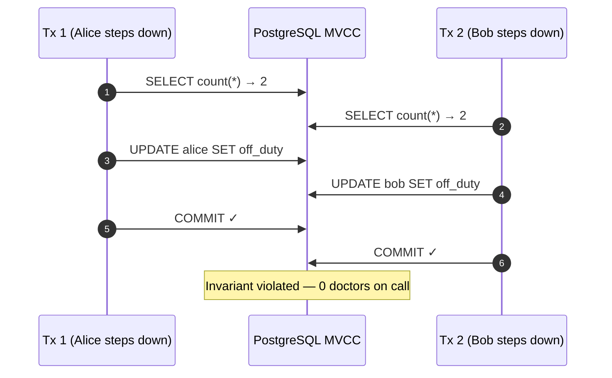

Relational storage engines must isolate concurrent transactions from interfering with one another while maintaining maximum execution throughput. Traditional locking mechanisms (e.g., Strict Two-Phase Locking) ensure safety by locking data cells during reads, but they force a harsh performance trade-off: readers block writers, and writers block readers. Modern high-throughput databases bypass this bottleneck using **Multi-Version Concurrency Control (MVCC)**.

---

## Snapshot Isolation Mechanics

The foundational design objective of MVCC is a system state where **readers never block writers, and writers never block readers**. To achieve this, the storage engine shifts away from in-place physical block modifications. When a data row is updated or deleted, the old version is preserved, and a new variant of that row (tuple) is generated elsewhere within the table's heap pages.

Every data tuple contains internal system metadata tracking attributes embedded within its binary header:

- `xmin`: The unique transaction ID that created this specific row version.
- `xmax`: The transaction ID that deleted or replaced this row version (initialized to `0` if active).

When a transaction initializes under **Snapshot Isolation**, the transaction engine creates an in-memory snapshot matrix containing an array of all active, uncommitted transaction IDs at that point in time. When running a `SELECT` query, the engine applies explicit visibility rules to every traversed tuple:

$$\text{Tuple is Visible IF } (xmin \le Transaction\_Snapshot \text{ AND } xmin \notin Active\_Tx\_List) \text{ AND } (xmax = 0 \text{ OR } xmax > Transaction\_Snapshot)$$

This logical evaluation allows the transaction to read a perfectly consistent historical state of the data without acquiring read locks, even as concurrent threads continuously commit updates to those exact same rows.

```text
  MVCC Tuple Chain on a Single Logical Row
  ┌─────────────────────────────────────────────────────┐
  │  Heap Page                                          │
  │  ┌──────────────┐    ┌──────────────┐               │
  │  │ v1 (dead)    │───►│ v2 (dead)    │───► v3 (live) │
  │  │ xmin=100     │    │ xmin=200     │    │ xmin=300  │
  │  │ xmax=200     │    │ xmax=300     │    │ xmax=0    │
  │  └──────────────┘    └──────────────┘    └───────────┘
  └─────────────────────────────────────────────────────┘
         ▲                                          ▲
         │                                          │
    invisible to                            visible to Tx
    Tx snapshot=250                         snapshot=350
```

Dead tuple versions accumulate until `VACUUM` reclaims them — the same bloat mechanics described in [Outbox/Inbox Performance Tuning](/database-internals/outbox-inbox-performance-tuning/).

---

## Isolation Level Realities

The ANSI/ISO SQL standard defines four primary isolation levels designed to balance data correctness against runtime concurrency. Under an MVCC engine, these configurations change how visibility snapshots are managed:

| Isolation Level | Snapshot Boundary | Dirty Read | Non-Repeatable Read | Phantom Read |
| :--- | :--- | :---: | :---: | :---: |
| **READ UNCOMMITTED** | Per statement | Possible | Possible | Possible |
| **READ COMMITTED** | Per statement | Blocked | Possible | Possible |
| **REPEATABLE READ** | Per transaction | Blocked | Blocked | Blocked (PostgreSQL) |
| **SERIALIZABLE** | SSI dependency graph | Blocked | Blocked | Blocked |

- **READ COMMITTED:** The engine generates a brand-new transaction snapshot at the initialization of **each individual query statement** within the transaction block. This blocks dirty reads but remains vulnerable to **non-repeatable reads** (where a concurrent transaction alters and commits a row between your statements) and **phantom reads** (where concurrent inserts introduce new rows into range queries). PostgreSQL's default isolation level.
- **REPEATABLE READ:** The engine generates a single transaction snapshot once at the **initial opening boundary of the overall transaction**. Every subsequent statement maps data visibility against this same snapshot, ensuring repeatable reads. PostgreSQL's implementation also prevents phantom reads via predicate locking on index ranges.

```sql
-- PostgreSQL: set isolation for the current transaction
BEGIN TRANSACTION ISOLATION LEVEL REPEATABLE READ;
SELECT count(*) FROM on_call_doctors WHERE status = 'ACTIVE';  -- snapshot frozen here
-- ... later statements see the same row versions ...
COMMIT;
```

---

## The Write Skew Trap

While `REPEATABLE READ` snapshot isolation protects applications from standard phantom reads, it remains vulnerable to a subtle data anomaly known as **write skew**.

Write skew manifests when concurrent transactions evaluate independent data rows to modify a common business constraint. Consider an enterprise medical staffing system enforcing an invariant: *"The facility must maintain at least one active doctor on call at all times."*

1. Doctors Alice and Bob are both currently on call. The database contains two distinct rows matching this state.
2. Transaction 1 (Alice) opens under `REPEATABLE READ` snapshot isolation and queries the active on-call count. The engine evaluates the current database snapshot and safely reads a count of `2`.
3. Transaction 2 (Bob) concurrently opens under an identical snapshot isolation boundary, runs the same query, and reads an identical count of `2`.
4. Transaction 1 concludes that because the count is 2, Alice can safely step down. It executes an `UPDATE` to change Alice's state to off-duty and commits.
5. Concurrently, Transaction 2 assumes that because its snapshot count is 2, Bob can also safely step down. It executes an `UPDATE` to modify Bob's state to off-duty and commits.

Because Transaction 1 and Transaction 2 mutated completely different physical rows (Alice's row vs. Bob's row), their write locks never overlapped. Both transactions commit successfully via the WAL ledger. However, the true database state violates the business invariant: the facility now has zero doctors on call.



| Anomaly | Overlapping Rows? | Detected by REPEATABLE READ? |
| :--- | :---: | :---: |
| **Lost update** | Same row | Yes — row lock conflict |
| **Write skew** | Different rows, shared constraint | **No** — no lock overlap |
| **Phantom read** | New rows in range | Blocked in PostgreSQL RR |

---

## Mitigation Protocols

To protect multi-tenant business systems against write skew anomalies, engineers must apply one of two primary architectural protocols:

### Protocol A: Explicit Pessimistic Locking

The application layer can force write serialization by appending locking commands directly onto its read queries. By executing a `SELECT ... FOR UPDATE` statement, the engine overrides the standard MVCC read isolation bypass, acquiring an explicit row-level write lock on the target data rows. This forces concurrent transactions trying to read or modify those same keys to block until the initial transaction concludes.

```sql
BEGIN;
-- Lock all active on-call rows before evaluating the constraint
SELECT id FROM on_call_doctors
WHERE status = 'ACTIVE'
FOR UPDATE;

-- Safe to step down — concurrent transactions block on the lock
UPDATE on_call_doctors SET status = 'OFF_DUTY' WHERE id = 'alice';
COMMIT;
```

**Trade-off:** Prevents write skew on the locked row set, but introduces blocking and increases [lock graph](/database-internals/lock-graphs-deadlocks-latching/) contention under high concurrency.

### Protocol B: Serializable Isolation + Retries

The cleaner architectural alternative is configuring the system to run at a strict `SERIALIZABLE` isolation level. Modern serializable tracking loops use **Serializable Snapshot Isolation (SSI)**. The engine does not block read paths with physical locks; instead, it maintains an in-memory dependency graph tracking read-write constraints across active transactions.

If the database detects an overlapping dependency cycle at commit time (e.g., confirming a write skew collision), the engine aborts the trailing transaction, executes a full rollback, and throws an explicit isolation error code (`SQLSTATE 40001`). The application layer must capture this conflict code and automatically route the failed transaction into a retry loop.

```javascript
const MAX_RETRIES = 3;

async function stepDownDoctor(doctorId) {
    for (let attempt = 0; attempt < MAX_RETRIES; attempt++) {
        const tx = await db.beginTransaction({ isolationLevel: 'SERIALIZABLE' });
        try {
            const count = await tx.query(
                "SELECT count(*) FROM on_call_doctors WHERE status = 'ACTIVE'"
            );
            if (count.rows[0].count <= 1) throw new Error('Cannot step down — last doctor');

            await tx.query(
                "UPDATE on_call_doctors SET status = 'OFF_DUTY' WHERE id = $1",
                [doctorId]
            );
            await tx.commit();
            return;
        } catch (error) {
            await tx.rollback();
            if (error.code === '40001' && attempt < MAX_RETRIES - 1) continue; // serialization failure
            throw error;
        }
    }
}
```

| Protocol | Mechanism | Throughput | Complexity |
| :--- | :--- | :--- | :--- |
| **`SELECT FOR UPDATE`** | Pessimistic row locks | Lower under contention | Simple; explicit in SQL |
| **`SERIALIZABLE` + retry** | SSI predicate dependencies | Higher read concurrency | Requires app-level retry on `40001` |
| **Advisory lock** | Application-scoped mutex | Medium | Good for shard/partition guards |

Choosing the right isolation level is a query-planning and concurrency design decision — long-running snapshots from bad [CBO plans](/database-internals/cost-based-query-optimization/) amplify dead tuple accumulation and make every MVCC trade-off more expensive at scale.
