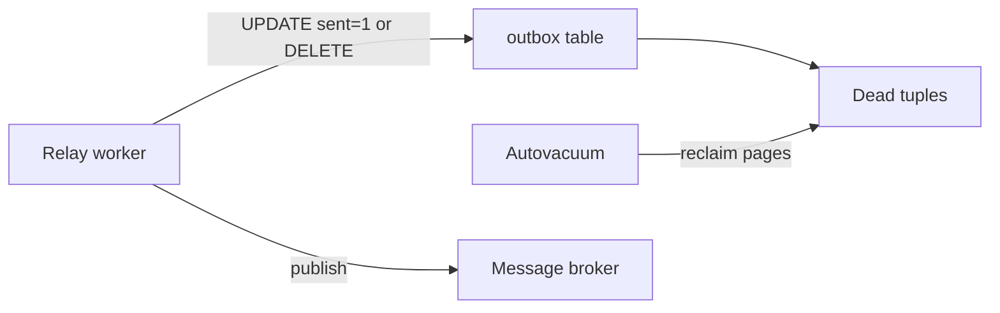

Deploying the [Transactional Outbox](/database-internals/transactional-outbox-pattern/) and [Transactional Inbox](/database-internals/transactional-inbox-pattern/) patterns solves distributed data consistency challenges, but transitions the complexity into the database engine. High-frequency insert, poll, update, and delete sequences create heavy operational loads on the storage layer. To scale transaction throughput, engineers must configure and tune the storage system specifically for high-churn event queues.

---

## MVCC Dead Tuple Bloat

Modern relational databases (such as PostgreSQL) manage concurrent transactions using Multi-Version Concurrency Control (MVCC). When a polling relay worker updates a batch of outbox rows to mark them as sent (`UPDATE outbox SET sent = 1 ...`), the storage engine does not modify the data blocks in place. Instead, it writes a completely new version of those rows (tuples) elsewhere in the page block and flags the older variants as physically expired.

In high-volume setups generating millions of events daily, this design causes massive **table bloat**:

- **Dead Tuple Accumulation:** Unreclaimed, expired row versions (dead tuples) continue clogging physical disk pages.
- **Scan Degradation:** Sequential sweeps or index traversals spend valuable memory and disk I/O processing these dead data blocks, degrading system execution speeds.
- **Autovacuum Exhaustion:** If the database's background vacuum system cannot keep up with the generation rate of dead rows, table bloat expands, driving up storage costs and degrading read performance.

### Production Remediation Blueprint

To prevent high-churn queue tables from causing system degradation, developers must aggressively adjust autovacuum configurations for the `outbox` and `inbox` tables:

```sql
-- Allocate aggressive vacuum parameters directly onto high-churn transactional tables
ALTER TABLE outbox SET (
    autovacuum_vacuum_scale_factor = 0.05,    -- Trigger vacuum after 5% row churn
    autovacuum_vacuum_threshold    = 1000,    -- Vacuum as soon as 1,000 tuples expire
    autovacuum_vacuum_cost_limit   = 2000,    -- Higher disk I/O budget for vacuum workers
    autovacuum_vacuum_cost_delay   = 2        -- Minimize sleep intervals between vacuum pages
);

ALTER TABLE inbox SET (
    autovacuum_vacuum_scale_factor = 0.05,
    autovacuum_vacuum_threshold    = 1000,
    autovacuum_vacuum_cost_limit   = 2000,
    autovacuum_vacuum_cost_delay   = 2
);
```

For high-throughput requirements, configure the relay engine to permanently drop rows (`DELETE FROM outbox WHERE id = ANY(...)`) inside the acknowledgement transaction block instead of using a `sent` status flag. Combined with aggressive vacuum configuration, this allows the engine to recycle empty slots within active memory buffer pages, preventing physical table bloat on disk.

| Strategy | Bloat Impact | Trade-off |
| :--- | :--- | :--- |
| **`sent = 1` flag (UPDATE)** | High dead tuple churn | Simple audit trail; requires aggressive autovacuum |
| **DELETE after ACK** | Minimal dead tuples | No replay history; lowest storage footprint |
| **Archive table + DELETE** | Low on hot table | Extra `INSERT` to cold storage; best of both worlds |



---

## Alleviating Polling Stress

If your application deploys a Polling Publisher model rather than log-based Change Data Capture (CDC), background worker services can place severe read strain on the index trees. Continuous, uncoordinated loops running `SELECT` queries across high-volume tables cause continuous disk page swapping and waste CPU cycles.

Optimizing this read layer requires a multi-tier indexing strategy:

### Leverage Partial Indexes

Avoid indexing the entire outbox file. Exclude the historical archive entirely by maintaining an explicit conditional index targeted only at active rows:

```sql
CREATE INDEX idx_outbox_active_hub ON outbox (created_at ASC) WHERE sent = 0;
```

The partial index keeps relay polling off dead rows and shrinks the B+ Tree footprint to only pending events — the exact rows the poller queries.

### Execute Horizontal Batching

Train relay loops to extract data in fixed windows rather than processing single rows. This reduces read transaction frequencies and maximizes database throughput.

| Batch Size | Polling Interval | Typical Throughput Profile |
| :--- | :--- | :--- |
| 50–100 rows | 500 ms – 1 s | Moderate event volume, low DB load |
| 100–500 rows | 250–500 ms | High volume, balanced latency |
| 500+ rows | 100–250 ms | Burst traffic; monitor lock duration |

### Implement Non-Blocking Concurrency Control

When running multiple parallel relay services to scale processing speeds, prevent different workers from processing the same row records by applying specialized concurrency markers:

```sql
SELECT id, topic, payload
FROM outbox
WHERE sent = 0
ORDER BY created_at ASC
LIMIT 100
FOR UPDATE SKIP LOCKED;  -- Lock matching rows; skip already-locked partitions
```

`SKIP LOCKED` allows N parallel pollers to drain the outbox concurrently without blocking on each other's row locks — each worker grabs a disjoint batch.

---

## Advisory Locking Protocols

When scaling background processing systems horizontally across a cluster, standard row-level lock trees (`FOR UPDATE`) can become inefficient under heavy traffic. The engine must manage extensive internal wait graphs, which can trigger transaction serialization bottlenecks and system latch contention — the same class of problems covered in [Lock Graphs & Deadlocks](/database-internals/lock-graphs-deadlocks-latching/).

Advanced storage architectures optimize this coordination layer by decoupling worker synchronization from physical data tables entirely, utilizing native **advisory locks**.

```text
               [ Distributed Relay Worker Nodes ]
               ┌────────────────┬────────────────┐
               ▼                ▼                ▼
         [ Agent Pod 1 ]  [ Agent Pod 2 ]  [ Agent Pod 3 ]
               │                │                │
               └────────┬───────┴────────────────┘
                        ▼       ▼
           [ PostgreSQL Shared Memory Subsystem ]
           ┌────────────────────────────────────────┐
           │      Shared Memory Advisory Matrix     │ ◄── Validates custom lock hashes
           │ (Locks application logic, NOT rows!) │     without data-block mutations
           └────────────────────────────────────────┘
```

Advisory locks are custom application-level locks that exist purely within the database's shared memory cache, completely independent of data page states or row mutations. This allows background workers to coordinate processing locks on specific application structures (e.g., locking an outbox shard or partition ID) quickly, avoiding disk write overhead or lock graph escalation risks.

```javascript
// Sample relay engine utilizing non-blocking transaction advisory locks
async function processOutboxPartition(partitionId) {
    // Generate a unique 64-bit numerical hash signature for the target application context
    const lockHash = generateHashValue('outbox_partition', partitionId);

    // Attempt to acquire a non-blocking advisory lock in database memory space
    const lockAcquired = await db.query(
        'SELECT pg_try_advisory_xact_lock($1) AS locked;',
        [lockHash]
    );

    if (!lockAcquired.rows[0].locked) {
        // Safe return path if another parallel node is already processing this partition shard
        log.info(`Partition ${partitionId} is locked by another agent node. Skipping loop.`);
        return;
    }

    // The node secured the advisory lock. Proceed with safe batch processing...
    const events = await db.query(
        'SELECT * FROM outbox WHERE partition_id = $1 AND sent = 0 LIMIT 100;',
        [partitionId]
    );
    await publishEventBatchToBroker(events.rows);
}
```

By applying short-lived, transaction-scoped advisory locks (`pg_try_advisory_xact_lock`), the execution engine verifies lock statuses instantly in RAM. If a resource is active, the worker skips the row processing loop entirely, eliminating database contention and enabling reliable horizontal scaling.

| Lock Type | Scope | Use Case |
| :--- | :--- | :--- |
| `pg_try_advisory_xact_lock(key)` | Transaction-scoped; auto-released on `COMMIT`/`ROLLBACK` | Partition/shard coordination |
| `pg_try_advisory_lock(key)` | Session-scoped; manual release required | Long-running background jobs |
| `FOR UPDATE SKIP LOCKED` | Row-level; touches data pages | Batch polling without shard partitioning |

### Module 2 Operational Checklist

| Concern | Tuning Action |
| :--- | :--- |
| Table bloat | Aggressive per-table autovacuum; prefer `DELETE` over `UPDATE sent` |
| Poll latency | Partial index on `WHERE sent = 0`; batch `LIMIT 100` |
| Worker contention | `FOR UPDATE SKIP LOCKED` for row batches; advisory locks for shard coordination |
| Inbox cleanup | Partial index on `WHERE status = 'PROCESSED'`; scheduled purge job |

These three layers — MVCC hygiene, index-aware polling, and advisory coordination — form the operational baseline for running outbox/inbox pipelines at production event volume without degrading the primary database cluster.
