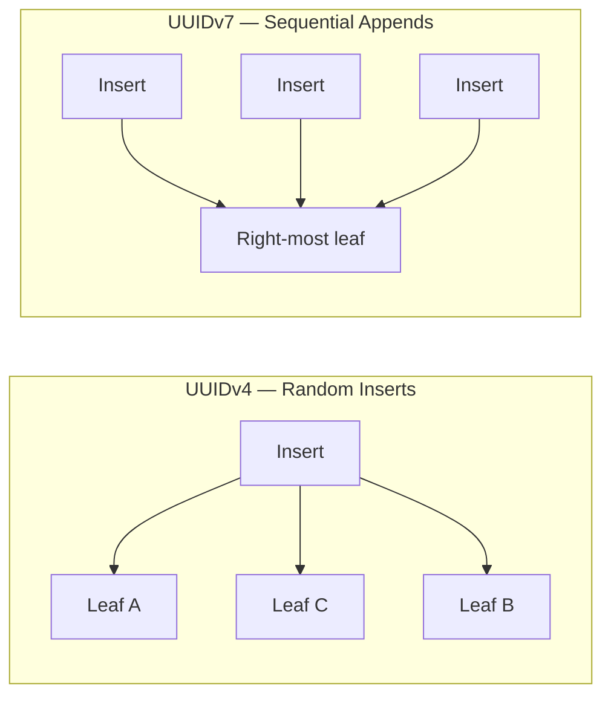

The selection of a table's primary key determines the storage layout efficiency, index maintenance overhead, and horizontal scalability limits of a relational schema. Selecting an incorrect primary key data type propagates downstream performance penalties into every referencing secondary index and foreign key column. Production-grade schema design requires evaluating the strict mathematical and physical structural trade-offs between natural, surrogate, random, and sequential identifiers.

---

## The Natural Key Pitfall

A **natural key** is an attribute inherently present within the business domain that carries domain meaning and uniqueness (e.g., an `email` string, a `username`, or a tax identification number). While using a natural key can make a schema more intuitive by eliminating the need for an artificial identity column, it presents severe architectural hazards in production systems:

- **Immutability Failure:** True business domain invariants are exceptionally rare. If a user changes their `username` or an organization mutates a tax identifier, the database engine must execute a cascading update sequence across all foreign-key tables referencing that natural key. This triggers intensive row locking and high write-amplification penalties across the schema.
- **Index Fragmentation:** Natural keys are typically variable-length text strings (`VARCHAR`). Storing multi-byte strings as a primary key rapidly inflates the physical size of the primary index tree, decreasing overall index density and cache efficiency within the engine's buffer pool.
- **Cascading Bloat:** Because secondary indexes store a copy of the primary key pointer inside their leaf nodes to map back to the table heap, any size inflation in the primary key duplicates across every single secondary index tree, accelerating table bloat.

| Natural Key Example | Risk |
| :--- | :--- |
| `email VARCHAR(255)` | Mutable; wide index entries; PII in every FK column |
| `username VARCHAR(50)` | Rename cascades; case-sensitivity edge cases |
| `tax_id VARCHAR(20)` | Regulatory format changes; cross-jurisdiction collisions |

---

## The Surrogate Key Baseline

To isolate storage optimization from unstable business domain rules, advanced database design mandates the use of a **surrogate key** — a globally unique, system-generated identifier devoid of domain meaning (e.g., an auto-incremented `BIGINT` or a unique binary identifier).

Historically, the auto-incremented `BIGINT` (8-byte integer) has served as the default surrogate key standard. Integers naturally align with CPU registers, sort rapidly, and pack efficiently into 8 KB page cells, maximizing [B+ Tree fan-out](/database-internals/b-plus-tree-storage-mechanics/) parameters.

Furthermore, because auto-incrementing values are strictly monotonic (ordered sequentially), the storage engine appends new records into the right-most leaf node of the index structure. This sequential write path eliminates random disk block seeks and prevents index page splits.

However, standard auto-increment integers present significant architecture limits when scaling horizontally:

- **Central Coordination Bottleneck:** In sharded or multi-primary topologies, independent cluster instances cannot safely generate monotonic integers without a centralized coordinator service. Without global cross-node synchronization, different database nodes will inevitably assign identical integer IDs to completely different entity rows, resulting in identifier collisions.
- **Information Leakage:** Sequential integer IDs expose system metrics externally through the application API (e.g., `api/v1/orders/1001`), allowing malicious actors to scrape data or infer confidential transaction volumes.

### The Random UUIDv4 Pitfall

To solve the multi-primary coordinate collision dilemma, developers often turn to standard 128-bit random identifiers (**UUIDv4**). While UUIDv4 allows decentralized nodes to generate globally unique IDs independently without network coordination, its complete lack of chronological ordering breaks physical storage efficiency:

```text
  UUIDv4 Insert — Random Leaf Targeting (Page Split Risk)
                    ┌─────────┐
                    │  Root   │
                    └────┬────┘
           ┌─────────────┼─────────────┐
           ▼             ▼             ▼
      ┌─────────┐   ┌─────────┐   ┌─────────┐
      │ Leaf A  │   │ Leaf B  │   │ Leaf C  │
      └─────────┘   └────┬────┘   └─────────┘
                         │
                    INSERT uuid-7f3a...  ◄── random key lands here
                         │
                    [ PAGE SPLIT ]  ◄── full leaf → allocate sibling + promote key
```

Because a UUIDv4 hash is completely random, incoming inserts target arbitrary leaf nodes across the B+ Tree structure. If an insert targets a leaf node page that is already completely full, the engine must trigger an expensive **page split** out-of-band. The engine allocates a new page, copies half the keys over, and alters parent node pointers.

Under heavy write traffic, this behavior triggers severe **page split storms**, causing immense random disk I/O, heavy index fragmentation, and massive memory buffer pool swapping.

| Key Type | Uniqueness | Insert Pattern | Sharding |
| :--- | :--- | :--- | :--- |
| `BIGSERIAL` | Per-node only | Sequential append | Requires coordinator |
| `UUIDv4` | Global, decentralized | Random scatter | Shard-safe |
| `UUIDv7` / `ULID` | Global, decentralized | Near-sequential append | Shard-safe |

---

## The Production Solution

Modern high-scale storage systems resolve this dilemma by using lexicographically sortable, time-ordered identifiers, specifically **UUIDv7** or **ULID** (Universally Unique Lexicographically Sortable Identifier).

```text
             Production-Grade UUIDv7 Binary Layout
┌───────────────────────────┬──────────────┬────────────────────────────┐
│  48-Bit Unix Epoch MS     │ 12-Bit Var/  │     68-Bit Random Noise    │
│ (Chronological Timestamp) │ Version Bits │ (Decentralized Uniqueness) │
└─────────────┬─────────────┴──────┬───────┴──────────────┬─────────────┘
              │                    │                      │
              ▼                    ▼                      ▼
   Sequential append paths    Maintains RFC          Zero global collisions
   inside B+ Tree leaves      compliance           across shards
```

A UUIDv7 embeds a 48-bit millisecond-precision Unix timestamp prefix followed by cryptographically secure random noise. This hybrid design successfully balances decentralization constraints with physical hardware storage mechanics:

- **Decoupled Generation:** Shards, background workers, and client devices generate identifiers independently without network consensus blocks, guaranteeing zero global cross-shard collisions.
- **B+ Tree Write Alignment:** Because the primary prefix increments monotonically over time, new inserts cluster at the right edge of the index — the same sequential append path that makes `BIGSERIAL` fast, without a central ID allocator.
- **Secondary Index Efficiency:** A 16-byte UUID fits in a fixed-width column; every secondary index stores a compact, predictable key width instead of variable-length natural strings.

### UUIDv7 vs ULID

| Property | UUIDv7 (RFC 9562) | ULID |
| :--- | :--- | :--- |
| **Timestamp precision** | 48-bit Unix ms | 48-bit Unix ms |
| **Encoding** | Standard UUID string (`018f...`) | Crockford Base32 (`01ARZ3NDEK...`) |
| **Sort order** | Lexicographic by timestamp prefix | Lexicographic by timestamp prefix |
| **Ecosystem** | Native in PostgreSQL 18+ (`uuidv7()`) | Library-driven (no built-in PG function) |
| **Use when** | Standard UUID columns already in schema | URL-safe, case-insensitive IDs needed |

```sql
-- PostgreSQL 18+: native time-ordered UUID generation
CREATE TABLE orders (
    id         UUID PRIMARY KEY DEFAULT uuidv7(),
    user_id    UUID NOT NULL,
    amount     NUMERIC(12, 2) NOT NULL,
    created_at TIMESTAMPTZ DEFAULT NOW() NOT NULL
);

-- Application-layer ULID (via library) stored as CHAR(26) or BYTEA
CREATE TABLE events (
    id         CHAR(26) PRIMARY KEY,  -- e.g. '01ARZ3NDEKTSV4RRFFQ69G5FAV'
    payload    JSONB NOT NULL
);
```



### Selection Decision Matrix

| Requirement | Recommended Key |
| :--- | :--- |
| Single-node PostgreSQL, no sharding | `BIGSERIAL` — simplest, fastest |
| Multi-shard / client-generated IDs | `UUIDv7` or `ULID` |
| Existing `UUID` columns, random v4 in production | Migrate new rows to `uuidv7()`; avoid backfill storms |
| Human-readable, URL-safe identifiers | `ULID` (26-char Base32) |
| Domain uniqueness needed for queries | Surrogate PK + `UNIQUE` constraint on natural key |

The primary key is the root of every index tree in the schema. Choosing a time-ordered surrogate key preserves the [B+ Tree append efficiency](/database-internals/b-plus-tree-storage-mechanics/) of monotonic integers while eliminating the coordination and enumeration risks that break `BIGSERIAL` at scale. Schema-level patterns that build on this foundation — soft deletes, partial indexes, and JSONB — are covered in [Schema Optimization Primitives](/database-internals/advanced-schema-optimization/).
