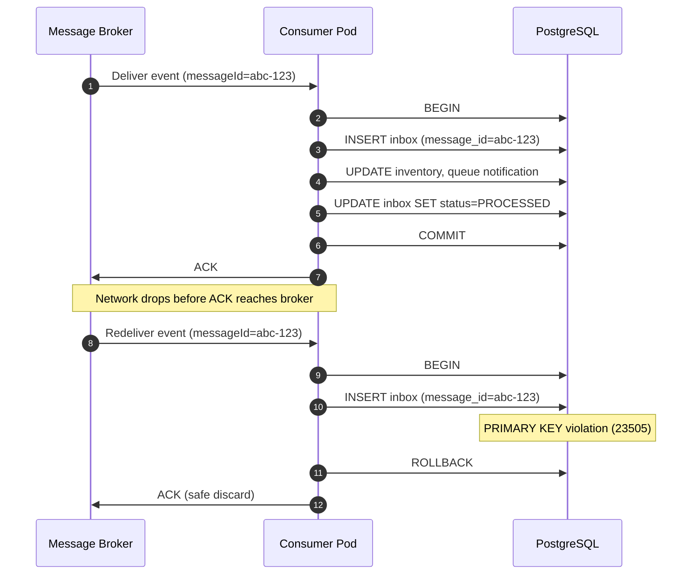

The [Transactional Outbox pattern](/database-internals/transactional-outbox-pattern/) guarantees that an upstream service will deliver message payloads to a broker at least once. However, across unreliable network boundaries, this at-least-once design introduces a downstream side effect: message redelivery. Consumers must be engineered to handle duplicate payloads safely. The Transactional Inbox pattern provides a systematic database-level framework to enforce message idempotency.

---

## The Redelivery Guarantee

Production-grade message brokers (e.g., Apache Kafka, RabbitMQ) rely on explicit network acknowledgements (ACKs) to coordinate data delivery streams. If a network disruption or application crash occurs *after* a downstream consumer processes an event but *before* the broker registers the consumer's ACK, the broker will re-queue and redeliver that identical event.

```text
    The Redelivery Pipeline Error Context
┌──────────────────┐     1. Deliver Event Payload     ┌──────────────────┐
│  Message Broker  ├─────────────────────────────────►│ Consumer App Pod │
└────────▲─────────┘                                  └────────┬─────────┘
         │                                                     │
         │ [ Network Drop Blocks Consumer ACK Link ]           │ 2. Mutate Local
         │                                                     ▼    State (Done)
         └─────────────────── X ──────────────────────── [ Database ]

[ Result: Broker Triggers Event Redelivery to Next Active Consumer Pod ]
```

If the downstream application runs a non-idempotent operation (such as adding charges to an invoice or decrementing stock inventory variables) based on this redelivered query, a data mutation anomaly occurs. Because distributed networks cannot guarantee exactly-once network transport delivery profiles, consumer services must handle duplicate requests gracefully at the storage tier.

| Delivery Guarantee | Who Provides It | Consumer Requirement |
| :--- | :--- | :--- |
| **At-most-once** | Broker discards on send | None — but events can be lost |
| **At-least-once** | Broker redelivers on missing ACK | **Idempotent processing required** |
| **Exactly-once** | Broker + transactional consumer | Inbox table or dedup store at DB layer |

---

## Idempotency Enforcement

The Transactional Inbox pattern resolves this vulnerability by processing incoming events through a structured deduplication ledger — the `inbox` tracking table. Rather than immediately altering core business domains upon payload receipt, the service forces the ingestion metadata through a tracking table within an atomic transaction boundary.

A production-grade transactional inbox table relies on the following relational schema layout:

```sql
CREATE TABLE inbox (
    message_id     UUID PRIMARY KEY,
    consumer_group VARCHAR(255) NOT NULL,
    status         VARCHAR(50) DEFAULT 'PROCESSING' NOT NULL,
    processed_at   TIMESTAMP WITH TIME ZONE,
    created_at     TIMESTAMP WITH TIME ZONE DEFAULT CURRENT_TIMESTAMP NOT NULL
);

-- Index path to track and clean out historical messages
CREATE INDEX idx_inbox_cleanup ON inbox (created_at) WHERE status = 'PROCESSED';
```

By binding the unique incoming `message_id` directly to a strict `PRIMARY KEY` constraint, the database engine uses its core B+ Tree indexing properties to prevent duplicate message ingestion. For multi-tenant consumers processing the same broker topic, a composite unique key on `(message_id, consumer_group)` extends the same guarantee across parallel consumer groups.

| Column | Purpose |
| :--- | :--- |
| `message_id` | Broker-assigned or upstream-generated unique event identifier |
| `consumer_group` | Isolates deduplication scope per consumer fleet |
| `status` | `PROCESSING` → `PROCESSED` lifecycle tracker |
| `processed_at` | Completion timestamp for observability and retention policies |
| `created_at` | Drives cleanup queries on the partial index |

---

## Unique Constraint Ingestion

When a consumer pod fetches an event payload from a queue, it opens an explicit transactional context against the targeted storage instance. The application write path executes an intentional unique check by running a preemptive insertion into the inbox registry table:

```javascript
// Ingestion pipeline executing strict idempotent unique checks
async function consumeOrderCreatedEvent(eventMsg) {
    const { messageId, payload } = eventMsg;
    const tx = await db.beginTransaction();

    try {
        // 1. Attempt to insert the unique incoming message tracker row
        await db.inbox.insert({
            message_id: messageId,
            consumer_group: 'order-post-processing',
            status: 'PROCESSING'
        }, { transaction: tx });

        // 2. Execute primary business domain mutations
        await db.inventory.decrementStock(payload.itemId, payload.quantity, { transaction: tx });
        await db.customerNotifications.queueEmail(payload.userId, 'Order Confirmed', { transaction: tx });

        // 3. Mark the inbox row status as fully resolved
        await db.inbox.update({
            status: 'PROCESSED',
            processed_at: db.fn.now()
        }, { where: { message_id: messageId }, transaction: tx });

        // Atomic local engine commit boundary
        await tx.commit();
        await eventMsg.ack(); // Securely clear message from broker cluster

    } catch (error) {
        await tx.rollback();

        // Handle database engine primary key constraint violations unique to duplicate hits
        if (error.code === '23505') { // Standard PostgreSQL unique violation error code
            console.warn(`Duplicate event message intercepted: ${messageId}. Discarding safely.`);
            await eventMsg.ack(); // ACK immediately — discard duplicate without retry loops
            return;
        }

        throw error; // Propagate business failures for standard queue retry paths
    }
}
```

This pattern leverages the database's transactional indexing layer to prevent duplicate processing. If a duplicate message enters the pipeline due to a connection failure, the secondary insertion attempt triggers a **unique constraint violation** directly inside the primary indexing ring. The transaction immediately aborts and rolls back, completely isolating the business tables from duplicate data mutations.



### Duplicate Discard Mechanics

The critical design decision is **when to ACK** relative to the database commit:

| Scenario | Inbox Insert | Business Mutation | Action |
| :--- | :--- | :--- | :--- |
| **First delivery** | Success | Committed | `COMMIT` → `ACK` |
| **Duplicate delivery** | `23505` violation | Rolled back — never executed | `ACK` immediately (no retry storm) |
| **Business logic failure** | Rolled back | Rolled back | No `ACK` — broker redelivers for retry |

The inbox row acts as a **deduplication fence**: the `PRIMARY KEY` on `message_id` converts an application-level idempotency problem into a storage-engine guarantee that duplicate keys cannot coexist in the same B+ Tree leaf.

### Outbox + Inbox as a Paired Pattern

| Side | Pattern | Guarantee |
| :--- | :--- | :--- |
| **Producer** | [Transactional Outbox](/database-internals/transactional-outbox-pattern/) | Domain row + event row commit atomically |
| **Consumer** | Transactional Inbox | Duplicate events discarded via unique constraint |
| **Operations** | [Performance Tuning](/database-internals/outbox-inbox-performance-tuning/) | Polling intervals, MVCC bloat, advisory locks |

Together, outbox and inbox form the standard production answer to **exactly-once processing semantics** across microservice boundaries — without distributed 2PC.
