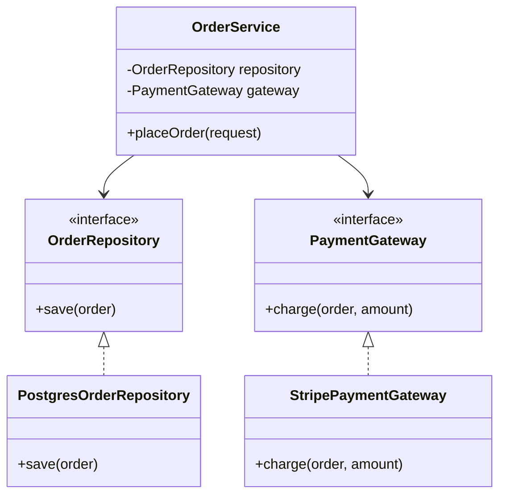
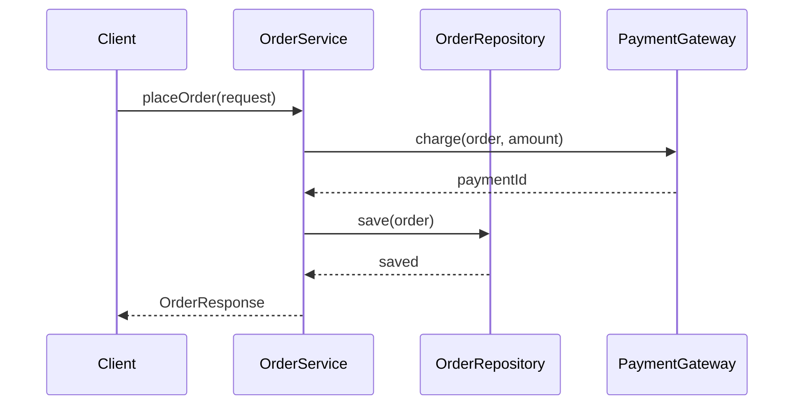

### Problem & Intent

The Dependency Inversion Principle (DIP) states that **high-level modules should not depend on low-level modules; both should depend on abstractions**. When `OrderService` imports JDBC classes directly, business logic is locked to Postgres, untestable without a database, and resistant to swapping storage. DIP inverts the dependency arrow — the domain defines `OrderRepository`; infrastructure implements it.

---

### When to Use / When NOT to Use

| Situation | Use? | Why |
| :--- | :---: | :--- |
| High-level policy code imports concrete DB, HTTP, or SDK types | Yes | Introduce interfaces owned by the domain or application layer |
| Unit tests require a real database or network | Yes | Inject test doubles through abstractions |
| Multiple implementations (Postgres, in-memory, S3) may coexist | Yes | Selection happens at composition root, not inside business logic |
| Script or CLI under 50 lines with one external call | No | Direct dependency is fine — abstraction adds ceremony |
| Abstraction has exactly one implementation forever with no test need | No | YAGNI until a second implementation or mock boundary appears |
| Leaking ORM entity types into every service method | No | DIP pairs with DTO mapping — fix the boundary, not just the import |

---

### Structure (Class Diagram)



---

### Interaction Flow



---

### Implementation




**Violation — high-level depends on JDBC concretion:**

```java
public class OrderService {
    public OrderResponse placeOrder(OrderRequest request) {
        // business rules intertwined with infrastructure
        try (Connection conn = DriverManager.getConnection(System.getenv("DB_URL"))) {
            PreparedStatement ps = conn.prepareStatement(
                "INSERT INTO orders (customer_id, total) VALUES (?, ?)");
            ps.setLong(1, request.customerId());
            ps.setBigDecimal(2, request.total());
            ps.executeUpdate();
        } catch (SQLException e) {
            throw new RuntimeException(e);
        }
        return new OrderResponse(/* ... */);
    }
}
```

**DIP-aligned — depend on abstractions, wire at the edge:**

```java
public interface OrderRepository {
    Order save(Order order);
}

public interface PaymentGateway {
    PaymentResult charge(Order order, Money amount);
}

public final class OrderService {
    private final OrderRepository repository;
    private final PaymentGateway paymentGateway;

    public OrderService(OrderRepository repository, PaymentGateway paymentGateway) {
        this.repository = repository;
        this.paymentGateway = paymentGateway;
    }

    public OrderResponse placeOrder(OrderRequest request) {
        Order order = Order.from(request);
        PaymentResult payment = paymentGateway.charge(order, request.total());
        order.markPaid(payment.id());
        Order saved = repository.save(order);
        return OrderResponse.from(saved);
    }
}

@Repository
public class PostgresOrderRepository implements OrderRepository {
    private final JdbcTemplate jdbc;

    @Override
    public Order save(Order order) { /* JDBC details here only */ }
}
```

**Spring:** constructor injection binds interfaces to `@Repository` / `@Service` implementations at startup.




**Violation:**

```go
type OrderService struct{}

func (s *OrderService) PlaceOrder(req OrderRequest) (OrderResponse, error) {
    db, err := sql.Open("postgres", os.Getenv("DB_URL"))
    if err != nil {
        return OrderResponse{}, err
    }
    defer db.Close()
    _, err = db.Exec(
        "INSERT INTO orders (customer_id, total) VALUES ($1, $2)",
        req.CustomerID, req.Total,
    )
    return OrderResponse{}, err
}
```

**DIP-aligned:**

```go
type OrderRepository interface {
    Save(ctx context.Context, order Order) (Order, error)
}

type PaymentGateway interface {
    Charge(ctx context.Context, order Order, amount Money) (PaymentResult, error)
}

type OrderService struct {
    repo    OrderRepository
    gateway PaymentGateway
}

func NewOrderService(repo OrderRepository, gateway PaymentGateway) *OrderService {
    return &OrderService{repo: repo, gateway: gateway}
}

func (s *OrderService) PlaceOrder(ctx context.Context, req OrderRequest) (OrderResponse, error) {
    order := NewOrder(req)
    payment, err := s.gateway.Charge(ctx, order, req.Total)
    if err != nil {
        return OrderResponse{}, err
    }
    order.MarkPaid(payment.ID)
    saved, err := s.repo.Save(ctx, order)
    if err != nil {
        return OrderResponse{}, err
    }
    return ToResponse(saved), nil
}

// postgres package implements OrderRepository — wired in main()
```

Define interfaces in the **application package**; adapters live in `infra/postgres`, `infra/stripe`.




---

### Trade-offs & Operational Realities

| Concern | Impact |
| :--- | :--- |
| **Testability** | `OrderService` tests use in-memory fakes — no Testcontainers required for unit scope |
| **Complexity** | More types and wiring; composition root (`main`, Spring config) owns the graph |
| **Framework fit** | Spring DI is built for DIP; Go uses explicit constructors or `wire` / `fx` |
| **Leaky abstractions** | Repository interfaces that mirror SQL row shapes defeat the purpose — return domain types |

---

### Junior Mistakes

- Putting interfaces in the infrastructure package (abstraction owned by the wrong layer)
- Creating `IOrderRepository` with only `PostgresOrderRepository` and never testing through it
- Confusing DIP with Dependency Injection — DI is a **mechanism**; DIP is the **design rule**
- Injecting `JdbcTemplate` into domain services instead of a domain-owned port interface

---

### Senior Questions

1. Who **owns** the interface — domain, application, or adapter package?
2. How does DIP interact with [Repository & Unit of Work](/design-patterns/06-architectural-principles/repository-and-unit-of-work/) at the persistence boundary?
3. When is a function parameter enough abstraction vs a named interface?
4. How do you avoid an explosion of one-method interfaces in Go without violating ISP?
5. Where does hexagonal architecture sit relative to DIP — same idea, different vocabulary?

---

### Revision Cheat Sheet

- **One line:** High-level policy depends on abstractions; details implement them.
- **Trigger smell:** `import` of JDBC, AWS SDK, or HTTP client inside a domain service.
- **Pairs with:** [Dependency Injection & IoC](/design-patterns/06-architectural-principles/dependency-injection-inversion-of-control/), [Repository Pattern](/design-patterns/06-architectural-principles/repository-and-unit-of-work/)
- **Avoid when:** The module is a thin script with no test or swap requirement.
- **Interview tip:** Draw arrows — before DIP they point down into infra; after DIP both sides point to an interface.

---

### See Also

- [Single Responsibility Principle](/design-patterns/01-solid-principles/single-responsibility-principle/)
- [Dependency Injection & IoC](/design-patterns/06-architectural-principles/dependency-injection-inversion-of-control/)
- [Repository & Unit of Work](/design-patterns/06-architectural-principles/repository-and-unit-of-work/)
- [Layered vs Hexagonal Architecture](/design-patterns/06-architectural-principles/layered-vs-hexagonal-architecture/)
