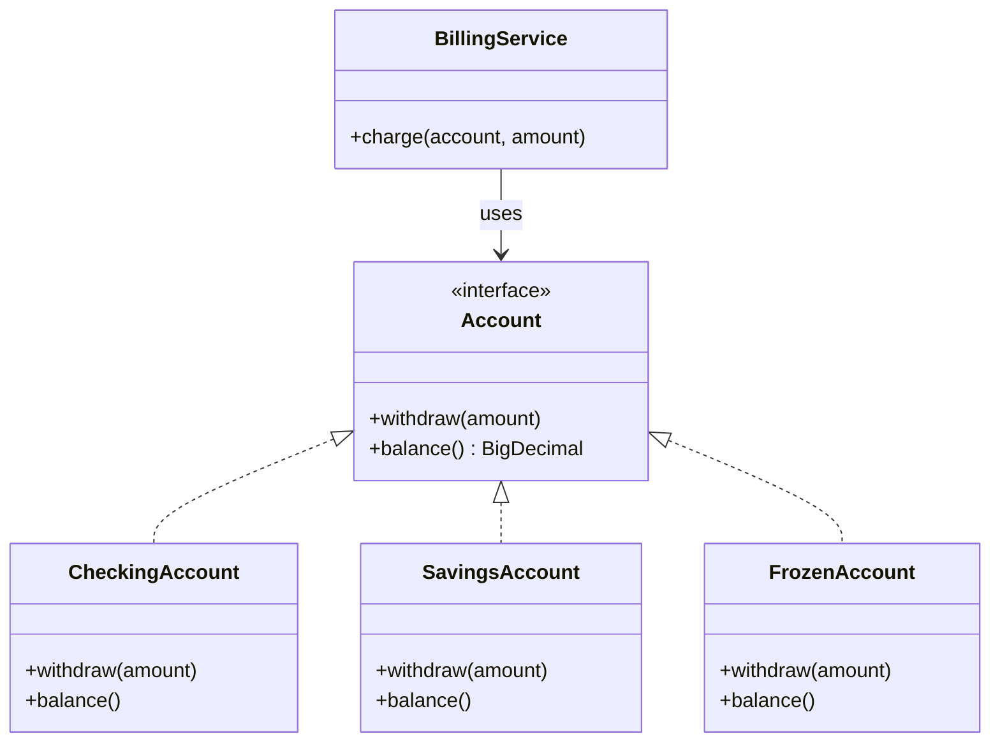
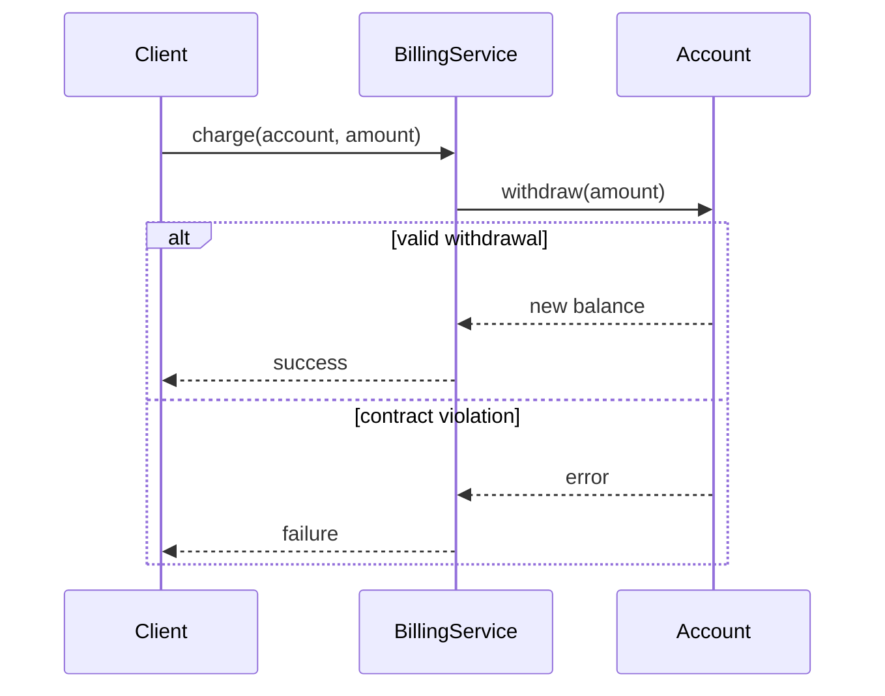

### Problem & Intent

The Liskov Substitution Principle (LSP) requires that **subtypes must be substitutable for their base types** without altering the correctness of the program. If code expects a `Rectangle` but receives a `Square` that rejects unequal width and height, callers break. LSP is about honoring behavioral contracts — preconditions, postconditions, and invariants — not just matching method signatures.

---

### When to Use / When NOT to Use

| Situation | Use? | Why |
| :--- | :---: | :--- |
| Designing inheritance or interface implementations shared by many clients | Yes | Substitutability is the safety net for polymorphism |
| Code review spots overrides that throw `UnsupportedOperationException` | Yes | Signal LSP violation — refactor to a narrower interface |
| Writing contract tests for plugin or driver implementations | Yes | Verify each implementation honors the base contract |
| Subtype "is-a" only in name but not in behavior (read-only `File` that writes) | No | Prefer composition or a separate role interface |
| Sealed hierarchy with no external substitutability requirement | No | LSP matters when clients depend on the abstraction |
| Forcing identical behavior when subtypes genuinely differ | No | Split the abstraction — don't fake substitutability |

---

### Structure (Class Diagram)



---

### Interaction Flow



---

### Implementation




**Violation — subtype breaks caller assumptions:**

```java
public class Rectangle {
    protected int width;
    protected int height;

    public void setWidth(int w) { width = w; }
    public void setHeight(int h) { height = h; }
    public int area() { return width * height; }
}

public class Square extends Rectangle {
    @Override
    public void setWidth(int w) {
        width = w;
        height = w; // surprises code that sets width and height independently
    }

    @Override
    public void setHeight(int h) {
        setWidth(h);
    }
}

// Client breaks when given a Square:
void resize(Rectangle r) {
    r.setWidth(5);
    r.setHeight(4);
    assert r.area() == 20; // fails for Square — LSP violation
}
```

**LSP-aligned — separate abstractions, no false inheritance:**

```java
public interface Account {
    BigDecimal balance();
    WithdrawResult withdraw(Money amount);
}

public final class CheckingAccount implements Account {
    private BigDecimal balance;

    @Override
    public WithdrawResult withdraw(Money amount) {
        if (balance.compareTo(amount.value()) < 0) {
            return WithdrawResult.insufficientFunds();
        }
        balance = balance.subtract(amount.value());
        return WithdrawResult.success(balance);
    }

    @Override
    public BigDecimal balance() { return balance; }
}

public final class FrozenAccount implements Account {
    @Override
    public WithdrawResult withdraw(Money amount) {
        return WithdrawResult.accountFrozen(); // honest contract, not UnsupportedOperationException
    }

    @Override
    public BigDecimal balance() { return BigDecimal.ZERO; }
}
```

Clients depend on `WithdrawResult` outcomes, not on subtype-specific exceptions.




**Violation:**

```go
type Rectangle struct {
    Width, Height int
}

type Square struct {
    Rectangle // embedding does not fix the contract problem
}

func (s *Square) SetWidth(w int) {
    s.Width, s.Height = w, w
}

func Resize(r *Rectangle) int {
    r.Width = 5
    r.Height = 4
    return r.Width * r.Height // wrong if r is actually a Square
}
```

**LSP-aligned:**

```go
type Money struct {
    Cents int64
}

type WithdrawResult struct {
    OK      bool
    Balance Money
    Reason  string
}

type Account interface {
    Balance() Money
    Withdraw(amount Money) WithdrawResult
}

type CheckingAccount struct {
    balance Money
}

func (a *CheckingAccount) Withdraw(amount Money) WithdrawResult {
    if a.balance.Cents < amount.Cents {
        return WithdrawResult{OK: false, Reason: "insufficient funds"}
    }
    a.balance.Cents -= amount.Cents
    return WithdrawResult{OK: true, Balance: a.balance}
}

type FrozenAccount struct{}

func (FrozenAccount) Withdraw(Money) WithdrawResult {
    return WithdrawResult{OK: false, Reason: "account frozen"}
}
```

Go favors **small interfaces** and **result types** over inheritance — each implementation honestly reports outcomes.




---

### Trade-offs & Operational Realities

| Concern | Impact |
| :--- | :--- |
| **Testability** | Contract tests on the base interface catch substitutability regressions across implementations |
| **Complexity** | May require splitting one fat base type into role-specific interfaces (see [ISP](/design-patterns/01-solid-principles/interface-segregation-principle/)) |
| **Framework fit** | Spring `@Service` implementations of the same interface must all honor transactional semantics declared on the contract |
| **Design pressure** | LSP often pushes you from inheritance to composition — slightly more wiring, safer polymorphism |

---

### Junior Mistakes

- Treating LSP as "subclass must override all methods" while `throw new UnsupportedOperationException()` in half of them
- Using inheritance for code reuse (`Square extends Rectangle`) when behavior diverges
- Assuming `@Override` guarantees correctness — signatures match but contracts break
- Ignoring strengthened preconditions (subtype requires *more* before calling) as a silent LSP violation

---

### Senior Questions

1. What **invariants** does the base type promise, and which subtype breaks them?
2. How would you write a contract test that any `Account` implementation must pass?
3. When is "return an error result" LSP-safe vs throwing an unexpected exception?
4. How does LSP relate to the [Interface Segregation Principle](/design-patterns/01-solid-principles/interface-segregation-principle/) for read-only views?
5. Would you use `sealed` interfaces (Java) or small package-local interfaces (Go) to limit unsafe substitutability?

---

### Revision Cheat Sheet

- **One line:** Subtypes must honor the behavioral contract of the base type.
- **Trigger smell:** `UnsupportedOperationException` or `panic("not implemented")` in an override.
- **Pairs with:** [Interface Segregation](/design-patterns/01-solid-principles/interface-segregation-principle/), [Composition over inheritance](/design-patterns/01-solid-principles/solid-principles-composition-guide/)
- **Avoid when:** Forcing one interface on types that behave fundamentally differently.
- **Interview tip:** Walk through Rectangle/Square or a read-only collection that mutates on `add`.

---

### See Also

- [Interface Segregation Principle](/design-patterns/01-solid-principles/interface-segregation-principle/)
- [Open-Closed Principle](/design-patterns/01-solid-principles/open-closed-principle/)
- [SOLID Composition Guide](/design-patterns/01-solid-principles/solid-principles-composition-guide/)
- [Repository & Unit of Work](/design-patterns/06-architectural-principles/repository-and-unit-of-work/)
