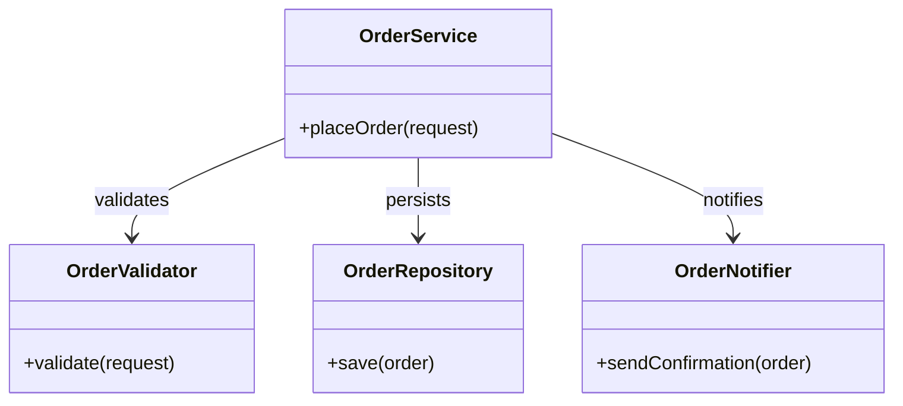
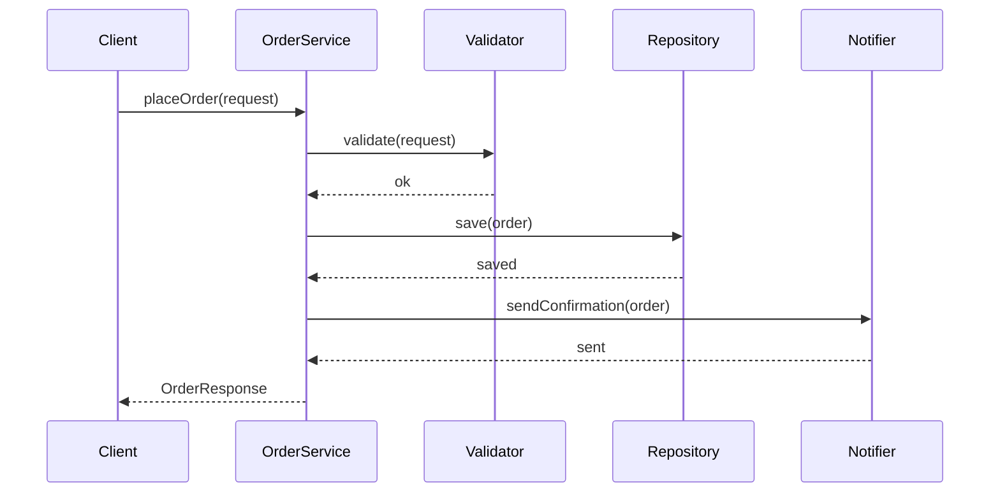

### Problem & Intent

The Single Responsibility Principle (SRP) states that a module should have **one reason to change** — meaning one axis of responsibility, not necessarily one method. When a class mixes persistence, business rules, and presentation, a schema change forces retesting unrelated logic. SRP is the foundation for testable, maintainable LLD.

---

### When to Use / When NOT to Use

| Situation | Use? | Why |
| :--- | :---: | :--- |
| A class changes for multiple unrelated reasons (DB + email + PDF) | Yes | Split by responsibility; each unit owns one concern |
| You need independent unit tests per concern | Yes | Smaller surfaces are easier to mock and verify |
| Team ownership boundaries differ (billing vs notifications) | Yes | Aligns code structure with change frequency |
| A 10-line helper with one clear job | No | Extraction adds noise without reducing change risk |
| Splitting creates circular dependencies between tiny classes | No | Refactor boundaries first; SRP is not micro-class fanaticism |
| "One class per method" as a rigid rule | No | Cohesive operations that always change together belong together |

---

### Structure (Class Diagram)



---

### Interaction Flow



---

### Implementation




**Violation — multiple reasons to change:**

```java
public class OrderManager {
    public void placeOrder(OrderRequest request) {
        if (request.getItems().isEmpty()) {
            throw new IllegalArgumentException("empty order");
        }
        // JDBC mixed with business logic
        try (Connection conn = DriverManager.getConnection(url)) {
            PreparedStatement ps = conn.prepareStatement(
                "INSERT INTO orders (customer_id) VALUES (?)");
            ps.setLong(1, request.getCustomerId());
            ps.executeUpdate();
        } catch (SQLException e) {
            throw new RuntimeException(e);
        }
        // Email mixed in the same class
        mailClient.send(request.getCustomerEmail(), "Order confirmed");
    }
}
```

**SRP-aligned — orchestration only:**

```java
public final class OrderService {
    private final OrderValidator validator;
    private final OrderRepository repository;
    private final OrderNotifier notifier;

    public OrderService(OrderValidator validator,
                        OrderRepository repository,
                        OrderNotifier notifier) {
        this.validator = validator;
        this.repository = repository;
        this.notifier = notifier;
    }

    public OrderResponse placeOrder(OrderRequest request) {
        validator.validate(request);
        Order order = repository.save(Order.from(request));
        notifier.sendConfirmation(order);
        return OrderResponse.from(order);
    }
}
```




**Violation:**

```go
type OrderManager struct {
    dbURL string
}

func (m *OrderManager) PlaceOrder(req OrderRequest) error {
    if len(req.Items) == 0 {
        return errors.New("empty order")
    }
    db, _ := sql.Open("postgres", m.dbURL)
    defer db.Close()
    _, err := db.Exec("INSERT INTO orders (customer_id) VALUES ($1)", req.CustomerID)
    if err != nil {
        return err
    }
    return sendEmail(req.CustomerEmail, "Order confirmed")
}
```

**SRP-aligned:**

```go
type OrderService struct {
    validator  OrderValidator
    repository OrderRepository
    notifier   OrderNotifier
}

func (s *OrderService) PlaceOrder(ctx context.Context, req OrderRequest) (OrderResponse, error) {
    if err := s.validator.Validate(req); err != nil {
        return OrderResponse{}, err
    }
    order, err := s.repository.Save(ctx, NewOrder(req))
    if err != nil {
        return OrderResponse{}, err
    }
    if err := s.notifier.SendConfirmation(ctx, order); err != nil {
        return OrderResponse{}, err
    }
    return ToResponse(order), nil
}
```




---

### Trade-offs & Operational Realities

| Concern | Impact |
| :--- | :--- |
| **Testability** | Each collaborator is mockable; `OrderService` tests focus on orchestration |
| **Complexity** | More types and wiring — mitigated by DI (see [DIP](/design-patterns/01-solid-principles/dependency-inversion-principle/)) |
| **Framework fit** | Spring `@Service` orchestrates; `@Repository` / `@Component` own single concerns |
| **Over-splitting** | Too many one-method classes increase navigation cost without reducing change coupling |

---

### Junior Mistakes

- Interpreting SRP as "one method per class" instead of **one axis of change**
- Splitting a cohesive domain aggregate into anemic data holders with logic elsewhere
- Creating `OrderService`, `OrderServiceHelper`, `OrderUtil` with unclear ownership
- Applying SRP only at class level but leaving god-packages (`com.app.util` dumping ground)

---

### Senior Questions

1. What are the **reasons to change** for this class — list them explicitly.
2. If validation rules differ per country, where does that responsibility live?
3. How does SRP interact with transaction boundaries when save + notify must be atomic?
4. Would you extract a `OrderPlacedEvent` publisher — is that a new responsibility or part of notification?
5. How do you detect SRP violations in code review without counting lines?

---

### Revision Cheat Sheet

- **One line:** One module, one reason to change.
- **Trigger smell:** "This class knows about SQL *and* SMTP *and* PDF."
- **Pairs with:** [Open-Closed](/design-patterns/01-solid-principles/open-closed-principle/), [Dependency Inversion](/design-patterns/01-solid-principles/dependency-inversion-principle/)
- **Avoid when:** Splitting harms cohesion or creates dependency cycles.
- **Interview tip:** Name the *stakeholders* who would request changes (DBA, compliance, UX).

---

### See Also

- [Open-Closed Principle](/design-patterns/01-solid-principles/open-closed-principle/)
- [Dependency Inversion Principle](/design-patterns/01-solid-principles/dependency-inversion-principle/)
- [SOLID Composition Guide](/design-patterns/01-solid-principles/solid-principles-composition-guide/)
- [Repository & Unit of Work](/design-patterns/06-architectural-principles/repository-and-unit-of-work/)
