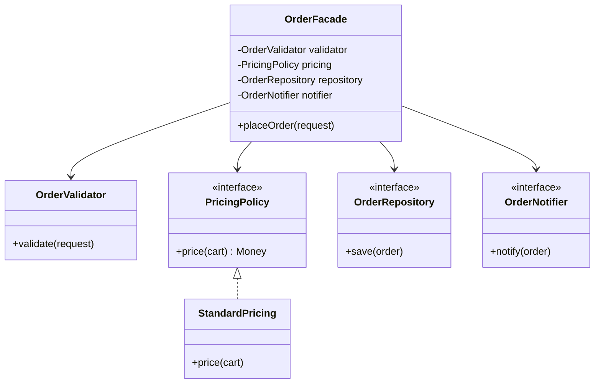
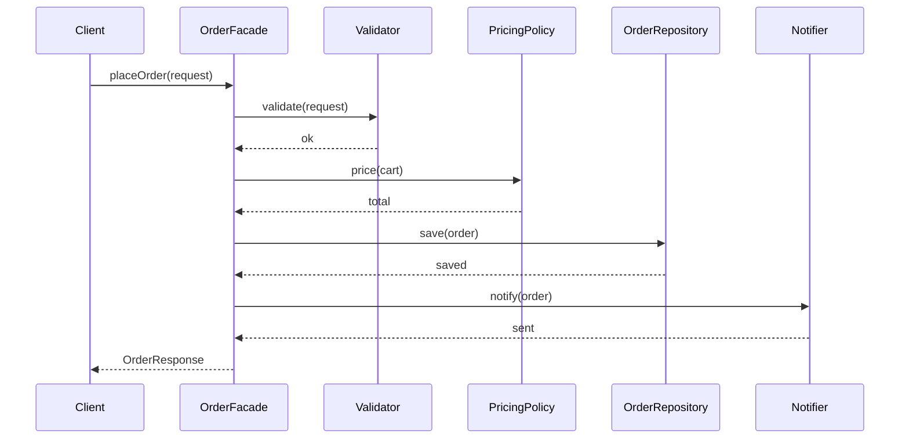

### Problem & Intent

SOLID is not five independent checkboxes — the principles **reinforce each other** in a typical refactor arc. A god class violates SRP first; fixing it exposes switch statements that OCP addresses; inheritance hacks surface LSP and ISP issues; stable extension points need DIP to keep high-level policy clean. This guide maps common smells to the principle that leads the fix and shows **composition over inheritance** as the recurring structural outcome.

---

### When to Use / When NOT to Use

| Situation | Use? | Why |
| :--- | :---: | :--- |
| Refactoring a legacy module with mixed concerns and growing `if/else` chains | Yes | Apply principles in order: SRP → OCP → LSP/ISP → DIP |
| Designing a new service boundary before code lands | Yes | Front-load segregated ports and injectable policies |
| Code review or interview discussion on "which SOLID applies here?" | Yes | Smell-to-fix map gives a consistent narrative |
| Greenfield spike under 200 lines with one developer and one deploy | No | Apply judgment — not every principle needs explicit types on day one |
| Using SOLID to justify abstract factories before requirements exist | No | Principles serve change pressure, not ceremony |
| Replacing deep inheritance trees with composition | Yes | Composition is the structural glue that makes LSP and OCP practical |

---

### Structure (Class Diagram)



---

### Interaction Flow



---

### Smell-to-Fix Map

| Smell | Lead principle | Typical fix |
| :--- | :--- | :--- |
| Class knows SQL, email, and PDF | [SRP](/design-patterns/01-solid-principles/single-responsibility-principle/) | Extract validator, repository, notifier |
| New promo = new `case` in one method | [OCP](/design-patterns/01-solid-principles/open-closed-principle/) | `DiscountPolicy` / strategy registry |
| Subtype throws on half its overrides | [LSP](/design-patterns/01-solid-principles/liskov-substitution-principle/) | Narrow interface or honest result types |
| Clients mock methods they never call | [ISP](/design-patterns/01-solid-principles/interface-segregation-principle/) | `Printable`, `Scannable` role interfaces |
| Service imports JDBC / SDK directly | [DIP](/design-patterns/01-solid-principles/dependency-inversion-principle/) | Domain-owned ports, infra adapters |

---

### Implementation




**Before — one class, all SOLID violations:**

```java
public class OrderManager {
    public void placeOrder(OrderRequest request) {
        if (request.items().isEmpty()) throw new IllegalArgumentException("empty");
        BigDecimal total = request.subtotal();
        if ("GOLD".equals(request.tier())) {
            total = total.multiply(new BigDecimal("0.90"));
        }
        try (Connection c = DriverManager.getConnection(url)) {
            // JDBC inline
        } catch (SQLException e) { throw new RuntimeException(e); }
        mailClient.send(request.email(), "confirmed");
    }
}
```

**After — composition + SOLID-aligned boundaries:**

```java
public final class OrderFacade {
    private final OrderValidator validator;
    private final PricingPolicy pricing;
    private final OrderRepository repository;
    private final OrderNotifier notifier;

    public OrderFacade(OrderValidator validator,
                       PricingPolicy pricing,
                       OrderRepository repository,
                       OrderNotifier notifier) {
        this.validator = validator;
        this.pricing = pricing;
        this.repository = repository;
        this.notifier = notifier;
    }

    public OrderResponse placeOrder(OrderRequest request) {
        validator.validate(request);
        Money total = pricing.price(request.cart());
        Order order = Order.from(request, total);
        Order saved = repository.save(order);
        notifier.notify(saved);
        return OrderResponse.from(saved);
    }
}
```

Each collaborator is swappable: new pricing = new `PricingPolicy` bean (OCP); repository = interface (DIP); notifier separate from persistence (SRP).




**Before:**

```go
type OrderManager struct {
    dbURL string
}

func (m *OrderManager) PlaceOrder(req OrderRequest) error {
    if len(req.Items) == 0 {
        return errors.New("empty order")
    }
    total := req.Subtotal
    if req.Tier == "GOLD" {
        total *= 0.90
    }
    db, _ := sql.Open("postgres", m.dbURL)
    defer db.Close()
    _, err := db.Exec("INSERT INTO orders ...", req.CustomerID, total)
    if err != nil {
        return err
    }
    return sendEmail(req.Email, "confirmed")
}
```

**After — struct composition, small interfaces:**

```go
type OrderFacade struct {
    validator  OrderValidator
    pricing    PricingPolicy
    repository OrderRepository
    notifier   OrderNotifier
}

func NewOrderFacade(
    v OrderValidator,
    p PricingPolicy,
    r OrderRepository,
    n OrderNotifier,
) *OrderFacade {
    return &OrderFacade{validator: v, pricing: p, repository: r, notifier: n}
}

func (f *OrderFacade) PlaceOrder(ctx context.Context, req OrderRequest) (OrderResponse, error) {
    if err := f.validator.Validate(req); err != nil {
        return OrderResponse{}, err
    }
    total := f.pricing.Price(req.Cart)
    order := NewOrder(req, total)
    saved, err := f.repository.Save(ctx, order)
    if err != nil {
        return OrderResponse{}, err
    }
    if err := f.notifier.Notify(ctx, saved); err != nil {
        return OrderResponse{}, err
    }
    return ToResponse(saved), nil
}
```

Wire concrete adapters in `main` — the facade depends only on narrow interfaces defined alongside it.




---

### Trade-offs & Operational Realities

| Concern | Impact |
| :--- | :--- |
| **Testability** | Facade tests stub four collaborators; each collaborator has focused unit tests |
| **Complexity** | More types than one god class — justified when change frequency and team size grow |
| **Framework fit** | Spring `@Service` facade + injected ports; Go explicit `main` wiring or `wire` |
| **Incremental adoption** | Refactor one smell at a time — full SOLID rewrite in one PR is high risk |

---

### Junior Mistakes

- Applying all five principles on day one of a prototype with no second variant in sight
- Using inheritance to "share code" between unrelated services instead of composing collaborators
- Treating SOLID as a scorecard ("we have interfaces so we're good") without smell-driven refactors
- Splitting without a facade or orchestrator — logic scattered with no clear entry point

---

### Senior Questions

1. Which smell would you fix **first** in a 800-line `OrderManager` — and why that order?
2. How does composition relate to [Strategy](/design-patterns/04-behavioral-patterns/strategy-pattern/) and [Decorator](/design-patterns/03-structural-patterns/decorator-pattern/) in the same module?
3. When does applying SOLID conflict with shipping — what is the minimum viable boundary?
4. How do you teach SOLID without encouraging interface-per-class dogma?
5. How would you migrate a module to hexagonal architecture using this smell-to-fix map?

---

### Revision Cheat Sheet

- **One line:** SOLID is a refactor compass — smells point to the principle that leads.
- **Trigger smell:** God class + switch + `UnsupportedOperationException` + JDBC in service.
- **Pairs with:** All five principle posts; [Layered vs Hexagonal](/design-patterns/06-architectural-principles/layered-vs-hexagonal-architecture/)
- **Avoid when:** No change pressure — don't pre-architect for imaginary variants.
- **Interview tip:** Walk one user story through SRP split, OCP policy, DIP ports in under three minutes.

---

### See Also

- [Single Responsibility Principle](/design-patterns/01-solid-principles/single-responsibility-principle/)
- [Open-Closed Principle](/design-patterns/01-solid-principles/open-closed-principle/)
- [Liskov Substitution Principle](/design-patterns/01-solid-principles/liskov-substitution-principle/)
- [Interface Segregation Principle](/design-patterns/01-solid-principles/interface-segregation-principle/)
- [Dependency Inversion Principle](/design-patterns/01-solid-principles/dependency-inversion-principle/)
- [Layered vs Hexagonal Architecture](/design-patterns/06-architectural-principles/layered-vs-hexagonal-architecture/)
