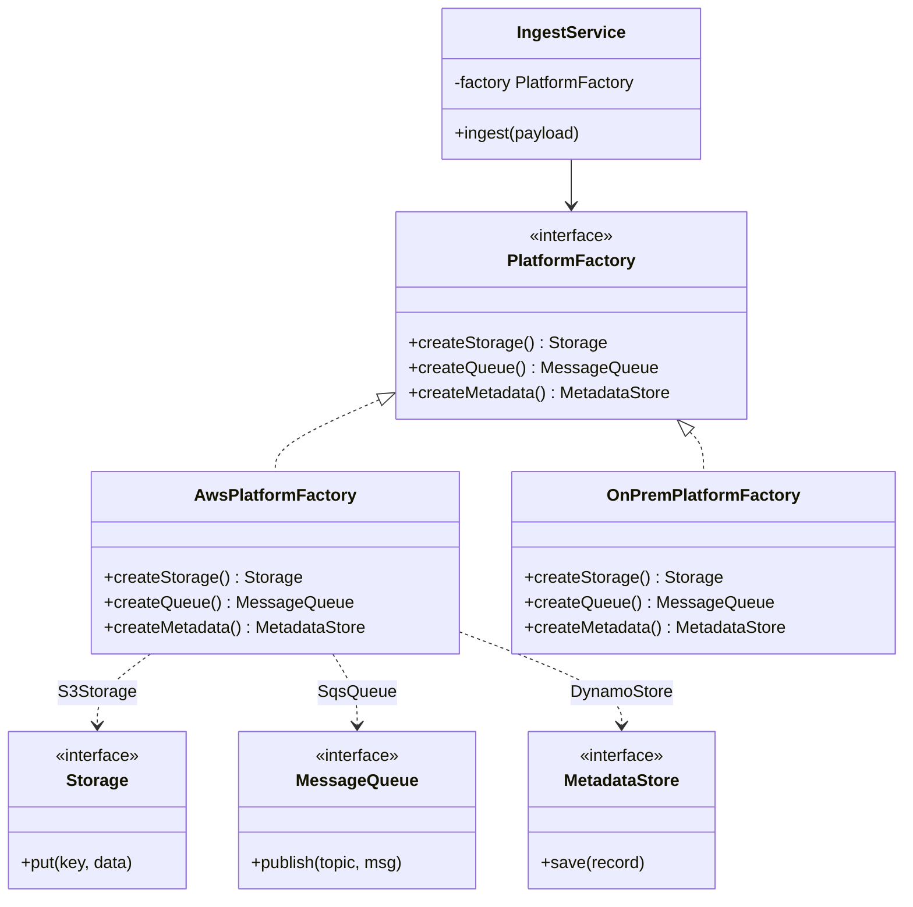
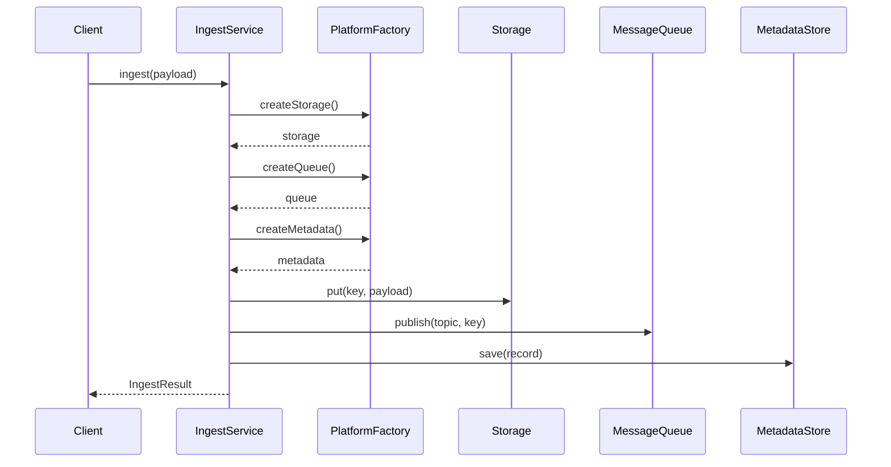

### Problem & Intent

The Abstract Factory Pattern provides an interface for creating **families of related or dependent objects** without specifying their concrete classes. When components must stay consistent within a platform — AWS S3 + SQS + DynamoDB vs on-prem NFS + RabbitMQ + PostgreSQL — a single factory produces the whole kit. Clients depend on `CloudStorage`, `MessageQueue`, and `MetadataStore` abstractions; swapping the factory swaps the entire stack atomically.

---

### When to Use / When NOT to Use

| Situation | Use? | Why |
| :--- | :---: | :--- |
| Multiple related products must be used together (UI widgets, cloud SDKs) | Yes | One factory guarantees compatible implementations |
| Runtime switch between entire platform stacks (multi-cloud, white-label themes) | Yes | Inject `AwsPlatformFactory` vs `AzurePlatformFactory` |
| Adding a new **family** without changing client code | Yes | New `GcpPlatformFactory` satisfies the same interface |
| You only create **one** object type with variants | No | Prefer [Factory Method](/design-patterns/02-creational-patterns/factory-method-pattern/) |
| Products are assembled step-by-step with many optional fields | No | Prefer [Builder](/design-patterns/02-creational-patterns/builder-pattern/) |
| Families rarely change and coupling is acceptable | No | Direct construction or DI of individual beans is simpler |

---

### Structure (Class Diagram)



---

### Interaction Flow



---

### Implementation




**Violation — mismatched concrete types:**

```java
public void ingest(byte[] payload) {
    // Accidentally mixes AWS storage with on-prem queue
    S3Storage storage = new S3Storage(s3Client, bucket);
    RabbitMqQueue queue = new RabbitMqQueue(connectionFactory);
    storage.put("key", payload);
    queue.publish("events", "key");
}
```

**Abstract Factory — consistent family:**

```java
public interface PlatformFactory {
    Storage createStorage();
    MessageQueue createQueue();
    MetadataStore createMetadata();
}

public final class AwsPlatformFactory implements PlatformFactory {
    private final S3Client s3;
    private final SqsClient sqs;
    private final DynamoDbClient dynamo;

    public AwsPlatformFactory(S3Client s3, SqsClient sqs, DynamoDbClient dynamo) {
        this.s3 = s3;
        this.sqs = sqs;
        this.dynamo = dynamo;
    }

    @Override public Storage createStorage() { return new S3Storage(s3); }
    @Override public MessageQueue createQueue() { return new SqsQueue(sqs); }
    @Override public MetadataStore createMetadata() { return new DynamoStore(dynamo); }
}

public final class IngestService {
    private final PlatformFactory factory;

    public IngestService(PlatformFactory factory) {
        this.factory = factory;
    }

    public void ingest(byte[] payload) {
        Storage storage = factory.createStorage();
        MessageQueue queue = factory.createQueue();
        MetadataStore meta = factory.createMetadata();
        String key = storage.put(payload);
        queue.publish("ingest", key);
        meta.save(new IngestRecord(key));
    }
}
```

**Spring wiring:** one `@Configuration` per platform profile; expose a single `PlatformFactory` bean selected by `@Profile`.




**Violation:**

```go
func Ingest(payload []byte) error {
    storage := NewS3Storage(s3Client, bucket)       // AWS
    queue := NewRabbitMQQueue(rabbitConn)           // on-prem — inconsistent
    key, err := storage.Put("obj", payload)
    if err != nil {
        return err
    }
    return queue.Publish("events", key)
}
```

**Abstract Factory:**

```go
type Storage interface {
    Put(key string, data []byte) (string, error)
}

type MessageQueue interface {
    Publish(topic, key string) error
}

type MetadataStore interface {
    Save(record IngestRecord) error
}

type PlatformFactory interface {
    NewStorage() Storage
    NewQueue() MessageQueue
    NewMetadata() MetadataStore
}

type AwsPlatformFactory struct {
    S3    S3Client
    SQS   SqsClient
    Dynamo DynamoClient
}

func (f AwsPlatformFactory) NewStorage() Storage       { return NewS3Storage(f.S3) }
func (f AwsPlatformFactory) NewQueue() MessageQueue    { return NewSqsQueue(f.SQS) }
func (f AwsPlatformFactory) NewMetadata() MetadataStore { return NewDynamoStore(f.Dynamo) }

type IngestService struct {
    factory PlatformFactory
}

func (s *IngestService) Ingest(payload []byte) error {
    storage := s.factory.NewStorage()
    queue := s.factory.NewQueue()
    meta := s.factory.NewMetadata()
    key, err := storage.Put("obj", payload)
    if err != nil {
        return err
    }
    if err := queue.Publish("ingest", key); err != nil {
        return err
    }
    return meta.Save(IngestRecord{Key: key})
}
```




```python
from typing import Protocol

class ExamplePort(Protocol):
    def execute(self) -> None: ...

class ExampleService:
    def __init__(self, port: ExamplePort) -> None:
        self._port = port

    def run(self) -> None:
        self._port.execute()
```




---

### Trade-offs & Operational Realities

| Concern | Impact |
| :--- | :--- |
| **Testability** | Inject `InMemoryPlatformFactory` for integration tests — all fakes share the same semantics |
| **Complexity** | Interface count grows with family size; each new product type touches every concrete factory |
| **Framework fit** | Spring `@Configuration` classes are natural abstract factories; Go uses struct literals implementing `PlatformFactory` |
| **Evolution pain** | Adding `createCache()` to the interface forces changes in all implementations — consider default methods or composition |

---

### Junior Mistakes

- Using Abstract Factory for a single product type (overkill vs Factory Method)
- Mixing products from different families because each was injected separately
- Growing the factory interface every sprint instead of grouping optional capabilities
- Confusing Abstract Factory with Builder — factory picks **which family**, builder assembles **one complex object**

---

### Senior Questions

1. How do you add GCP support without touching `IngestService`?
2. Abstract Factory vs Factory Method — when does "family" justify the extra interfaces?
3. A new product type joins the family — how do you roll out without breaking existing factories?
4. How would you test cross-family behavior (ensure AWS factory never returns RabbitMQ)?
5. Can `@Profile` + individual `@Bean`s replace an explicit `PlatformFactory` interface?

---

### Revision Cheat Sheet

- **One line:** One factory creates a whole family of related products.
- **Trigger smell:** "Never mix S3 with RabbitMQ" comments in code — encode that in the factory.
- **Pairs with:** [Factory Method](/design-patterns/02-creational-patterns/factory-method-pattern/), [Open-Closed](/design-patterns/01-solid-principles/open-closed-principle/), [DIP](/design-patterns/01-solid-principles/dependency-inversion-principle/)
- **Avoid when:** Single product or families never switch at runtime.
- **Interview tip:** Name three products that must stay consistent; draw one factory box feeding all three.

---

### See Also

- [Factory Method Pattern](/design-patterns/02-creational-patterns/factory-method-pattern/)
- [Factory Method vs Abstract Factory vs Builder](/design-patterns/05-pattern-comparisons/factory-method-vs-abstract-factory-vs-builder/)
- [Dependency Inversion Principle](/design-patterns/01-solid-principles/dependency-inversion-principle/)
- [Layered vs Hexagonal Architecture](/design-patterns/06-architectural-principles/layered-vs-hexagonal-architecture/)
