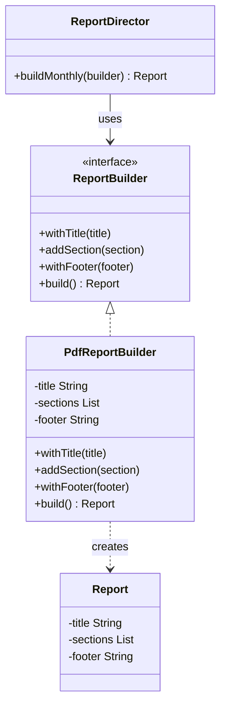
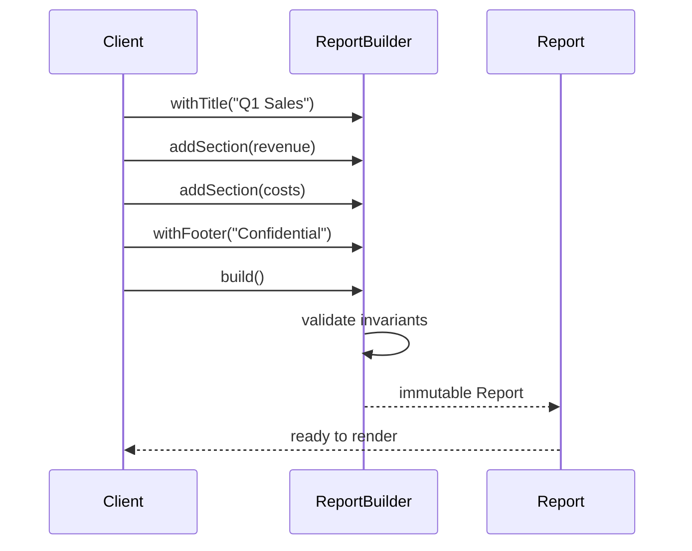

### Problem & Intent

The Builder Pattern separates the **construction** of a complex object from its **representation**, allowing the same construction process to create different configurations. Telescoping constructors and overloaded `new` calls with twelve parameters are unreadable and error-prone (swapping `timeout` and `retryCount`). A fluent builder exposes named steps — `withHeaders()`, `addSection()`, `withFooter()` — and validates invariants at `build()` time.

---

### When to Use / When NOT to Use

| Situation | Use? | Why |
| :--- | :---: | :--- |
| Object has many optional fields or nested parts | Yes | Readable, self-documenting assembly |
| Construction order matters or requires validation before use | Yes | `build()` enforces "at least one section" rules |
| Same construction recipe produces different representations | Yes | `PdfReportBuilder` vs `HtmlReportBuilder` share steps |
| Immutable value objects with combinatorial field sets | Yes | Avoids telescoping constructors |
| Object has 2–3 required fields, all always set | No | Constructor or factory method is enough |
| You need interchangeable **families** of products | No | Prefer [Abstract Factory](/design-patterns/02-creational-patterns/abstract-factory-pattern/) |
| Deep copying from an existing instance is the goal | No | Prefer [Prototype](/design-patterns/02-creational-patterns/prototype-pattern/) |

---

### Structure (Class Diagram)



---

### Interaction Flow



---

### Implementation




**Violation — telescoping constructor:**

```java
public Report(String title, List<Section> sections, String footer,
              boolean includeToc, String locale, ZoneId timezone) {
    // Callers confuse argument order; half the params are null
    this.title = title;
    this.sections = sections;
    // ...
}

// Usage nightmare:
new Report("Q1", sections, null, true, "en-US", null);
```

**Builder — fluent assembly with validation:**

```java
public final class Report {
    private final String title;
    private final List<Section> sections;
    private final String footer;

    private Report(Builder builder) {
        this.title = builder.title;
        this.sections = List.copyOf(builder.sections);
        this.footer = builder.footer;
    }

    public static final class Builder {
        private String title;
        private final List<Section> sections = new ArrayList<>();
        private String footer;

        public Builder title(String title) {
            this.title = title;
            return this;
        }

        public Builder addSection(Section section) {
            this.sections.add(section);
            return this;
        }

        public Builder footer(String footer) {
            this.footer = footer;
            return this;
        }

        public Report build() {
            if (title == null || title.isBlank()) {
                throw new IllegalStateException("title required");
            }
            if (sections.isEmpty()) {
                throw new IllegalStateException("at least one section required");
            }
            return new Report(this);
        }
    }
}

// Usage:
Report report = new Report.Builder()
    .title("Q1 Sales")
    .addSection(revenueSection)
    .addSection(costSection)
    .footer("Confidential")
    .build();
```

**Lombok `@Builder`** is acceptable for DTOs; keep hand-rolled builders when validation or cross-field rules matter.




**Violation:**

```go
func NewReport(title string, sections []Section, footer *string,
    includeToc bool, locale string) (*Report, error) {
    // Caller passes wrong order; nil footer vs empty string ambiguity
    return &Report{Title: title, Sections: sections}, nil
}
```

**Builder — functional options or struct builder:**

```go
type Report struct {
    Title    string
    Sections []Section
    Footer   string
}

type ReportBuilder struct {
    title    string
    sections []Section
    footer   string
}

func (b *ReportBuilder) Title(t string) *ReportBuilder {
    b.title = t
    return b
}

func (b *ReportBuilder) AddSection(s Section) *ReportBuilder {
    b.sections = append(b.sections, s)
    return b
}

func (b *ReportBuilder) Footer(f string) *ReportBuilder {
    b.footer = f
    return b
}

func (b *ReportBuilder) Build() (Report, error) {
    if b.title == "" {
        return Report{}, errors.New("title required")
    }
    if len(b.sections) == 0 {
        return Report{}, errors.New("at least one section required")
    }
    return Report{
        Title:    b.title,
        Sections: append([]Section(nil), b.sections...),
        Footer:   b.footer,
    }, nil
}

// Usage:
report, err := (&ReportBuilder{}).
    Title("Q1 Sales").
    AddSection(revenue).
    Footer("Confidential").
    Build()
```

Go also uses the **functional options** pattern (`NewServer(WithPort(8080), WithTLS(cfg))`) for similar goals with less type ceremony.




---

### Trade-offs & Operational Realities

| Concern | Impact |
| :--- | :--- |
| **Testability** | Build partial configs in tests; assert `build()` rejects invalid combos |
| **Complexity** | Extra builder type per product — offset by eliminating parameter-order bugs |
| **Framework fit** | Spring `RestClient.Builder`, `UriComponentsBuilder`; Go `grpc.DialOption` — learn platform idioms |
| **Immutability** | Builder is mutable; product should be immutable after `build()` to prevent half-initialized state |

---

### Junior Mistakes

- Making the domain object itself mutable with chainable setters and calling it a "builder"
- Skipping validation in `build()` — invalid objects leak into production
- Creating a builder for a 2-field struct "because patterns"
- Forgetting to defensively copy collections in `build()` — caller mutates internal list after build

---

### Senior Questions

1. Builder vs constructor with `@JsonCreator` — when does Jackson deserialization need a separate builder?
2. How does the **Director** role (preset recipes like `buildMonthlyReport`) differ from the builder itself?
3. When would functional options in Go replace a dedicated `ReportBuilder` struct?
4. How do you version a builder API when new mandatory fields are added?
5. Builder + Abstract Factory — who owns `build()` when format (PDF/HTML) varies?

---

### Revision Cheat Sheet

- **One line:** Assemble complex objects step-by-step; validate at `build()`.
- **Trigger smell:** Constructors with 6+ parameters or many `null` arguments at call sites.
- **Pairs with:** [Factory Method](/design-patterns/02-creational-patterns/factory-method-pattern/), [Prototype](/design-patterns/02-creational-patterns/prototype-pattern/), immutable value objects
- **Avoid when:** Few required fields or construction never varies.
- **Go tip:** Functional options (`type Option func(*T)`) scale well for servers and clients.

---

### See Also

- [Factory Method vs Abstract Factory vs Builder](/design-patterns/05-pattern-comparisons/factory-method-vs-abstract-factory-vs-builder/)
- [Prototype Pattern](/design-patterns/02-creational-patterns/prototype-pattern/)
- [DTO, Entity & Mapper Separation](/design-patterns/06-architectural-principles/dto-entity-mapper-separation/)
- [Notification Service LLD](/design-patterns/08-lld-case-studies/notification-system/)
