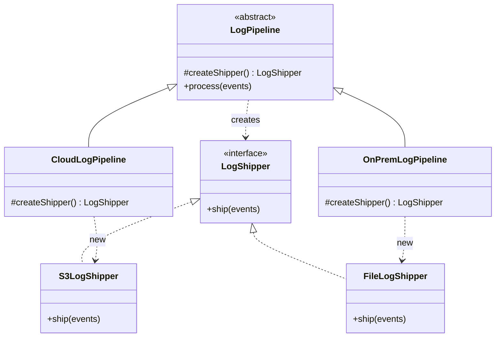
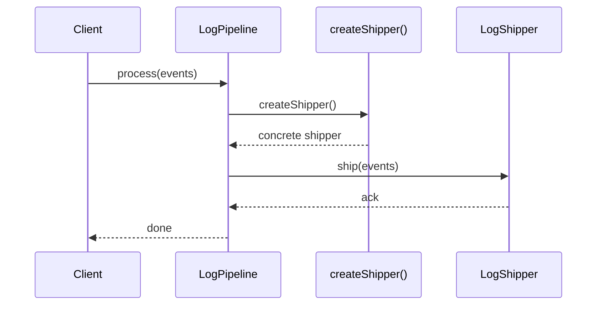

### Problem & Intent

The Factory Method Pattern defines an interface for creating an object but lets **subclasses or providers decide which concrete type to instantiate**. Client code depends on the product abstraction, not `new ConcreteClass()` scattered across the codebase. It is the creational pattern you reach for when construction logic varies by deployment, tenant, or format — but you only need **one product type per factory**, not an entire related family.

---

### When to Use / When NOT to Use

| Situation | Use? | Why |
| :--- | :---: | :--- |
| Client must stay decoupled from concrete product classes | Yes | Creator exposes `createProduct()`; callers use the interface |
| New product variants are added by subclassing, not editing callers | Yes | Open-Closed: add `S3LogShipperFactory` without touching `LogPipeline` |
| Construction requires environment-specific setup (cloud region, file path) | Yes | Factory encapsulates `new` + wiring in one place |
| You need a **family** of related products (button + checkbox + dialog) | No | Prefer [Abstract Factory](/design-patterns/02-creational-patterns/abstract-factory-pattern/) |
| Object has many optional fields and step-by-step assembly | No | Prefer [Builder](/design-patterns/02-creational-patterns/builder-pattern/) |
| Only one concrete type, never varies | No | Inject the product directly — a factory adds ceremony |

---

### Structure (Class Diagram)



---

### Interaction Flow



---

### Implementation




**Violation — `new` in business logic:**

```java
public void process(List<LogEvent> events, String deployment) {
    LogShipper shipper;
    if ("cloud".equals(deployment)) {
        shipper = new S3LogShipper(s3Client, bucket);
    } else {
        shipper = new FileLogShipper("/var/log/app.log");
    }
    shipper.ship(events);
}
```

**Factory Method — creation delegated to creator subclasses:**

```java
public interface LogShipper {
    void ship(List<LogEvent> events);
}

public abstract class LogPipeline {
    protected abstract LogShipper createShipper();

    public void process(List<LogEvent> events) {
        createShipper().ship(events);
    }
}

public final class CloudLogPipeline extends LogPipeline {
    private final S3Client s3;
    private final String bucket;

    public CloudLogPipeline(S3Client s3, String bucket) {
        this.s3 = s3;
        this.bucket = bucket;
    }

    @Override
    protected LogShipper createShipper() {
        return new S3LogShipper(s3, bucket);
    }
}

public final class OnPremLogPipeline extends LogPipeline {
    private final String path;

    public OnPremLogPipeline(String path) {
        this.path = path;
    }

    @Override
    protected LogShipper createShipper() {
        return new FileLogShipper(path);
    }
}
```

**Spring variant:** register each `LogPipeline` as a `@Bean`; select by profile (`@Profile("cloud")`) instead of subclassing when inheritance is awkward.




**Violation:**

```go
func Process(events []LogEvent, deployment string) error {
    var shipper LogShipper
    switch deployment {
    case "cloud":
        shipper = NewS3LogShipper(s3Client, bucket)
    default:
        shipper = NewFileLogShipper("/var/log/app.log")
    }
    return shipper.Ship(events)
}
```

**Factory Method — functional factory on struct:**

```go
type LogShipper interface {
    Ship(events []LogEvent) error
}

type ShipperFactory func() LogShipper

type LogPipeline struct {
    createShipper ShipperFactory
}

func (p *LogPipeline) Process(events []LogEvent) error {
    return p.createShipper().Ship(events)
}

func NewCloudPipeline(s3 S3Client, bucket string) *LogPipeline {
    return &LogPipeline{
        createShipper: func() LogShipper {
            return NewS3LogShipper(s3, bucket)
        },
    }
}

func NewOnPremPipeline(path string) *LogPipeline {
    return &LogPipeline{
        createShipper: func() LogShipper {
            return NewFileLogShipper(path)
        },
    }
}
```

Go has no inheritance — use **constructor functions** that close over dependencies, or a `ShipperFactory` func type passed into the pipeline.




---

### Trade-offs & Operational Realities

| Concern | Impact |
| :--- | :--- |
| **Testability** | Subclass or inject a factory that returns a mock `LogShipper`; pipeline logic tests without S3/filesystem |
| **Complexity** | One extra layer per variant — worthwhile when `new` branches multiply across callers |
| **Framework fit** | Spring `@Bean` factory methods are idiomatic; Go uses constructor funcs and `sync.Once` only when singleton is required |
| **Discovery** | Registry maps (`Map<String, LogPipeline>`) replace subclass explosion when variants are data-driven |

---

### Junior Mistakes

- Naming every `static getInstance()` helper a "factory" when it returns only one concrete type
- Putting business validation inside the factory instead of the product or a dedicated validator
- Using Factory Method when the real need is Abstract Factory (multiple related products per family)
- Returning concrete types from the factory method instead of the product interface — callers `new` again upstream

---

### Senior Questions

1. How do you add a `KafkaLogShipper` without modifying `LogPipeline.process()`?
2. Factory Method vs Simple Factory vs Abstract Factory — where does a Spring `@Configuration` class fit?
3. When would you replace subclass-based factories with a registry keyed on tenant ID?
4. How do you test `CloudLogPipeline` when `S3LogShipper` touches AWS — mock the factory or the shipper?
5. Does a parameterized factory method (`createShipper(Region r)`) violate Open-Closed if regions keep growing?

---

### Revision Cheat Sheet

- **One line:** Subclasses (or providers) decide which concrete product to instantiate.
- **Trigger smell:** `if (type.equals("cloud")) new S3...` inside domain logic.
- **Pairs with:** [Open-Closed](/design-patterns/01-solid-principles/open-closed-principle/), [Strategy](/design-patterns/04-behavioral-patterns/strategy-pattern/), [DI](/design-patterns/06-architectural-principles/dependency-injection-inversion-of-control/)
- **Avoid when:** One product forever, or you need coordinated families of objects.
- **Interview tip:** Draw Creator → `createProduct()` → Product; client never names concrete classes.

---

### See Also

- [Abstract Factory Pattern](/design-patterns/02-creational-patterns/abstract-factory-pattern/)
- [Factory Method vs Abstract Factory vs Builder](/design-patterns/05-pattern-comparisons/factory-method-vs-abstract-factory-vs-builder/)
- [Open-Closed Principle](/design-patterns/01-solid-principles/open-closed-principle/)
- [Dependency Injection & IoC](/design-patterns/06-architectural-principles/dependency-injection-inversion-of-control/)
