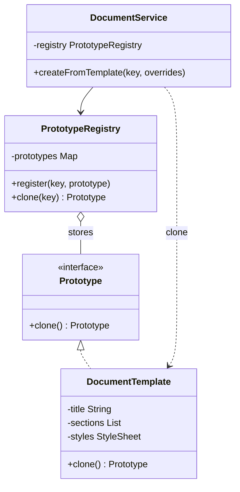
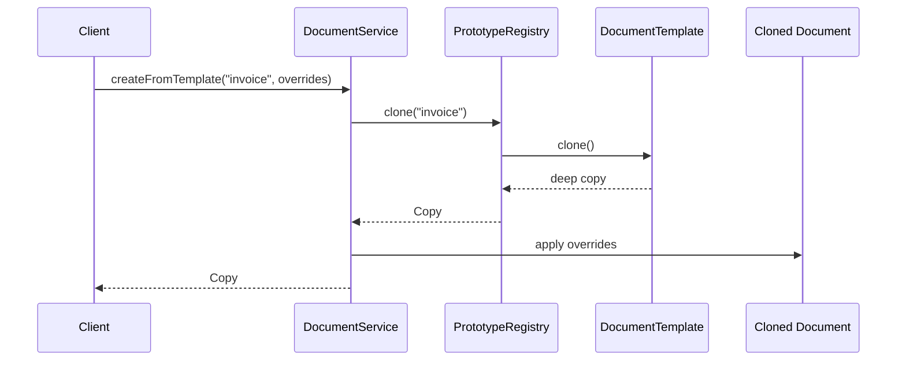

### Problem & Intent

The Prototype Pattern creates new objects by **copying an existing instance** (the prototype) rather than invoking constructors or builders from scratch. Use it when object creation is expensive (database load, parsing a large template), when configurations differ only slightly from a baseline, or when the concrete class is unknown at compile time. A prototype registry holds pre-built exemplars; clients call `clone()` and tweak the copy.

---

### When to Use / When NOT to Use

| Situation | Use? | Why |
| :--- | :---: | :--- |
| Creating from scratch is costly (I/O, parsing, remote fetch) | Yes | Clone a warmed prototype and mutate only deltas |
| Many instances share most state with small variations | Yes | Copy-on-write or shallow clone + override fields |
| Concrete types are registered dynamically (plugins, schemas) | Yes | Registry maps key → prototype; `clone()` avoids `new` chains |
| Objects are simple value types with few fields | No | Constructor or builder is clearer |
| Deep graphs with shared mutable references | No | Clone semantics are error-prone — document shallow vs deep |
| You need step-by-step assembly of optional parts | No | Prefer [Builder](/design-patterns/02-creational-patterns/builder-pattern/) |

---

### Structure (Class Diagram)



---

### Interaction Flow



---

### Implementation




**Violation — rebuild from scratch every time:**

```java
public Document createInvoice(String customerName) {
    // Re-parses YAML template and reloads styles on every request
    StyleSheet styles = StyleSheet.loadFromClasspath("/templates/invoice-styles.yml");
    List<Section> sections = TemplateParser.parse("/templates/invoice.yaml");
    Document doc = new Document("Invoice", sections, styles);
    doc.setField("customer", customerName);
    return doc;
}
```

**Prototype — clone from registry:**

```java
public interface DocumentPrototype {
    DocumentPrototype clone();
}

public final class DocumentTemplate implements DocumentPrototype {
    private final String title;
    private final List<Section> sections;
    private final StyleSheet styles;

    public DocumentTemplate(String title, List<Section> sections, StyleSheet styles) {
        this.title = title;
        this.sections = sections;
        this.styles = styles;
    }

    @Override
    public DocumentTemplate clone() {
        return new DocumentTemplate(
            title,
            sections.stream().map(Section::copy).toList(),
            styles.copy()
        );
    }

    public Document toDocument() {
        return new Document(title, new ArrayList<>(sections), styles);
    }
}

public final class PrototypeRegistry {
    private final Map<String, DocumentPrototype> prototypes = new HashMap<>();

    public void register(String key, DocumentPrototype prototype) {
        prototypes.put(key, prototype);
    }

    public Document create(String key, Consumer<Document> customizer) {
        DocumentPrototype copy = prototypes.get(key).clone();
        Document doc = ((DocumentTemplate) copy).toDocument();
        customizer.accept(doc);
        return doc;
    }
}
```

Prefer explicit `copy()` methods over `Cloneable` — Java's `Object.clone()` is shallow and awkward.




**Violation:**

```go
func CreateInvoice(customer string) (*Document, error) {
    styles, err := LoadStyleSheet("/templates/invoice-styles.yml")
    if err != nil {
        return nil, err
    }
    sections, err := ParseTemplate("/templates/invoice.yaml")
    if err != nil {
        return nil, err
    }
    doc := &Document{Title: "Invoice", Sections: sections, Styles: styles}
    doc.SetField("customer", customer)
    return doc, nil
}
```

**Prototype — `Clone` method + registry:**

```go
type DocumentPrototype interface {
    Clone() DocumentPrototype
}

type DocumentTemplate struct {
    Title    string
    Sections []Section
    Styles   StyleSheet
}

func (t DocumentTemplate) Clone() DocumentPrototype {
    sections := make([]Section, len(t.Sections))
    for i, s := range t.Sections {
        sections[i] = s.Copy()
    }
    return DocumentTemplate{
        Title:    t.Title,
        Sections: sections,
        Styles:   t.Styles.Copy(),
    }
}

func (t DocumentTemplate) ToDocument() *Document {
    return &Document{
        Title:    t.Title,
        Sections: append([]Section(nil), t.Sections...),
        Styles:   t.Styles,
    }
}

type PrototypeRegistry struct {
    protos map[string]DocumentPrototype
}

func (r *PrototypeRegistry) Register(key string, p DocumentPrototype) {
    r.protos[key] = p
}

func (r *PrototypeRegistry) Create(key string, customize func(*Document)) (*Document, error) {
    proto, ok := r.protos[key]
    if !ok {
        return nil, fmt.Errorf("unknown template: %s", key)
    }
    tmpl := proto.Clone().(DocumentTemplate)
    doc := tmpl.ToDocument()
    customize(doc)
    return doc, nil
}
```

Go has no built-in clone — implement `Clone()` explicitly and document deep vs shallow copy.




```python
from typing import Protocol

class ExamplePort(Protocol):
    def execute(self) -> None: ...

class ExampleService:
    def __init__(self, port: ExamplePort) -> None:
        self._port = port

    def run(self) -> None:
        self._port.execute()
```




---

### Trade-offs & Operational Realities

| Concern | Impact |
| :--- | :--- |
| **Testability** | Register in-memory prototypes in tests; verify clones are independent (mutate copy, prototype unchanged) |
| **Complexity** | Deep-copy logic is easy to get wrong with nested mutable fields |
| **Framework fit** | Spring `@Scope("prototype")` beans are **a new instance per injection**, not the GoF copy pattern — know the difference |
| **Performance** | Shallow clone is fast but shared references bite; profile before optimizing construction away |

---

### Junior Mistakes

- Using `Object.clone()` without understanding shallow copy — sibling objects share mutable lists
- Confusing Spring prototype scope with the Prototype pattern
- Cloning mutable singletons that were never meant to be templates
- Registering prototypes without defensive copy on `register()` — callers mutate the registry entry

---

### Senior Questions

1. Shallow vs deep clone — how do you handle `List<Section>` with nested mutable metadata?
2. Prototype vs Factory Method — when is "copy and tweak" cheaper than "construct fresh"?
3. How would you implement copy-on-write for large read-mostly templates?
4. How do you test that two clones do not share references after customization?
5. When does a JSON blob loaded once and `json.Unmarshal` per request beat explicit cloning?

---

### Revision Cheat Sheet

- **One line:** Create objects by cloning a prototype, then customize the copy.
- **Trigger smell:** Repeated expensive setup for objects that differ in one or two fields.
- **Pairs with:** [Builder](/design-patterns/02-creational-patterns/builder-pattern/), [Factory Method](/design-patterns/02-creational-patterns/factory-method-pattern/), [Flyweight](/design-patterns/03-structural-patterns/flyweight-pattern/)
- **Avoid when:** Cheap construction or deep graphs make copy semantics risky.
- **Interview tip:** State shallow vs deep copy explicitly; draw registry → `clone()` → customize.

---

### See Also

- [Builder Pattern](/design-patterns/02-creational-patterns/builder-pattern/)
- [Flyweight Pattern](/design-patterns/03-structural-patterns/flyweight-pattern/)
- [Factory Method vs Abstract Factory vs Builder](/design-patterns/05-pattern-comparisons/factory-method-vs-abstract-factory-vs-builder/)
- [Specification Pattern](/design-patterns/06-architectural-principles/specification-pattern/)
