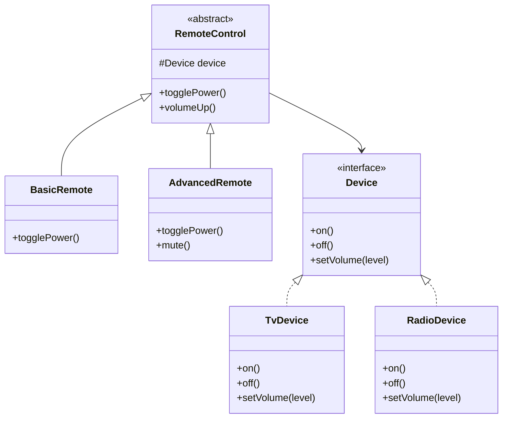
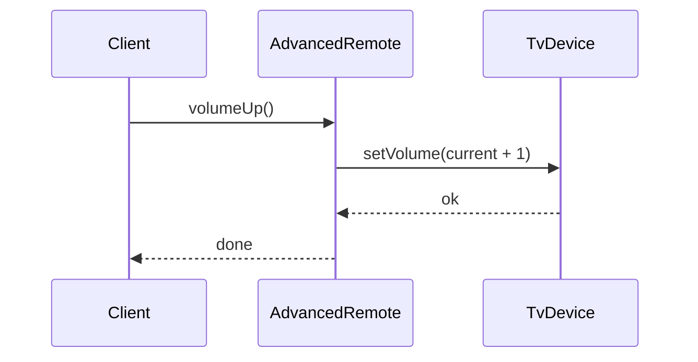

### Problem & Intent

The Bridge Pattern **decouples an abstraction from its implementation** so the two can vary independently. Instead of `BasicRemote` × `SonyTV` / `SamsungTV` subclass grid, you hold a `Remote` abstraction that delegates to a `Device` implementation interface. The dominant force is **Cartesian product explosion** — two or more dimensions of variation that would otherwise multiply subclasses.

---

### When to Use / When NOT to Use

| Situation | Use? | Why |
| :--- | :---: | :--- |
| Abstraction and implementation both have multiple variants | Yes | Compose at runtime; avoid N×M subclasses |
| Implementation may change at runtime (driver, renderer, transport) | Yes | Inject a new implementor without new abstraction class |
| Single stable implementation, one abstraction | No | Direct dependency is simpler |
| Stack optional behaviors on one object | No | Prefer [Decorator](/design-patterns/03-structural-patterns/decorator-pattern/) |
| Hide a complex subsystem behind one method | No | Prefer [Facade](/design-patterns/03-structural-patterns/facade-pattern/) |
| Translate foreign API to yours | No | Prefer [Adapter](/design-patterns/03-structural-patterns/adapter-pattern/) |

---

### Structure (Class Diagram)



---

### Interaction Flow



---

### Implementation




**Subclass explosion:**

```java
public class AdvancedSonyTvRemote extends SonyTvRemote { /* ... */ }
public class AdvancedSamsungTvRemote extends SamsungTvRemote { /* ... */ }
public class BasicRadioRemote extends RadioRemote { /* ... */ }
// N remotes × M devices
```

**Bridge approach:**

```java
public interface Device {
    void on();
    void off();
    void setVolume(int level);
}

public final class TvDevice implements Device {
    private boolean powered;
    private int volume;
    @Override public void on() { powered = true; }
    @Override public void off() { powered = false; }
    @Override public void setVolume(int level) { volume = level; }
}

public abstract class RemoteControl {
    protected final Device device;
    protected RemoteControl(Device device) { this.device = device; }
    public abstract void togglePower();
}

public final class BasicRemote extends RemoteControl {
    public BasicRemote(Device device) { super(device); }
    @Override
    public void togglePower() {
        // simplified: track state in device in real code
        device.on();
    }
}

public final class AdvancedRemote extends RemoteControl {
    public AdvancedRemote(Device device) { super(device); }
    @Override
    public void togglePower() { device.on(); }
    public void volumeUp() { device.setVolume(1); } // read-modify-write in production
}
```

Wire `new AdvancedRemote(new TvDevice())` at composition root — swap device without new remote class.




**Subclass explosion smell:**

```go
type AdvancedSonyRemote struct { SonyRemote }
```

**Bridge approach:**

```go
type Device interface {
    On()
    Off()
    SetVolume(level int)
}

type TVDevice struct {
    powered bool
    volume  int
}

func (d *TVDevice) On()                { d.powered = true }
func (d *TVDevice) Off()               { d.powered = false }
func (d *TVDevice) SetVolume(l int)   { d.volume = l }

type RemoteControl interface {
    TogglePower()
}

type BasicRemote struct {
    Device Device
}

func (r BasicRemote) TogglePower() { r.Device.On() }

type AdvancedRemote struct {
    Device Device
}

func (r AdvancedRemote) TogglePower() { r.Device.On() }
func (r AdvancedRemote) VolumeUp(current int) { r.Device.SetVolume(current + 1) }

// Composition:
// remote := AdvancedRemote{Device: &TVDevice{}}
```

Go favors **struct embedding of the Device interface field** and small abstraction interfaces per remote capability.




---

### Trade-offs & Operational Realities

| Concern | Impact |
| :--- | :--- |
| **Testability** | Mock `Device` when testing remotes; mock nothing when testing device drivers |
| **Complexity** | Two hierarchies to navigate — pays off when both axes genuinely vary |
| **Framework fit** | JDBC drivers, logging appenders, rendering backends, message transports |
| **Discovery** | Junior devs may not see the pattern — name types clearly (`Device`, `Renderer`) |
| **Runtime swap** | Bridge enables changing implementor; ensure abstraction holds interface, not concrete type |

---

### Junior Mistakes

- Confusing Bridge with Adapter — Bridge **designs** two dimensions upfront; Adapter **fixes** existing mismatch
- Confusing Bridge with Decorator — Bridge has **one** implementor chosen at construction; decorator stacks many wrappers
- Putting business logic in the implementor that belongs in the abstraction (or vice versa)
- Using Bridge when only one dimension varies (YAGNI)

---

### Senior Questions

1. How do you add a `StreamingDevice` without creating new remote subclasses?
2. Bridge vs Strategy — is `Device` a strategy? What differs in intent?
3. Draw the class count: 4 remotes × 3 devices with inheritance vs Bridge.
4. Where does JDBC `Connection` / `Driver` fit the Bridge pattern?
5. How does [Decorator vs Proxy vs Bridge](/design-patterns/05-pattern-comparisons/decorator-vs-proxy-vs-bridge/) disambiguate structurally similar wrappers?

---

### Revision Cheat Sheet

- **One line:** Split abstraction and implementation into two composable hierarchies.
- **Trigger smell:** Class names like `AdvancedSonyTvRemote` multiplying with every new device.
- **Pairs with:** [Open-Closed](/design-patterns/01-solid-principles/open-closed-principle/), [Strategy](/design-patterns/04-behavioral-patterns/strategy-pattern/), [Decorator vs Proxy vs Bridge](/design-patterns/05-pattern-comparisons/decorator-vs-proxy-vs-bridge/)
- **Avoid when:** One dimension is fixed forever or product is N×M with no shared interface.
- **Interview tip:** Bridge = **two axes of variation**; Adapter = **one-off translation**.

---

### See Also

- [Decorator vs Proxy vs Bridge](/design-patterns/05-pattern-comparisons/decorator-vs-proxy-vs-bridge/)
- [Strategy Pattern](/design-patterns/04-behavioral-patterns/strategy-pattern/)
- [Adapter Pattern](/design-patterns/03-structural-patterns/adapter-pattern/)
- [Open-Closed Principle](/design-patterns/01-solid-principles/open-closed-principle/)
