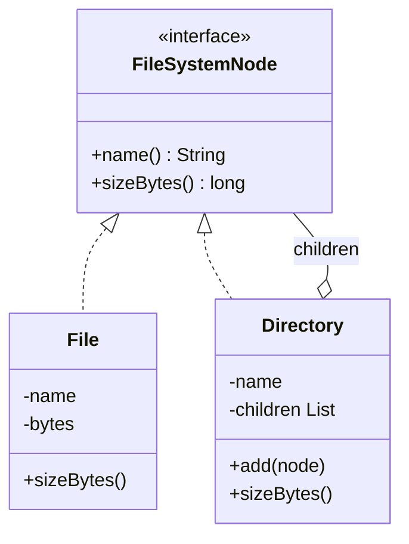
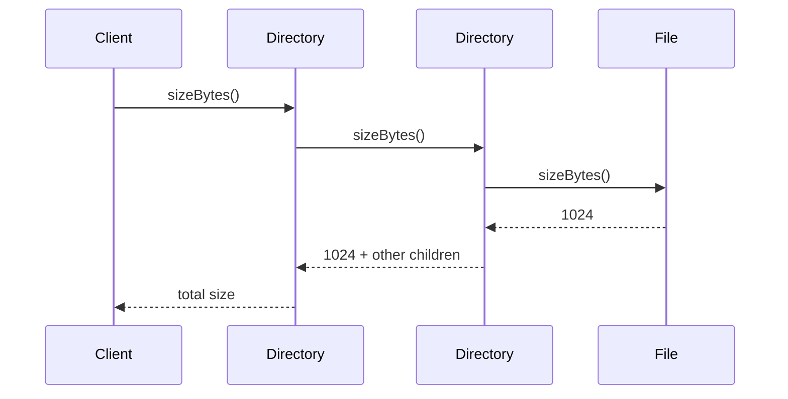

### Problem & Intent

The Composite Pattern composes objects into **tree structures** so clients treat individual objects and groups **uniformly**. A file and a folder both support `getSize()`; a menu item and a submenu both support `render()`. The dominant force is **recursive part-whole hierarchies** where operations must propagate through the tree without `instanceof` branching at every call site.

---

### When to Use / When NOT to Use

| Situation | Use? | Why |
| :--- | :---: | :--- |
| Tree structure where leaves and containers share operations | Yes | One interface; recursion lives in the composite node |
| Clients traverse or aggregate over nested children | Yes | `getSize()`, `print()`, permissions inheritance |
| Flat list with no nesting | No | Simple collection is enough |
| Only leaves exist — no containers ever | No | Composite adds unnecessary abstraction |
| Type-specific operations on leaves only (e.g., `compress()`) | No | Leaking leaf methods on composite breaks uniformity |
| Deep trees with heavy cross-cutting concerns per node | Maybe | Consider [Visitor](/design-patterns/04-behavioral-patterns/visitor-pattern/) for operations that vary |

---

### Structure (Class Diagram)



---

### Interaction Flow



---

### Implementation




**Branching on type everywhere:**

```java
public long totalSize(Object node) {
    if (node instanceof File f) {
        return f.bytes().length;
    }
    if (node instanceof Directory d) {
        return d.children().stream().mapToLong(this::totalSize).sum();
    }
    throw new IllegalArgumentException();
}
```

**Composite approach:**

```java
public interface FileSystemNode {
    String name();
    long sizeBytes();
}

public final class File implements FileSystemNode {
    private final String name;
    private final byte[] bytes;

    public File(String name, byte[] bytes) {
        this.name = name;
        this.bytes = bytes;
    }

    @Override
    public String name() { return name; }

    @Override
    public long sizeBytes() { return bytes.length; }
}

public final class Directory implements FileSystemNode {
    private final String name;
    private final List<FileSystemNode> children = new ArrayList<>();

    public Directory(String name) { this.name = name; }

    public void add(FileSystemNode child) { children.add(child); }

    @Override
    public String name() { return name; }

    @Override
    public long sizeBytes() {
        return children.stream().mapToLong(FileSystemNode::sizeBytes).sum();
    }
}

// Client — no instanceof:
long size = root.sizeBytes();
```




**Branching smell:**

```go
func TotalSize(node any) int64 {
    switch n := node.(type) {
    case File:
        return int64(len(n.Bytes))
    case Directory:
        // manual recursion
    }
}
```

**Composite approach:**

```go
type FileSystemNode interface {
    Name() string
    SizeBytes() int64
}

type File struct {
    Name_ string
    Bytes  []byte
}

func (f File) Name() string     { return f.Name_ }
func (f File) SizeBytes() int64 { return int64(len(f.Bytes)) }

type Directory struct {
    Name_    string
    Children []FileSystemNode
}

func (d *Directory) Add(child FileSystemNode) {
    d.Children = append(d.Children, child)
}

func (d Directory) Name() string { return d.Name_ }

func (d Directory) SizeBytes() int64 {
    var total int64
    for _, c := range d.Children {
        total += c.SizeBytes()
    }
    return total
}

// Client:
// size := root.SizeBytes()
```

Go uses **interface + struct slices**; unexported fields prevent external slices mutation if needed.




```python
from typing import Protocol

class ExamplePort(Protocol):
    def execute(self) -> None: ...

class ExampleService:
    def __init__(self, port: ExamplePort) -> None:
        self._port = port

    def run(self) -> None:
        self._port.execute()
```




---

### Trade-offs & Operational Realities

| Concern | Impact |
| :--- | :--- |
| **Testability** | Test leaf in isolation; test composite with stub children |
| **Complexity** | Uniform interface can force meaningless methods on leaves (`add()` on File) — document or split interfaces |
| **Framework fit** | UI component trees, org charts, permission trees, JSON document models |
| **Safety** | Cycles in the graph cause infinite recursion — detect or use acyclic builders |
| **Performance** | Deep trees: iterative traversal or memoized aggregates for hot paths |

---

### Junior Mistakes

- Putting `add()` / `remove()` on the leaf interface when only composites need them
- Using Composite for a flat list "in case we nest later"
- Forgetting cycle detection when users can link directories freely
- Confusing Composite with [Decorator](/design-patterns/03-structural-patterns/decorator-pattern/) — composite **owns** children; decorator **wraps** one inner

---

### Senior Questions

1. How do you add a `findByName` operation without bloating every node class?
2. Composite vs Iterator — how do you walk the tree without exposing internal lists?
3. Safety vs transparency: should `File.add()` throw or should only `Directory` be mutable?
4. When would you use [Visitor](/design-patterns/04-behavioral-patterns/visitor-pattern/) instead of methods on the composite?
5. How do you persist and rebuild a composite tree from a relational schema?

---

### Revision Cheat Sheet

- **One line:** Tree of parts and wholes sharing one interface; operations recurse.
- **Trigger smell:** `instanceof` / type switches for every tree operation.
- **Pairs with:** [Iterator](/design-patterns/04-behavioral-patterns/iterator-pattern/), [Visitor](/design-patterns/04-behavioral-patterns/visitor-pattern/), [Composite organizational models](/design-patterns/06-architectural-principles/domain-driven-design-building-blocks/)
- **Avoid when:** No hierarchy or only one level of grouping.
- **Interview tip:** Composite = **structure**; Decorator = **one wrapper chain**.

---

### See Also

- [Iterator Pattern](/design-patterns/04-behavioral-patterns/iterator-pattern/)
- [Visitor Pattern](/design-patterns/04-behavioral-patterns/visitor-pattern/)
- [Decorator Pattern](/design-patterns/03-structural-patterns/decorator-pattern/)
- [Elevator Control System LLD](/design-patterns/08-lld-case-studies/elevator-control-system/) — floor/button hierarchies
