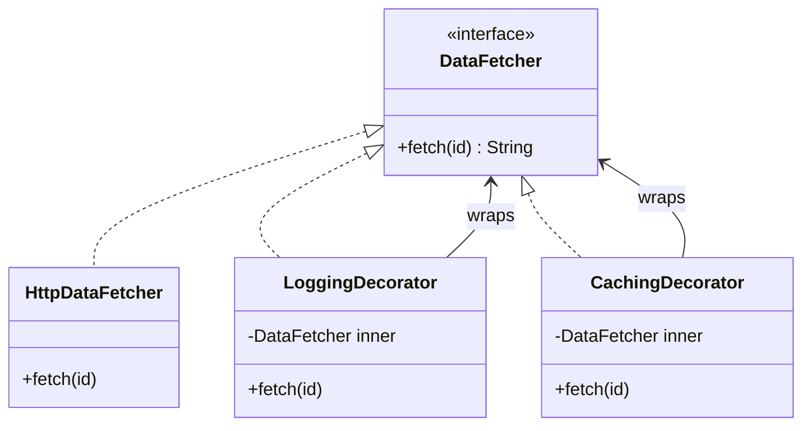
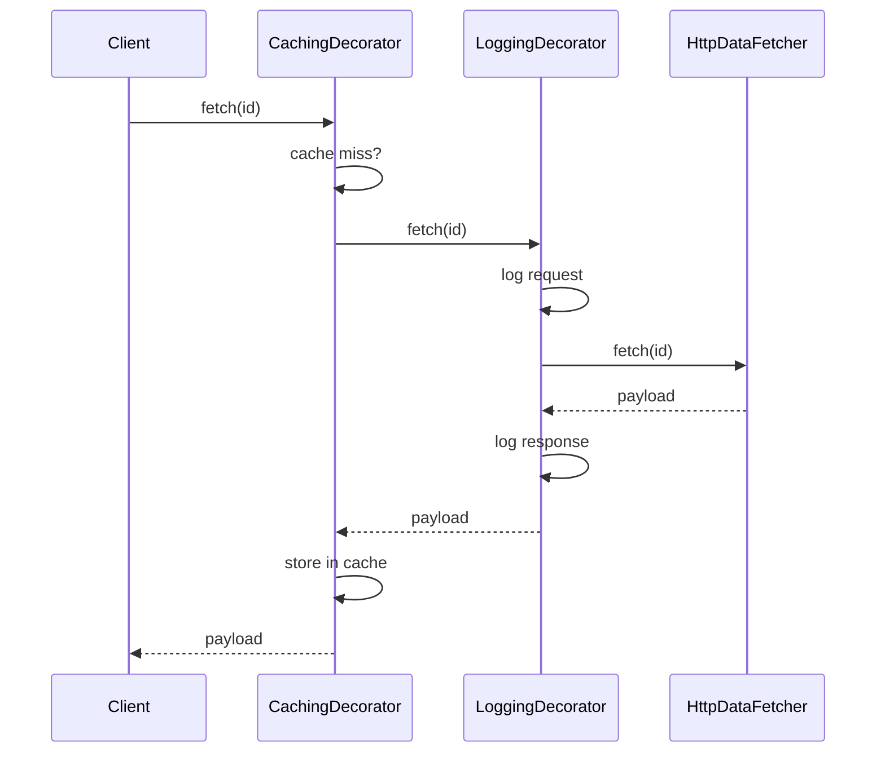

### Problem & Intent

The Decorator Pattern attaches additional responsibilities to an object **dynamically**. Wrappers implement the same interface as the core object and delegate to it, composing behavior at runtime instead of creating subclasses like `CachedLoggingHttpClient extends LoggingHttpClient`. The dominant force is **optional, combinable cross-cutting enhancements** — compression, metrics, retries, encryption — layered in any order.

---

### When to Use / When NOT to Use

| Situation | Use? | Why |
| :--- | :---: | :--- |
| Add behavior that can be combined in many orders (log + cache + retry) | Yes | Stack decorators; each concern stays isolated |
| Open for extension without modifying the core class | Yes | New decorator = new class; core unchanged |
| Every instance always needs the same extra behavior | No | Bake it into the core or use a single wrapper |
| Behavior changes object identity semantics (authorization gate) | No | Prefer [Proxy](/design-patterns/03-structural-patterns/proxy-pattern/) |
| Splitting abstraction from platform implementation | No | Prefer [Bridge](/design-patterns/03-structural-patterns/bridge-pattern/) |
| Two optional flags only (`withCache`, `withLog`) | No | Constructor flags or builder may suffice |

---

### Structure (Class Diagram)



---

### Interaction Flow



---

### Implementation




**Subclass explosion:**

```java
public class CachedLoggingHttpDataFetcher extends LoggingHttpDataFetcher { /* ... */ }
public class RetryingCachedHttpDataFetcher extends CachedHttpDataFetcher { /* ... */ }
// 2^n combinations as flags grow
```

**Decorator approach:**

```java
public interface DataFetcher {
    String fetch(String id);
}

public final class HttpDataFetcher implements DataFetcher {
    @Override
    public String fetch(String id) {
        return httpGet("/data/" + id);
    }
}

public abstract class DataFetcherDecorator implements DataFetcher {
    protected final DataFetcher inner;
    protected DataFetcherDecorator(DataFetcher inner) { this.inner = inner; }
}

public final class LoggingDecorator extends DataFetcherDecorator {
    public LoggingDecorator(DataFetcher inner) { super(inner); }
    @Override
    public String fetch(String id) {
        log.info("fetch {}", id);
        String result = inner.fetch(id);
        log.info("fetch {} done", id);
        return result;
    }
}

public final class CachingDecorator extends DataFetcherDecorator {
    private final Map<String, String> cache = new ConcurrentHashMap<>();
    public CachingDecorator(DataFetcher inner) { super(inner); }
    @Override
    public String fetch(String id) {
        return cache.computeIfAbsent(id, inner::fetch);
    }
}

// Composition at wiring time:
DataFetcher fetcher = new CachingDecorator(
    new LoggingDecorator(new HttpDataFetcher()));
```




**Subclass explosion smell:**

```go
type CachedLoggingFetcher struct { /* embeds LoggingFetcher embeds HttpFetcher */ }
```

**Decorator approach:**

```go
type DataFetcher interface {
    Fetch(ctx context.Context, id string) (string, error)
}

type HTTPDataFetcher struct{}

func (HTTPDataFetcher) Fetch(ctx context.Context, id string) (string, error) {
    return httpGet(ctx, "/data/"+id)
}

type LoggingDecorator struct {
    Inner DataFetcher
}

func (d LoggingDecorator) Fetch(ctx context.Context, id string) (string, error) {
    log.Printf("fetch %s", id)
    result, err := d.Inner.Fetch(ctx, id)
    log.Printf("fetch %s done", id)
    return result, err
}

type CachingDecorator struct {
    Inner DataFetcher
    cache sync.Map
}

func (d *CachingDecorator) Fetch(ctx context.Context, id string) (string, error) {
    if v, ok := d.cache.Load(id); ok {
        return v.(string), nil
    }
    result, err := d.Inner.Fetch(ctx, id)
    if err == nil {
        d.cache.Store(id, result)
    }
    return result, err
}

// Stack at construction:
fetcher := &CachingDecorator{
    Inner: LoggingDecorator{Inner: HTTPDataFetcher{}},
}
```

Go has no inheritance — **embedding + interface satisfaction** or explicit wrapper structs achieve the same stacking.




```python
from typing import Protocol

class Notifier(Protocol):
    def send(self, msg: str) -> None: ...

class EmailNotifier:
    def send(self, msg: str) -> None:
        print(f"email: {msg}")

class LoggingDecorator:
    def __init__(self, inner: Notifier) -> None:
        self._inner = inner

    def send(self, msg: str) -> None:
        print("log: sending")
        self._inner.send(msg)
```




---

### Trade-offs & Operational Realities

| Concern | Impact |
| :--- | :--- |
| **Testability** | Test each decorator with a stub inner; integration test the stack order |
| **Complexity** | Order matters (cache outside log vs inside) — document wiring conventions |
| **Framework fit** | Spring: `BeanPostProcessor` and servlet filters are decorator chains; Go: `http.Handler` middleware |
| **Debugging** | Deep stacks make stack traces longer — correlate with request IDs |
| **Identity** | Decorators should be transparent — same interface, no surprise type checks |

---

### Junior Mistakes

- Decorating with a **different** interface than the core (breaks substitutability)
- Putting business rules in decorators instead of domain services
- Wrong stack order — caching auth tokens or logging after compression corrupts output
- Confusing Decorator with Proxy — decorator **adds** features; proxy **controls access** to one subject

---

### Senior Questions

1. How do you add a metrics decorator without touching existing decorators?
2. Decorator vs Proxy vs Bridge — classify `RetryingHttpClient` wrapping `HttpClient`.
3. Does decorator order matter for cache + retry + logging? Draw the correct stack.
4. How do Java servlet filters relate to the Decorator pattern?
5. When does a decorator chain become a [Chain of Responsibility](/design-patterns/04-behavioral-patterns/chain-of-responsibility-pattern/)?

---

### Revision Cheat Sheet

- **One line:** Wrap an object to add behavior while keeping the same interface.
- **Trigger smell:** `CachedX`, `LoggedCachedX`, `RetryingLoggedCachedX` subclass tree.
- **Pairs with:** [Open-Closed](/design-patterns/01-solid-principles/open-closed-principle/), [Proxy](/design-patterns/03-structural-patterns/proxy-pattern/), [Decorator vs Proxy vs Bridge](/design-patterns/05-pattern-comparisons/decorator-vs-proxy-vs-bridge/)
- **Avoid when:** Single fixed enhancement or behavior is access control, not feature stacking.
- **Go tip:** `http.Handler` middleware is idiomatic decorator chaining.

---

### See Also

- [Decorator vs Proxy vs Bridge](/design-patterns/05-pattern-comparisons/decorator-vs-proxy-vs-bridge/)
- [Proxy Pattern](/design-patterns/03-structural-patterns/proxy-pattern/)
- [Open-Closed Principle](/design-patterns/01-solid-principles/open-closed-principle/)
- [In-Memory Rate Limiter LLD](/design-patterns/08-lld-case-studies/rate-limiter/) — layered request handling
