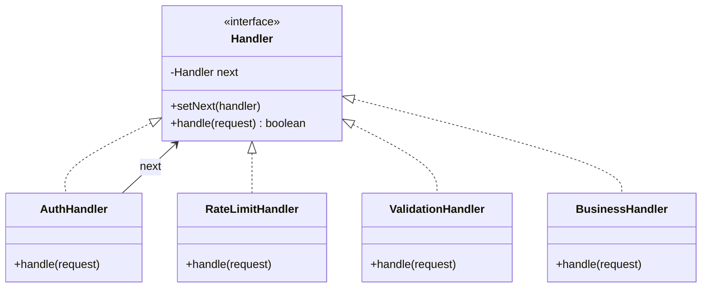
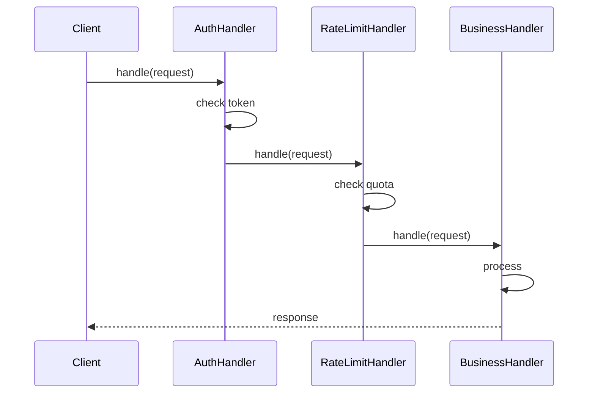

### Problem & Intent

The Chain of Responsibility Pattern **passes a request along a chain of handlers** until one handles it — or every handler gets a chance to process it (pipeline style). Each handler knows only its successor, decoupling senders from receivers. It models servlet filters, Spring `HandlerInterceptor`s, auth middleware, rate limiting, and validation pipelines where **order and composition matter**.

---

### When to Use / When NOT to Use

| Situation | Use? | Why |
| :--- | :---: | :--- |
| Multiple handlers may process a request; exact handler unknown upfront | Yes | Chain discovers the right handler at runtime |
| Handlers should be added/reordered without changing client code | Yes | Link chain in config or DI |
| Cross-cutting pipeline (auth → validate → execute) | Yes | Each link has single responsibility |
| Exactly one handler always processes the request | No | Direct dispatch or strategy is simpler |
| Chain depth is unbounded or handlers call back up the chain | No | Risk of infinite loops and opaque failures |
| All handlers must run (not first-match) | No | Use explicit pipeline list, not early-exit chain |
| Business rules are data-driven with no ordering semantics | No | Rule engine or [Specification](/design-patterns/06-architectural-principles/specification-pattern/) |

---

### Structure (Class Diagram)



---

### Interaction Flow



---

### Implementation




**Junior approach — monolithic filter method:**

```java
public void handleRequest(HttpRequest req) {
    if (!authService.isValid(req.getToken())) throw new UnauthorizedException();
    if (!rateLimiter.allow(req.getClientId())) throw new TooManyRequestsException();
    if (!validator.isValid(req.getBody())) throw new BadRequestException();
    businessService.process(req);
}
```

**Chain approach:**

```java
public abstract class Handler {
    private Handler next;

    public Handler setNext(Handler next) {
        this.next = next;
        return next; // fluent wiring
    }

    public final void handle(Request request) {
        if (!doHandle(request) && next != null) {
            next.handle(request);
        }
    }

    protected abstract boolean doHandle(Request request);
}

public final class AuthHandler extends Handler {
    @Override
    protected boolean doHandle(Request request) {
        if (!isValidToken(request.getToken())) {
            throw new UnauthorizedException();
        }
        return false; // continue chain
    }
}

public final class BusinessHandler extends Handler {
    @Override
    protected boolean doHandle(Request request) {
        process(request);
        return true; // handled — stop chain
    }
}

// Wiring: auth.setNext(rateLimit).setNext(validation).setNext(business);
```

**Spring:** `FilterChain`, `HandlerInterceptor`, and WebFlux `WebFilter` are production chain implementations.




```go
type Request struct {
    Token    string
    ClientID string
    Body     []byte
}

type Handler interface {
    Handle(req Request) error
}

type HandlerFunc func(Request) error

func (f HandlerFunc) Handle(req Request) error { return f(req) }

type Chain struct {
    handlers []Handler
}

func (c *Chain) Add(h Handler) *Chain {
    c.handlers = append(c.handlers, h)
    return c
}

func (c *Chain) Run(req Request) error {
    for _, h := range c.handlers {
        if err := h.Handle(req); err != nil {
            return err
        }
    }
    return nil
}

func AuthHandler(next Handler) Handler {
    return HandlerFunc(func(req Request) error {
        if req.Token == "" {
            return errors.New("unauthorized")
        }
        return next.Handle(req)
    })
}
```

Go middleware uses **higher-order functions** wrapping `http.Handler` — idiomatic chain without abstract base classes.




```python
from typing import Protocol

class ExamplePort(Protocol):
    def execute(self) -> None: ...

class ExampleService:
    def __init__(self, port: ExamplePort) -> None:
        self._port = port

    def run(self) -> None:
        self._port.execute()
```




---

### Trade-offs & Operational Realities

| Concern | Impact |
| :--- | :--- |
| **Testability** | Each handler tested alone; integration test wires full chain |
| **Complexity** | Debugging "which link failed" needs correlation IDs and logging per handler |
| **Framework fit** | Spring Security filter chain; Go `net/http` middleware stacks |
| **Performance** | Deep chains add latency — measure per-link cost |

---

### Junior Mistakes

- Forgetting to call `next` — silently drops requests
- Mixing "first handler wins" with "all handlers must run" semantics in one chain
- Handlers that know concrete successor types instead of the interface
- No short-circuit on fatal errors — propagates through entire chain unnecessarily
- Building chain in random order because wiring is scattered across `@Bean` methods

---

### Senior Questions

1. Pipeline (all run) vs chain (first match) — which does your design need?
2. How do you add a handler in production without redeploying every link?
3. Chain of Responsibility vs [Decorator](/design-patterns/03-structural-patterns/decorator-pattern/) — both wrap; what's the difference?
4. How would you implement async handlers (reactive chain)?
5. Where does [In-Memory Rate Limiter LLD](/design-patterns/08-lld-case-studies/rate-limiter/) sit in the chain?

---

### Revision Cheat Sheet

- **One line:** Pass request through linked handlers until one handles or all process.
- **Trigger smell:** Growing sequential `if` checks at every API entry point.
- **Pairs with:** [Decorator Pattern](/design-patterns/03-structural-patterns/decorator-pattern/), [Proxy Pattern](/design-patterns/03-structural-patterns/proxy-pattern/), [In-Memory Rate Limiter LLD](/design-patterns/08-lld-case-studies/rate-limiter/)
- **Avoid when:** Single handler, unordered rules, or all handlers must always execute.
- **Go tip:** `func Middleware(next http.Handler) http.Handler` is the standard chain idiom.

---

### See Also

- [Decorator Pattern](/design-patterns/03-structural-patterns/decorator-pattern/)
- [Proxy Pattern](/design-patterns/03-structural-patterns/proxy-pattern/)
- [In-Memory Rate Limiter LLD](/design-patterns/08-lld-case-studies/rate-limiter/)
- [Single Responsibility Principle](/design-patterns/01-solid-principles/single-responsibility-principle/)
