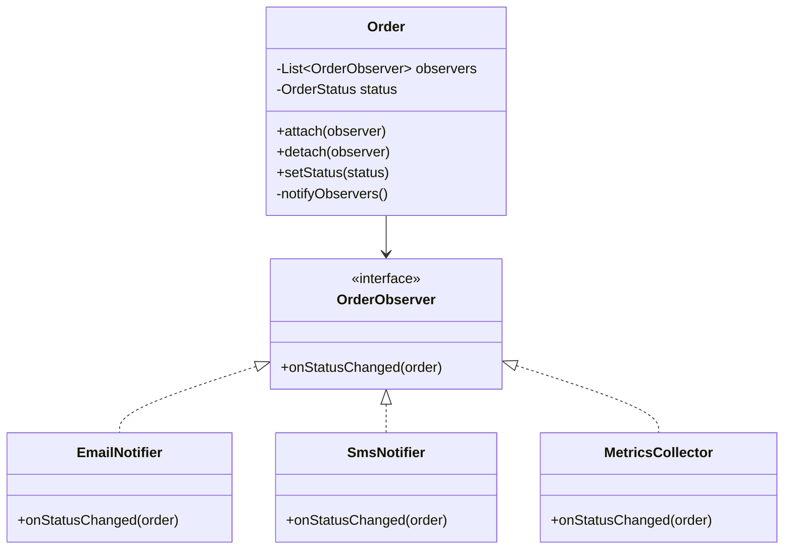
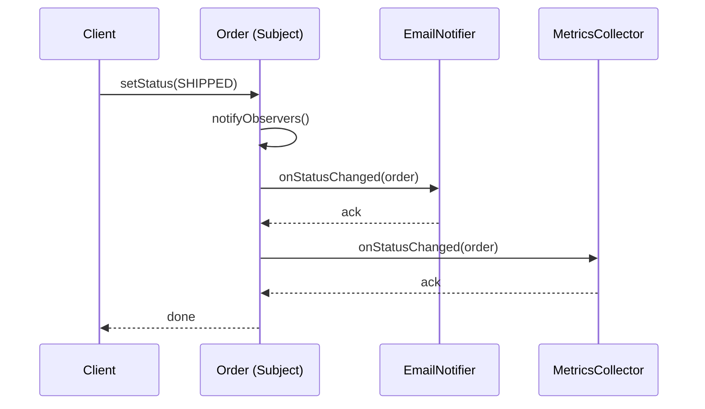

### Problem & Intent

The Observer Pattern defines a **one-to-many dependency** so that when a subject's state changes, all registered observers are notified automatically. The subject does not need to know concrete observer types — only that something wants updates. It is the structural backbone of event-driven UI, domain events, metrics hooks, and outbox-style side effects.

---

### When to Use / When NOT to Use

| Situation | Use? | Why |
| :--- | :---: | :--- |
| Multiple components must react to the same state change | Yes | Decouple publisher from subscribers |
| Reaction logic varies (email, SMS, analytics) and grows over time | Yes | Add observers without editing the subject |
| You need loose coupling for test doubles (mock listeners) | Yes | Subject tests assert notifications, not SMTP |
| Only one listener, always known at compile time | No | Direct method call or callback is simpler |
| Observers need transactional consistency with the subject | No | Prefer domain events + outbox or transactional messaging |
| High-frequency updates with expensive observers | No | Batch, debounce, or use reactive streams with backpressure |
| Bidirectional peer-to-peer updates between many objects | No | Prefer [Mediator Pattern](/design-patterns/04-behavioral-patterns/mediator-pattern/) |

---

### Structure (Class Diagram)



---

### Interaction Flow



---

### Implementation




**Junior approach — hard-coded side effects:**

```java
public void shipOrder(Order order) {
    order.setStatus(OrderStatus.SHIPPED);
    mailClient.send(order.getCustomerEmail(), "Shipped!");
    smsClient.send(order.getPhone(), "Shipped!");
    metrics.increment("orders.shipped");
}
```

**Observer approach:**

```java
public interface OrderObserver {
    void onStatusChanged(Order order);
}

public final class Order {
    private final List<OrderObserver> observers = new CopyOnWriteArrayList<>();
    private OrderStatus status;

    public void attach(OrderObserver observer) {
        observers.add(observer);
    }

    public void setStatus(OrderStatus newStatus) {
        this.status = newStatus;
        notifyObservers();
    }

    private void notifyObservers() {
        for (OrderObserver observer : observers) {
            observer.onStatusChanged(this);
        }
    }
}

public final class EmailNotifier implements OrderObserver {
    @Override
    public void onStatusChanged(Order order) {
        // send email based on order.getStatus()
    }
}
```

**Spring wiring:** publish `ApplicationEvent` from the domain service; `@EventListener` methods are observers. For cross-service fan-out, pair with transactional outbox.




```go
type OrderStatus string

const (
    StatusPending OrderStatus = "PENDING"
    StatusShipped OrderStatus = "SHIPPED"
)

type Order struct {
    ID       string
    Status   OrderStatus
    observers []OrderObserver
}

type OrderObserver interface {
    OnStatusChanged(order Order)
}

func (o *Order) Attach(obs OrderObserver) {
    o.observers = append(o.observers, obs)
}

func (o *Order) SetStatus(status OrderStatus) {
    o.Status = status
    for _, obs := range o.observers {
        obs.OnStatusChanged(*o)
    }
}

type EmailNotifier struct{}

func (EmailNotifier) OnStatusChanged(order Order) {
    // send email
}

type MetricsCollector struct{}

func (MetricsCollector) OnStatusChanged(order Order) {
    // increment counter
}
```

Go has no built-in observer framework — use **function callbacks** (`type ObserverFunc func(Order)`) for simple cases, or channel-based pub/sub when observers run asynchronously.




---

### Trade-offs & Operational Realities

| Concern | Impact |
| :--- | :--- |
| **Testability** | Subject tests register spy observers; each notifier tested in isolation |
| **Complexity** | Ordering, failure handling, and duplicate notifications need explicit policy |
| **Framework fit** | Spring `ApplicationEventPublisher`; Go: channels, `sync.Map` registries, or message bus |
| **Operational risk** | Slow observer blocks subject unless notifications are async or queued |

---

### Junior Mistakes

- Calling observers **before** the subject's state is fully consistent
- No error isolation — one failing observer aborts the rest
- Using Observer when a single `Consumer<T>` callback suffices
- Confusing Observer with Mediator — observers react; mediators route peer messages
- Synchronous notification on hot paths without measuring latency impact

---

### Senior Questions

1. Push vs pull: should observers receive the full subject or fetch state on demand?
2. How do you guarantee **at-least-once** delivery when observers are external services?
3. Observer vs domain events vs message bus — where do you draw the line?
4. How do you prevent observer loops (A notifies B notifies A)?
5. What happens when an observer needs the same DB transaction as the subject?

---

### Revision Cheat Sheet

- **One line:** Subject broadcasts state changes to registered observers.
- **Trigger smell:** Subject method grows a list of unrelated side-effect calls.
- **Pairs with:** [Mediator](/design-patterns/04-behavioral-patterns/mediator-pattern/), [Command](/design-patterns/04-behavioral-patterns/command-pattern/), [Notification Service LLD](/design-patterns/08-lld-case-studies/notification-system/)
- **Avoid when:** One listener, transactional fan-out, or backpressure is required.
- **Go tip:** Channels decouple publisher from subscribers when async is acceptable.

---

### See Also

- [Notification Service LLD](/design-patterns/08-lld-case-studies/notification-system/)
- [Mediator Pattern](/design-patterns/04-behavioral-patterns/mediator-pattern/)
- [Command Pattern](/design-patterns/04-behavioral-patterns/command-pattern/)
- [Open-Closed Principle](/design-patterns/01-solid-principles/open-closed-principle/)
