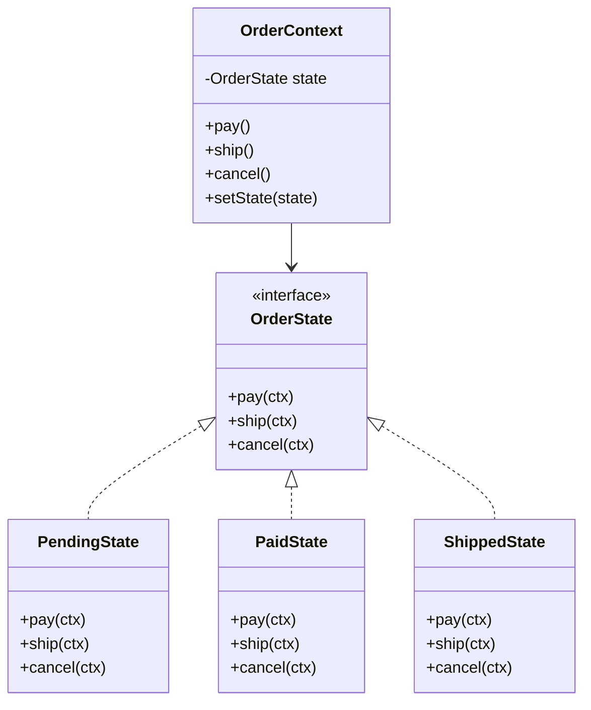
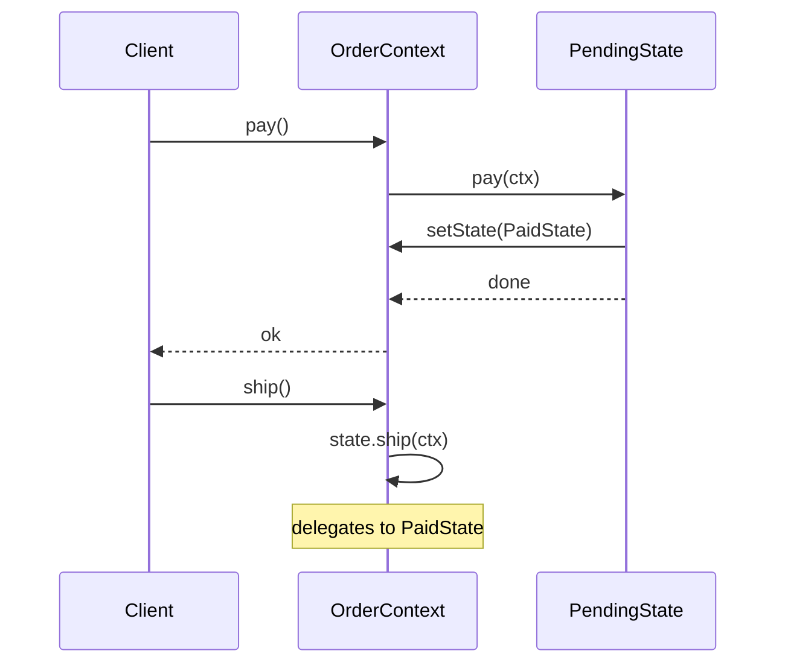

### Problem & Intent

The State Pattern lets an object **alter its behavior when its internal state changes**, appearing to change class. Instead of sprawling `switch (status)` blocks, the context delegates to a state object; transitions replace the current state reference. It models lifecycles — orders, tickets, connections, workflows — where **allowed actions depend on current state**.

---

### When to Use / When NOT to Use

| Situation | Use? | Why |
| :--- | :---: | :--- |
| Object behavior changes significantly across lifecycle phases | Yes | Each state class owns valid transitions and actions |
| `switch` on status enum grows with every new state | Yes | Open for new states without editing every branch |
| States have different allowed operations (pay only when pending) | Yes | Illegal operations fail inside state, not scattered checks |
| Algorithm chosen externally at runtime | No | Prefer [Strategy Pattern](/design-patterns/04-behavioral-patterns/strategy-pattern/) |
| Two or three simple states with identical behavior | No | Enum + guard methods is enough |
| States are data-driven rules from config | No | Rule engine or specification pattern may fit better |
| Algorithm skeleton fixed, only steps vary | No | Prefer [Template Method](/design-patterns/04-behavioral-patterns/template-method-pattern/) |

---

### Structure (Class Diagram)



---

### Interaction Flow



---

### Implementation




**Junior approach — switch explosion:**

```java
public void ship(Order order) {
    return switch (order.getStatus()) {
        case PENDING -> throw new IllegalStateException("not paid");
        case PAID -> { order.setStatus(SHIPPED); yield; }
        case SHIPPED -> throw new IllegalStateException("already shipped");
        case CANCELLED -> throw new IllegalStateException("cancelled");
    };
}
```

**State approach:**

```java
public interface OrderState {
    void pay(OrderContext ctx);
    void ship(OrderContext ctx);
    void cancel(OrderContext ctx);
}

public final class PendingState implements OrderState {
    @Override
    public void pay(OrderContext ctx) {
        ctx.setState(new PaidState());
    }

    @Override
    public void ship(OrderContext ctx) {
        throw new IllegalStateException("pay first");
    }

    @Override
    public void cancel(OrderContext ctx) {
        ctx.setState(new CancelledState());
    }
}

public final class OrderContext {
    private OrderState state = new PendingState();

    public void setState(OrderState state) {
        this.state = state;
    }

    public void pay()  { state.pay(this); }
    public void ship() { state.ship(this); }
}
```

**Spring State Machine** (`spring-statemachine`) fits complex workflows; simple lifecycles often need only hand-rolled state classes.




```go
type OrderContext struct {
    state OrderState
}

type OrderState interface {
    Pay(ctx *OrderContext)
    Ship(ctx *OrderContext)
    Cancel(ctx *OrderContext)
}

type PendingState struct{}

func (PendingState) Pay(ctx *OrderContext)  { ctx.state = PaidState{} }
func (PendingState) Ship(ctx *OrderContext) {
    panic("pay first")
}
func (PendingState) Cancel(ctx *OrderContext) { ctx.state = CancelledState{} }

type PaidState struct{}

func (PaidState) Pay(ctx *OrderContext)  { panic("already paid") }
func (PaidState) Ship(ctx *OrderContext) { ctx.state = ShippedState{} }
func (PaidState) Cancel(ctx *OrderContext) { ctx.state = CancelledState{} }

func (c *OrderContext) Pay()  { c.state.Pay(c) }
func (c *OrderContext) Ship() { c.state.Ship(c) }
```

Go uses **empty struct state types** and interface delegation — no inheritance. State singletons (`var pending = PendingState{}`) avoid allocations on hot paths.




---

### Trade-offs & Operational Realities

| Concern | Impact |
| :--- | :--- |
| **Testability** | Each state tested for allowed/denied transitions in isolation |
| **Complexity** | Many small classes; transition tables help when states exceed ~6 |
| **Framework fit** | Spring State Machine for BPM-like flows; JPA `@Enumerated` still stores status column |
| **Persistence** | Serialize state as enum/string; rehydrate to correct state object on load |

---

### Junior Mistakes

- Storing state enum **and** state object — duplicate sources of truth
- Context methods that bypass state and mutate status directly
- Confusing State with Strategy — states **transition internally**; strategies are **swapped externally**
- God context that still contains `switch` while claiming to use State
- Not handling unknown/restored states after schema migration

---

### Senior Questions

1. State vs Strategy — who owns the transition: context or state object?
2. How do you persist and restore state machines across service restarts?
3. Hierarchical states (sub-states of PAID) — nested classes or flat enum?
4. How does State interact with [Observer](/design-patterns/04-behavioral-patterns/observer-pattern/) on transition events?
5. When does a state machine belong in the DB (workflow engine) vs in code?

---

### Revision Cheat Sheet

- **One line:** Context delegates to state objects; transitions swap the delegate.
- **Trigger smell:** `switch(status)` duplicated across multiple methods.
- **Pairs with:** [Strategy Pattern](/design-patterns/04-behavioral-patterns/strategy-pattern/), [Strategy vs State vs Template Method](/design-patterns/05-pattern-comparisons/strategy-vs-state-vs-template-method/)
- **Avoid when:** Few states, external algorithm selection, or rules are purely data-driven.
- **Interview tip:** State = behavior changes with **internal** lifecycle; Strategy = **external** algorithm pick.

---

### See Also

- [Strategy Pattern](/design-patterns/04-behavioral-patterns/strategy-pattern/)
- [Strategy vs State vs Template Method](/design-patterns/05-pattern-comparisons/strategy-vs-state-vs-template-method/)
- [Elevator Control System LLD](/design-patterns/08-lld-case-studies/elevator-control-system/)
- [Open-Closed Principle](/design-patterns/01-solid-principles/open-closed-principle/)
