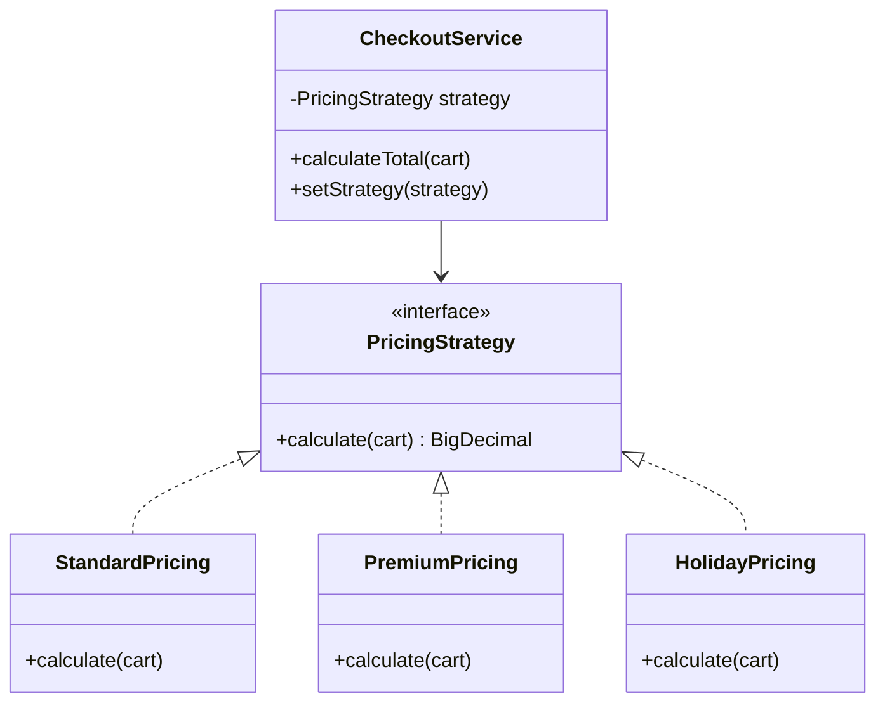
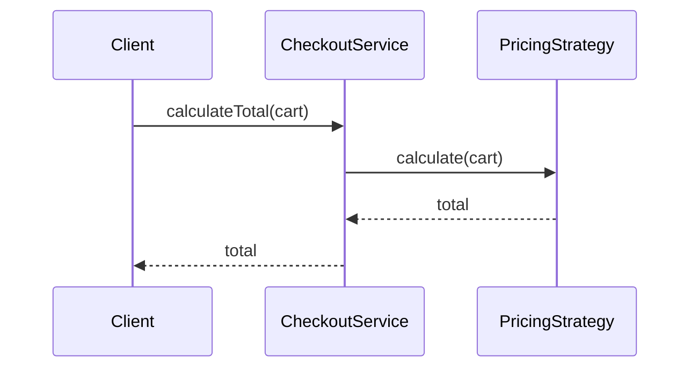

### Problem & Intent

The Strategy Pattern defines a family of algorithms, encapsulates each one, and makes them **interchangeable at runtime**. The context delegates to a strategy interface instead of branching on type codes. It is the go-to fix for growing `if/else` or `switch` blocks that select behavior — pricing rules, payment methods, compression algorithms, and validation pipelines.

---

### When to Use / When NOT to Use

| Situation | Use? | Why |
| :--- | :---: | :--- |
| Multiple algorithms for the same operation, chosen at runtime | Yes | Open for new strategies without editing context |
| Rules vary by configuration, tenant, or feature flag | Yes | Inject the right strategy from DI container |
| Unit-test each algorithm in isolation | Yes | Strategies are small, swappable units |
| Only one algorithm, never varies | No | Plain method or function is simpler (YAGNI) |
| Behavior is tied to object lifecycle state transitions | No | Prefer [State Pattern](/design-patterns/04-behavioral-patterns/state-pattern/) |
| Algorithm skeleton fixed, only steps vary | No | Prefer [Template Method](/design-patterns/04-behavioral-patterns/template-method-pattern/) |
| Two strategies differ only by a constant | No | Parameterize instead of new classes |

---

### Structure (Class Diagram)



---

### Interaction Flow



---

### Implementation




**Junior approach — switch explosion:**

```java
public BigDecimal calculateTotal(Cart cart, String customerTier) {
    return switch (customerTier) {
        case "STANDARD" -> cart.subtotal();
        case "PREMIUM" -> cart.subtotal().multiply(new BigDecimal("0.90"));
        case "HOLIDAY" -> cart.subtotal().subtract(new BigDecimal("10"));
        default -> throw new IllegalArgumentException(customerTier);
    };
}
```

**Strategy approach:**

```java
public interface PricingStrategy {
    BigDecimal calculate(Cart cart);
}

public final class StandardPricing implements PricingStrategy {
    @Override
    public BigDecimal calculate(Cart cart) {
        return cart.subtotal();
    }
}

public final class PremiumPricing implements PricingStrategy {
    @Override
    public BigDecimal calculate(Cart cart) {
        return cart.subtotal().multiply(new BigDecimal("0.90"));
    }
}

public final class CheckoutService {
    private final PricingStrategy pricingStrategy;

    public CheckoutService(PricingStrategy pricingStrategy) {
        this.pricingStrategy = pricingStrategy;
    }

    public BigDecimal calculateTotal(Cart cart) {
        return pricingStrategy.calculate(cart);
    }
}
```

**Spring wiring:** register each `PricingStrategy` as a bean; select by `@Qualifier` or a factory keyed on tenant/tier.




```go
type Cart struct {
    Subtotal float64
}

type PricingStrategy interface {
    Calculate(c Cart) float64
}

type StandardPricing struct{}

func (StandardPricing) Calculate(c Cart) float64 { return c.Subtotal }

type PremiumPricing struct{}

func (PremiumPricing) Calculate(c Cart) float64 { return c.Subtotal * 0.90 }

type CheckoutService struct {
    strategy PricingStrategy
}

func (s *CheckoutService) CalculateTotal(c Cart) float64 {
    return s.strategy.Calculate(c)
}

// Strategy registry — common Go pattern instead of Spring DI
func PricingForTier(tier string) (PricingStrategy, error) {
    switch tier {
    case "STANDARD":
        return StandardPricing{}, nil
    case "PREMIUM":
        return PremiumPricing{}, nil
    default:
        return nil, fmt.Errorf("unknown tier: %s", tier)
    }
}
```

Go favors **small interfaces** and **functions as strategies** (`type PricingFunc func(Cart) float64`) when stateless — use structs when strategies hold configuration.




---

### Trade-offs & Operational Realities

| Concern | Impact |
| :--- | :--- |
| **Testability** | Each strategy tested independently; context tests use stub strategy |
| **Complexity** | More types than a switch — pays off when rules grow or are plugin-like |
| **Framework fit** | Spring: strategy beans + factory; Go: registry map or constructor injection |
| **Runtime selection** | Needs clear ownership of which strategy is active (request scope vs singleton) |

---

### Junior Mistakes

- Creating a strategy interface with one implementation "for future use"
- Passing strategy choice as `String` and switching inside the context anyway (defeats the pattern)
- Making the context aware of all concrete strategy class names
- Confusing Strategy with State — strategies are usually **swapped externally**, states **transition internally**

---

### Senior Questions

1. How do you add a new pricing rule without modifying `CheckoutService`?
2. Strategy vs State vs Template Method — classify **shipping + tax + discount** pipeline.
3. How would you handle per-request strategy selection in a multi-tenant API?
4. Can a strategy call another strategy (composition)? When does that become a Chain of Responsibility?
5. How do you avoid creating 50 strategy classes when rules are data-driven?

---

### Revision Cheat Sheet

- **One line:** Delegate varying algorithm to interchangeable strategy objects.
- **Trigger smell:** Growing `switch` on type/tier/mode for the same method.
- **Pairs with:** [Factory Method](/design-patterns/02-creational-patterns/factory-method-pattern/), [Open-Closed](/design-patterns/01-solid-principles/open-closed-principle/), [DI](/design-patterns/06-architectural-principles/dependency-injection-inversion-of-control/)
- **Avoid when:** Single fixed algorithm or behavior driven by internal state machine.
- **Go tip:** Function types work as strategies when no per-strategy state is needed.

---

### See Also

- [Open-Closed Principle](/design-patterns/01-solid-principles/open-closed-principle/)
- [State Pattern](/design-patterns/04-behavioral-patterns/state-pattern/)
- [Strategy vs State vs Template Method](/design-patterns/05-pattern-comparisons/strategy-vs-state-vs-template-method/)
- [Parking Lot System LLD](/design-patterns/08-lld-case-studies/parking-lot/) — pricing strategies in practice
