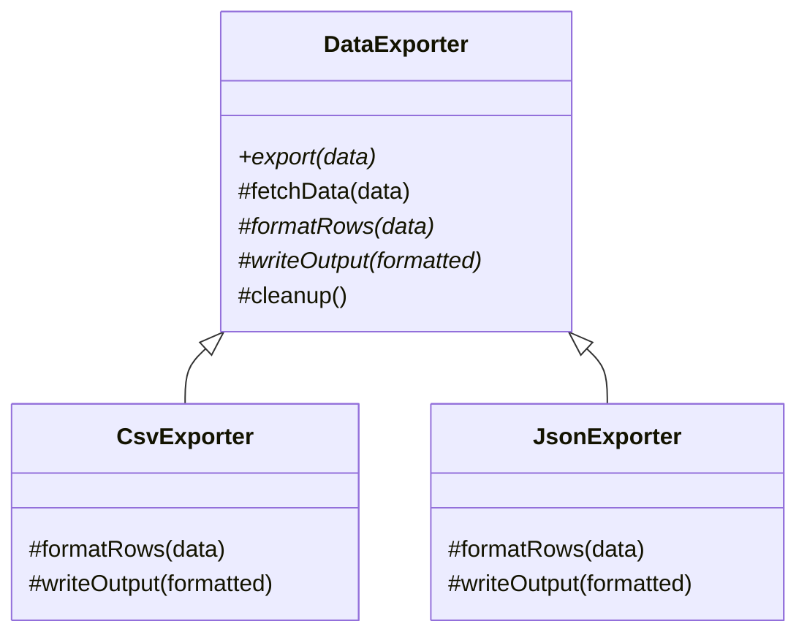
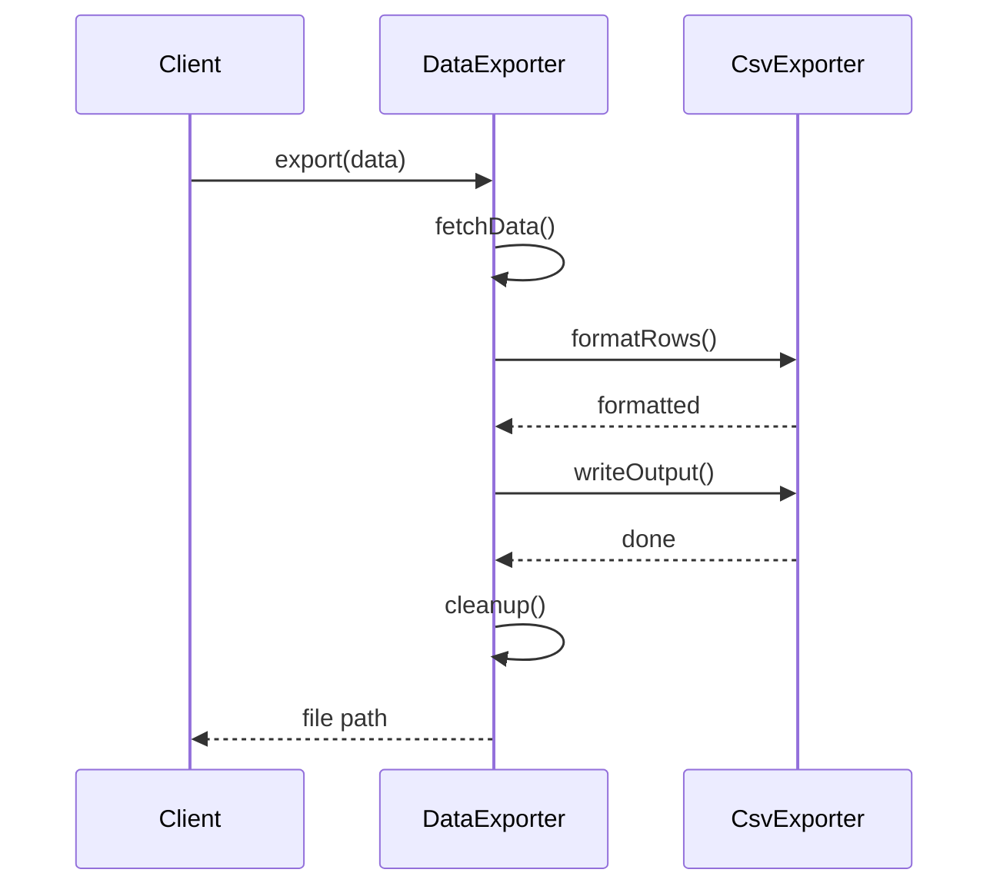

### Problem & Intent

The Template Method Pattern defines the **skeleton of an algorithm in a base class**, deferring some steps to subclasses. The template method calls abstract or hook methods in a fixed order, enforcing invariant steps (open connection, validate, transform, close) while allowing variation in specific steps. It is inheritance-based reuse for pipelines where **structure is stable but details differ**.

---

### When to Use / When NOT to Use

| Situation | Use? | Why |
| :--- | :---: | :--- |
| Multiple classes share the same algorithm steps in the same order | Yes | DRY for orchestration; vary only hooks |
| Invariant steps must not be skipped (security, resource cleanup) | Yes | `final` template method prevents reordering |
| Framework defines lifecycle (`init`, `execute`, `destroy`) | Yes | Subclasses plug into fixed hooks |
| Algorithms differ in structure, not just steps | No | Prefer [Strategy](/design-patterns/04-behavioral-patterns/strategy-pattern/) composition |
| Language lacks inheritance (or team bans it) | No | Compose with functions or strategy objects |
| Only one implementation exists | No | Plain method sequence is enough |
| Need runtime swapping of entire algorithm | No | Strategy, not template method |

---

### Structure (Class Diagram)



---

### Interaction Flow



---

### Implementation




**Junior approach — duplicated pipeline:**

```java
public void exportCsv(List<Row> data) {
    List<Row> fetched = repository.findAll();
    String csv = toCsv(fetched);
    Files.write(path, csv.getBytes());
}

public void exportJson(List<Row> data) {
    List<Row> fetched = repository.findAll(); // duplicated
    String json = toJson(fetched);
    Files.write(path, json.getBytes());       // duplicated
}
```

**Template Method approach:**

```java
public abstract class DataExporter {
    public final String export() {
        List<Row> data = fetchData();
        String formatted = formatRows(data);
        String path = writeOutput(formatted);
        cleanup();
        return path;
    }

    protected List<Row> fetchData() {
        return repository.findAll();
    }

    protected abstract String formatRows(List<Row> data);
    protected abstract String writeOutput(String formatted);

    protected void cleanup() { /* default no-op hook */ }
}

public final class CsvExporter extends DataExporter {
    @Override
    protected String formatRows(List<Row> data) {
        return CsvWriter.write(data);
    }

    @Override
    protected String writeOutput(String formatted) {
        return fileStore.save("export.csv", formatted);
    }
}
```

Mark `export()` `final` so subclasses cannot break step order. Hooks (`cleanup`) stay overridable with defaults.




```go
type Row struct {
    ID   int
    Name string
}

type Exporter struct {
    Format func([]Row) string
    Write  func(string) (string, error)
    Fetch  func() ([]Row, error)
}

func (e Exporter) Export() (string, error) {
    data, err := e.Fetch()
    if err != nil {
        return "", err
    }
    formatted := e.Format(data)
    path, err := e.Write(formatted)
    if err != nil {
        return "", err
    }
    return path, nil
}

// CsvExporter wires the template steps via function fields
func NewCsvExporter(repo RowRepository, store FileStore) Exporter {
    return Exporter{
        Fetch:  repo.FindAll,
        Format: rowsToCsv,
        Write:  func(s string) (string, error) { return store.Save("export.csv", s) },
    }
}
```

Go has no inheritance — **compose the template as a struct with function fields** or an unexported orchestration function plus injected step functions.




---

### Trade-offs & Operational Realities

| Concern | Impact |
| :--- | :--- |
| **Testability** | Test each hook in subclass; test template once with stub hooks |
| **Complexity** | Deep inheritance hierarchies become rigid — favor hooks over many abstract methods |
| **Framework fit** | Spring `JdbcTemplate`, JUnit test lifecycle, Servlet `service()` method |
| **Fragile base class** | Changes to template method break all subclasses — version hooks carefully |

---

### Junior Mistakes

- Subclass overrides template method itself, breaking invariant steps
- Too many abstract methods — every new step forces all subclasses to change
- Using Template Method when composition (Strategy pipeline) would avoid inheritance
- Hook methods with empty defaults that subclasses forget to override silently
- Confusing with Strategy — template fixes **order**; strategy swaps **whole algorithm**

---

### Senior Questions

1. Template Method vs Strategy — when is inheritance the right reuse mechanism?
2. How do Hollywood Principle ("don't call us, we'll call you") and IoC relate to this pattern?
3. Can hooks be optional without forcing empty overrides in every subclass?
4. How would you implement the same skeleton in Go without a base class?
5. Classify a Spring `@Transactional` service method — template method or aspect?

---

### Revision Cheat Sheet

- **One line:** Base class defines algorithm order; subclasses fill in steps.
- **Trigger smell:** Copy-pasted multi-step pipelines differing only in one step.
- **Pairs with:** [Strategy Pattern](/design-patterns/04-behavioral-patterns/strategy-pattern/), [Strategy vs State vs Template Method](/design-patterns/05-pattern-comparisons/strategy-vs-state-vs-template-method/)
- **Avoid when:** No shared skeleton, runtime algorithm swap, or inheritance is discouraged.
- **Go tip:** Function fields in a struct replace abstract methods cleanly.

---

### See Also

- [Strategy Pattern](/design-patterns/04-behavioral-patterns/strategy-pattern/)
- [Strategy vs State vs Template Method](/design-patterns/05-pattern-comparisons/strategy-vs-state-vs-template-method/)
- [Open-Closed Principle](/design-patterns/01-solid-principles/open-closed-principle/)
- [Factory Method Pattern](/design-patterns/02-creational-patterns/factory-method-pattern/)
