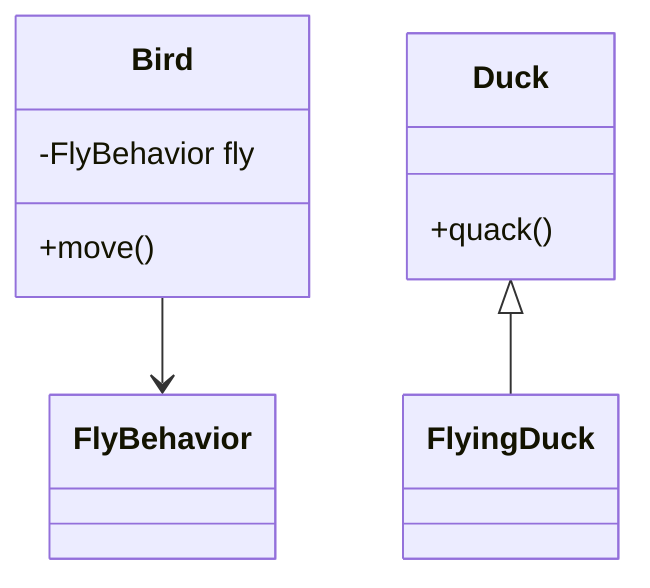
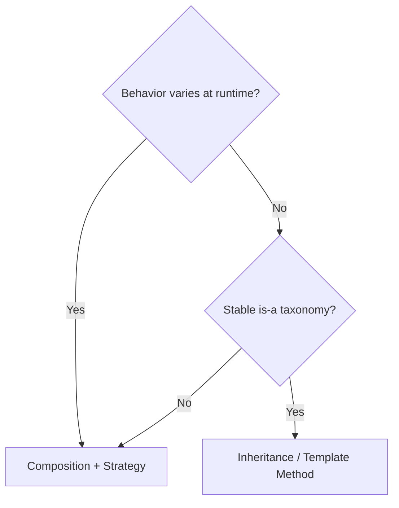

### Problem & Intent

**Composition** (has-a) favors runtime flexibility and test doubles. **Inheritance** (is-a) shares implementation and enforces contracts — but tight coupling and fragile base classes drive teams toward composition + interfaces.

---

### Pattern Comparison at a Glance

| Dimension | Composition | Inheritance |
| :--- | :--- | :--- |
| **Coupling** | Looser | Tighter to base |
| **Runtime change** | Swap delegate | Fixed hierarchy |
| **Reuse** | Delegate behavior | Override hooks |
| **Go default** | Preferred | Embedding, not subclassing |

---

### When to Use / When NOT to Use

| Situation | Composition | Inheritance |
| :--- | :---: | :---: |
| Pricing policy varies at runtime | Yes | — |
| Template Method fixed skeleton | — | Yes (or composition + strategy) |
| Deep framework extension points | Maybe | Yes if hooks are stable |
| Single-language Go service | Yes | Rare |

---

### Structure (Class Diagram)

---

### Interaction Flow

---

### Implementation

Prefer [Strategy](/design-patterns/04-behavioral-patterns/strategy-pattern/) and [Decorator](/design-patterns/03-structural-patterns/decorator-pattern/) for composition; [Template Method](/design-patterns/04-behavioral-patterns/template-method-pattern/) for inheritance hooks.

---

### Trade-offs & Operational Realities

| Tradeoff | Composition | Inheritance |
| :--- | :--- | :--- |
| **Testability** | Easy mock delegate | Subclass test matrix |
| **LSP risk** | Lower | Higher |

---

### Junior Mistakes

- Inheritance for code reuse only (violates LSP).
- Composition explosion without interfaces.

---

### Senior Questions

1. How does LSP constrain inheritance choices?
2. When is Template Method still idiomatic in Java?

---

### Revision Cheat Sheet

- **Favor composition** for varying behavior.
- **Inheritance** for stable taxonomies and hook methods.

---

### See Also

- [LSP](/design-patterns/01-solid-principles/liskov-substitution-principle/)
- [Interface vs Abstract Class](/design-patterns/05-pattern-comparisons/interface-vs-abstract-class/)
