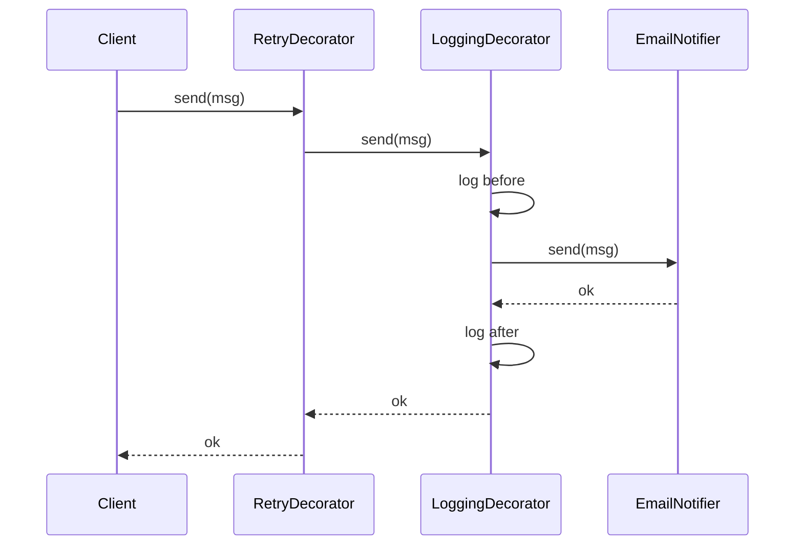
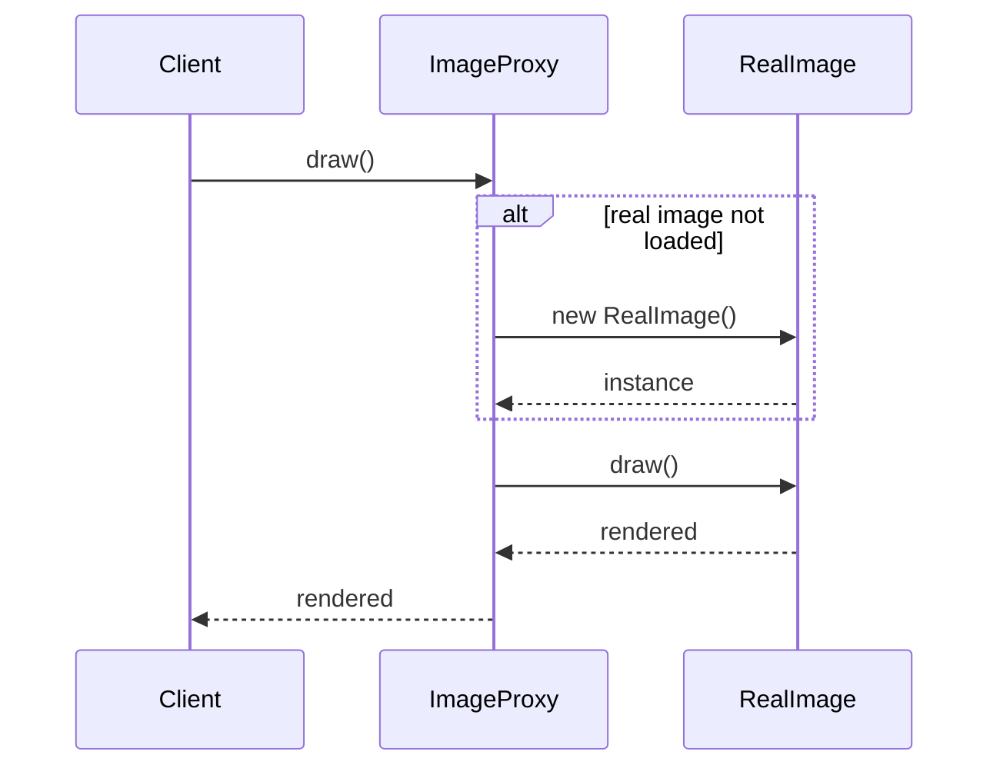
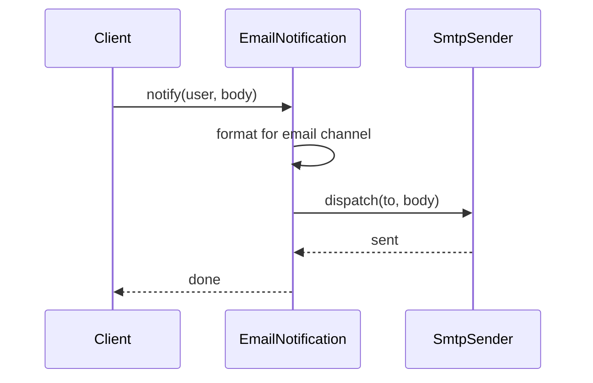

### Problem & Intent

**Decorator**, **Proxy**, and **Bridge** all involve wrapping or separating collaborators — juniors confuse them because every variant implements the same interface and forwards calls. The disambiguation is **intent and lifetime**:

- **Decorator** adds responsibilities **transparently** (logging, caching, compression) — often stacked, always same contract.
- **Proxy** controls **access** to a subject (lazy load, security, remote, pooling) — client may not know real object timing.
- **Bridge** splits **abstraction from implementation** so each dimension varies independently — not about stacking wrappers at runtime.

This guide maps smells to the right structural pattern before you build a Russian doll of `new Foo(new Bar(new Baz()))`.

---

### Pattern Comparison at a Glance

| Dimension | Decorator | Proxy | Bridge |
| :--- | :--- | :--- | :--- |
| **Primary intent** | Add behavior dynamically | Control access / indirection | Decouple abstraction from implementation |
| **Interface contract** | Same as component; enriched semantics | Same as subject; may defer work | Abstraction interface ≠ implementation details |
| **Wrapping** | Stack multiple decorators | Usually one proxy per subject | Fixed composition at construction |
| **Client awareness** | Often unaware of layers | Often unaware (virtual proxy) | Aware of abstraction; blind to concrete impl |
| **Who creates wrapper** | Client or factory stacks decorators | Factory / container injects proxy | Assembler wires impl into abstraction |
| **Typical examples** | `BufferedInputStream`, metrics middleware | Lazy image load, RMI stub, DB connection pool | UI toolkit × OS renderer, message sender × transport |
| **Go idiom** | `http.Handler` middleware chain | `io.Reader` lazy wrapper, gRPC client | Small interfaces + embed struct |

---

### When to Use / When NOT to Use

| Situation | Decorator | Proxy | Bridge | Why |
| :--- | :---: | :---: | :---: | :--- |
| Add logging/metrics around a service call | Yes | — | — | Cross-cutting enhancement; stackable |
| Load 10 MB image only when `draw()` is called | — | Yes | — | Access control + lazy initialization |
| Support Windows/Mac/Linux renderers for same UI API | — | — | Yes | Two orthogonal axes vary independently |
| Enforce RBAC before repository access | — | Yes | — | Gatekeeper; not enriching return value |
| Compress then encrypt an output stream | Yes | — | — | Layered responsibilities, same `OutputStream` |
| Payment UI must work with Stripe, PayPal, bank APIs | — | — | Yes | Abstraction stable; swap payment impl |
| Single optional cache in front of DB | Yes or Proxy | Yes | — | Decorator if transparent cache; Proxy if access semantics differ |
| Need different interface than wrapped object | No | No | No | Use [Adapter](/design-patterns/03-structural-patterns/adapter-pattern/) |
| Wrapping only to mock in tests | No | No | No | Use test doubles / interfaces directly |
| Every call needs 6 stacked wrappers | Maybe | — | — | Consider pipeline or middleware framework instead |

---

### Structure (Class Diagram)

```mermaid
classDiagram
    direction TB

    namespace Decorator {
        class Notifier {
            <<interface>>
            +send(message)
        }
        class EmailNotifier {
            +send(message)
        }
        class NotifierDecorator {
            <<abstract>>
            -wrapped Notifier
            +send(message)
        }
        class LoggingDecorator
        class RetryDecorator
        Notifier <|.. EmailNotifier
        Notifier <|.. NotifierDecorator
        NotifierDecorator <|-- LoggingDecorator
        NotifierDecorator <|-- RetryDecorator
        NotifierDecorator --> Notifier : wraps
    }

    namespace Proxy {
        class Image {
            <<interface>>
            +draw()
        }
        class RealImage {
            +draw()
        }
        class ImageProxy {
            -realImage RealImage
            +draw()
        }
        Image <|.. RealImage
        Image <|.. ImageProxy
        ImageProxy --> RealImage : lazy create
    }

    namespace Bridge {
        class Notification {
            <<abstraction>>
            -sender MessageSender
            +notify(user, body)
        }
        class SmsNotification
        class EmailNotification
        class MessageSender {
            <<implementation>>
            +dispatch(to, body)
        }
        class TwilioSender
        class SmtpSender
        Notification <|-- SmsNotification
        Notification <|-- EmailNotification
        Notification --> MessageSender
        MessageSender <|.. TwilioSender
        MessageSender <|.. SmtpSender
    }
```

---

### Interaction Flow

**Decorator — each layer adds behavior, then forwards:**



**Proxy — gatekeeper may delay creating or reaching real subject:**



**Bridge — abstraction delegates to implementation interface (not stacking same interface):**



---

### Implementation




**Decorator — stack logging + retry on notifier:**

```java
public interface Notifier {
    void send(String message);
}

public final class EmailNotifier implements Notifier {
    @Override
    public void send(String message) {
        mailClient.deliver(message);
    }
}

public abstract class NotifierDecorator implements Notifier {
    protected final Notifier wrapped;

    protected NotifierDecorator(Notifier wrapped) {
        this.wrapped = wrapped;
    }
}

public final class LoggingDecorator extends NotifierDecorator {
    public LoggingDecorator(Notifier wrapped) { super(wrapped); }

    @Override
    public void send(String message) {
        log.info("sending: {}", message);
        wrapped.send(message);
    }
}

// Usage: new LoggingDecorator(new RetryDecorator(new EmailNotifier()))
```

**Proxy — lazy-load expensive image:**

```java
public interface Image {
    void draw();
}

public final class RealImage implements Image {
    public RealImage(String path) { loadFromDisk(path); }

    @Override
    public void draw() { /* render pixels */ }
}

public final class ImageProxy implements Image {
    private final String path;
    private RealImage realImage;

    public ImageProxy(String path) { this.path = path; }

    @Override
    public void draw() {
        if (realImage == null) {
            realImage = new RealImage(path);
        }
        realImage.draw();
    }
}
```

**Bridge — notification channel × message transport:**

```java
public interface MessageSender {
    void dispatch(String to, String body);
}

public final class SmtpSender implements MessageSender {
    @Override
    public void dispatch(String to, String body) { /* SMTP */ }
}

public abstract class Notification {
    protected final MessageSender sender;

    protected Notification(MessageSender sender) {
        this.sender = sender;
    }

    public abstract void notify(User user, String body);
}

public final class EmailNotification extends Notification {
    public EmailNotification(MessageSender sender) { super(sender); }

    @Override
    public void notify(User user, String body) {
        sender.dispatch(user.getEmail(), "Subject: ...\n" + body);
    }
}
```




**Decorator — middleware-style wrapping (same interface):**

```go
type Notifier interface {
    Send(message string) error
}

type EmailNotifier struct{}

func (EmailNotifier) Send(message string) error {
    return mailClient.Deliver(message)
}

type LoggingDecorator struct {
    wrapped Notifier
}

func (d LoggingDecorator) Send(message string) error {
    log.Printf("sending: %s", message)
    return d.wrapped.Send(message)
}

// Stack: LoggingDecorator{RetryDecorator{EmailNotifier{}}}
```

**Proxy — lazy initialization behind same interface:**

```go
type Image interface {
    Draw()
}

type RealImage struct {
    pixels []byte
}

func NewRealImage(path string) *RealImage {
    return &RealImage{pixels: loadFromDisk(path)}
}

type ImageProxy struct {
    path string
    real *RealImage
}

func (p *ImageProxy) Draw() {
    if p.real == nil {
        p.real = NewRealImage(p.path)
    }
    p.real.Draw()
}
```

**Bridge — abstraction embeds implementation interface:**

```go
type MessageSender interface {
    Dispatch(to, body string) error
}

type SmtpSender struct{}
func (SmtpSender) Dispatch(to, body string) error { /* SMTP */ }

type Notification interface {
    Notify(user User, body string) error
}

type EmailNotification struct {
    sender MessageSender
}

func (n EmailNotification) Notify(user User, body string) error {
    formatted := "Subject: alert\n" + body
    return n.sender.Dispatch(user.Email, formatted)
}

// Wire: EmailNotification{sender: SmtpSender{}}
// Swap transport without changing EmailNotification API.
```

`http.Handler` middleware is **Decorator**; `database/sql` driver behind `DB` is closer to **Bridge** (abstraction vs driver impl).




**Python note:** compare trade-offs using the Java/Go tabs — Python uses Protocols, dataclasses, and composition similarly.

```python
from typing import Protocol

class ExamplePort(Protocol):
    def execute(self) -> None: ...

class ExampleService:
    def __init__(self, port: ExamplePort) -> None:
        self._port = port

    def run(self) -> None:
        self._port.execute()
```




---

### Trade-offs & Operational Realities

| Concern | Decorator | Proxy | Bridge |
| :--- | :--- | :--- | :--- |
| **Testability** | Wrap with spy decorator; test each layer | Mock subject; test proxy gating (lazy, auth) | Mock `MessageSender`; test abstraction formatting alone |
| **Complexity** | Stack depth can obscure order (log before or after retry?) | Single proxy is simple; distributed proxy adds network failure modes | Two hierarchies — worth it only when both axes truly vary |
| **Framework fit** | Spring AOP, servlet filters, `http.Handler` chains | Spring `@Cacheable` proxy, lazy `@Bean`, gRPC stubs | JDBC drivers, logging backends (slf4j → logback) |
| **Performance** | Each layer adds call overhead | Virtual proxy saves startup; remote proxy adds latency | Indirection cost; pays off in maintainability |
| **Observability** | Easy to add metrics decorator | Proxy is natural place for audit / auth logging | Log at bridge boundary to see impl swaps |
| **Lifetime** | Decorators often per-request or per-stack | Proxy often singleton managing expensive subject | Wiring typically at app startup |

---

### Junior Mistakes

- Calling every wrapper a "Decorator" when it **controls access** (that's Proxy)
- Using Decorator stacking for **orthogonal dimensions** (UI × OS) — use Bridge
- Bridge with identical interface on both sides — collapses into Decorator with extra ceremony
- Proxy that **changes method signatures** — that's Adapter or Facade
- Six decorators where a single **pipeline struct** or interceptor list is clearer
- Forgetting decorator **order matters**: `Retry(Logging(x))` ≠ `Logging(Retry(x))`
- In Spring, confusing **JDK dynamic proxy** (interface) with CGLIB subclass proxy — both are Proxy pattern, different mechanics

---

### Senior Questions

1. `BufferedInputStream` over `FileInputStream` — Decorator or Proxy? What if reads are synchronized?
2. How does [Circuit Breaker](/design-patterns/03-structural-patterns/proxy-pattern/) relate to Proxy? Where would you place metrics?
3. Draw Bridge for **report exporter** (PDF/CSV) × **storage** (S3/local). How many classes?
4. When does a caching wrapper become a **correctness bug** (stale reads) vs legitimate Decorator?
5. gRPC client stub — Proxy, Adapter, or Bridge? Defend with call flow.
6. How do you unit-test a 4-layer decorator stack without integration tests?
7. Remote Proxy + failure handling — what belongs in proxy vs [Facade](/design-patterns/03-structural-patterns/facade-pattern/)?

---

### Revision Cheat Sheet

- **Decorator:** "Same interface, extra behavior, stackable." Smell: cross-cutting concerns duplicated at every call site. Pairs with [Decorator Pattern](/design-patterns/03-structural-patterns/decorator-pattern/), [Open-Closed](/design-patterns/01-solid-principles/open-closed-principle/).
- **Proxy:** "Same interface, control access." Smell: expensive init, remote object, security gate. Pairs with [Proxy Pattern](/design-patterns/03-structural-patterns/proxy-pattern/), lazy loading, circuit breaker.
- **Bridge:** "Two dimensions vary independently." Smell: cartesian product of subclasses (`EmailTwilio`, `EmailSmtp`, `SmsTwilio`…). Pairs with [Bridge Pattern](/design-patterns/03-structural-patterns/bridge-pattern/).
- **Avoid Decorator when:** only one layer ever exists and no stacking — inline or aspect framework.
- **Avoid Proxy when:** you need a different API — use Adapter.
- **Avoid Bridge when:** only one implementation and no second axis — direct dependency is fine.
- **Interview trick:** Ask *"Can I stack three of them interchangeably?"* — yes → Decorator; *"Does it delay or guard?"* → Proxy; *"Do I have two hierarchies?"* → Bridge.

---

### See Also

- [Decorator Pattern](/design-patterns/03-structural-patterns/decorator-pattern/)
- [Proxy Pattern](/design-patterns/03-structural-patterns/proxy-pattern/)
- [Bridge Pattern](/design-patterns/03-structural-patterns/bridge-pattern/)
- [Adapter Pattern](/design-patterns/03-structural-patterns/adapter-pattern/)
- [Facade Pattern](/design-patterns/03-structural-patterns/facade-pattern/)
- [Open-Closed Principle](/design-patterns/01-solid-principles/open-closed-principle/)
- [In-Memory Rate Limiter LLD](/design-patterns/08-lld-case-studies/rate-limiter/) — Proxy-like gating
